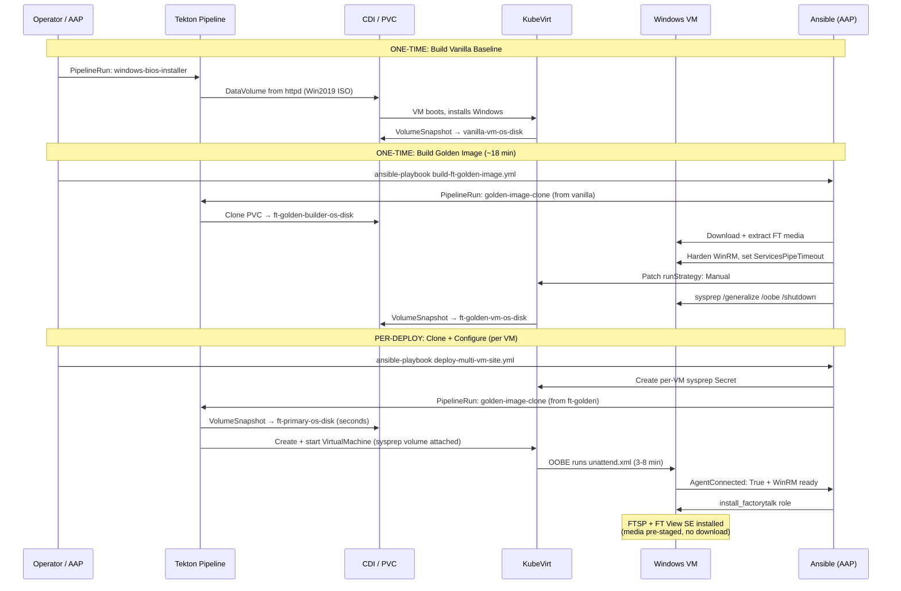

# Pattern 02 — VM Lifecycle: From ISO to Running Workload

> **ADRs**: [ADR-003](../docs/adrs/003-vm-workload-ingestion-via-cdi.md) · [ADR-010](../docs/adrs/010-virtio-driver-injection-windows-guest.md) · [ADR-012](../docs/adrs/012-vanilla-vm-validation-phase.md) · [ADR-017](../docs/adrs/017-windows-sysprep-gitops-automation.md) · [ADR-028](../docs/adrs/028-golden-image-pipeline-sysprep-at-build-time.md)  
> **Validated**: v1.2.0 (June 15, 2026) · v1.8.0 (July 7, 2026)

## Problem Statement

Deploying Windows VMs at scale — across multiple sites and workload tiers — requires a reproducible, automated path from raw OS media to a configured, WinRM-accessible VM. Manual installation (boot from ISO, click through Windows setup, configure WinRM, install drivers, run sysprep) takes 45-90 minutes per VM and is not repeatable.

The pattern here describes how to go from a Windows Server 2019 ISO to a deployed, role-configured VM in a single automated flow, and how to make that entire flow repeatable via a golden image.

---

## The VM Lifecycle — Three Phases

```mermaid
graph LR
    subgraph Phase1["Phase 1: Base Image"]
        ISO["Windows Server 2019 ISO<br/>~5.3 GiB"] --> BIOSInstall["windows-bios-installer<br/>Tekton Pipeline"]
        BIOSInstall --> VanillaPVC["vanilla-vm-os-disk<br/>150 GiB RBD PVC<br/>Validated baseline"]
    end

    subgraph Phase2["Phase 2: Golden Image Build"]
        VanillaPVC --> Clone1["Clone to builder VM<br/>(ft-golden-builder)"]
        Clone1 --> Download["Download FT Media<br/>from httpd server"]
        Download --> Extract["Extract archives<br/>(async, no WinRM block)"]
        Extract --> Harden["Harden WinRM<br/>LocalAccountTokenFilterPolicy=1"]
        Harden --> Sysprep["sysprep /generalize /oobe /shutdown<br/>runStrategy: Manual FIRST"]
        Sysprep --> GoldenPVC["ft-golden-vm-os-disk<br/>150 GiB, generalized<br/>FT media pre-staged"]
    end

    subgraph Phase3["Phase 3: Clone Deployment"]
        GoldenPVC --> SnapshotClone["golden-image-clone<br/>Tekton Pipeline<br/>(CSI VolumeSnapshot)"]
        SysprepSecret["per-VM sysprep Secret<br/>(unattend.xml)"] --> SnapshotClone
        SnapshotClone --> VMOPVC["ft-primary-os-disk<br/>Unique clone PVC"]
        VMOPVC --> BootVM["VM boots → OOBE<br/>KubeVirt sysprep volume<br/>applies unattend.xml"]
        BootVM --> WinRM["WinRM ready<br/>AgentConnected: True<br/>Unique SID"]
        WinRM --> InstallFT["install_factorytalk role<br/>Prerequisites → FTSP → View SE"]
    end
```



---

## Phase 1: Vanilla VM (Base Windows Image)

### What it is
A clean Windows Server 2019 installation, with VirtIO drivers and qemu-guest-agent installed, validated against the OT network — but with NO application software.

### Why validate before adding software
The "vanilla VM validation" phase (ADR-012) confirms that:
- Windows boots correctly in the target KVM profile
- VirtIO storage and network drivers are loaded
- QEMU guest agent is installed and responding
- Layer-2 connectivity to the OT VLAN works (Multus CNI bridge)
- WinRM is reachable from the Ansible helper

This validation gate prevents discovering KVM/driver/network issues after a 2-hour FactoryTalk installation.

### BIOS vs UEFI
The `windows-bios-installer` Tekton pipeline uses **BIOS mode** (MBR partition table). UEFI was initially attempted but the "Press any key to boot from CD" prompt blocks automation. BIOS avoids this.

```
autounattend.xml partition layout (BIOS/MBR):
  - Single Primary partition (no GPT, no EFI, no MSR)
  - Disk 0 (VirtIO storage driver loaded first via PnpCustomizationsWinPE)
```

### VirtIO driver injection — the exact paths

Two critical constraints from ADR-021:

1. **Component placement**: VirtIO `DriverPaths` must be in `Microsoft-Windows-PnpCustomizationsWinPE`, NOT `Microsoft-Windows-Setup`. The wrong component produces: `A component or setting specified in the answer file does not exist`.

2. **Path format**: Use driver name first, then OS version:
   ```
   E:\viostor\2k19\amd64   ← correct (storage)
   E:\NetKVM\2k19\amd64    ← correct (network)
   E:\amd64\2k19           ← WRONG (causes silent failure)
   ```

### CDI ingestion paths

The `vanilla-vm-os-disk` PVC is populated by the `windows-bios-installer` pipeline, which uses CDI to ingest the Windows ISO from the in-cluster httpd server (ADR-016):

```
httpd pod (CephFS PVC) → DataVolume (source.http) → ISO fetched into CephFS
→ VM boots ISO → Windows installs → VM shuts down
→ VolumeSnapshot created → vanilla-vm-os-disk PVC
```

Windows ISO requires `≥10Gi` DataVolume allocation. The 5.3 GiB ISO expands during install, and CephFS overhead + CDI scratch space pushes the requirement well past the raw file size.

---

## Phase 2: Golden Image Build

### Why a golden image

Without a golden image, each new VM must:
1. Clone vanilla baseline
2. Download FT media (20-45 min per VM)
3. Extract archives
4. Configure WinRM
5. Install prerequisites + FTSP + View SE

At 5-7 VMs, this parallelism is possible but download/extract time dominates. The golden image pre-stages all FT media so each clone skips steps 2-3 entirely, shaving 20-45 minutes per VM.

### Sysprep must happen at build time (not clone time)

This is the most critical architectural decision in the VM lifecycle (ADR-028). The failure mode of running sysprep post-clone:

```
Problem: Post-clone sysprep breaks WinRM
  1. Ansible connects to VM via WinRM (NTLM)
  2. Ansible runs: sysprep /generalize /oobe /shutdown
  3. Sysprep resets: LocalAccountTokenFilterPolicy → 0
                     WinRM auth → Negotiate-only
  4. VM reboots — WinRM no longer accepts NTLM
  5. Ansible cannot reconnect — chicken-and-egg deadlock
```

**Fix**: Sysprep is run as the LAST step of the golden image build, while the build VM is accessible. Each clone boots with a KubeVirt sysprep volume (containing per-VM `unattend.xml`) that re-runs OOBE and configures WinRM before Ansible ever connects.

### runStrategy must be Manual before sysprep

Before triggering `sysprep /generalize /oobe /shutdown`, patch the VM's `runStrategy` from `Always` to `Manual`. With `Always`, KubeVirt restarts the VM immediately after shutdown — the sysprep `Wait for VMI disappears` check never succeeds.

```yaml
# Patch via kubernetes.core.k8s_json_patch
- op: replace
  path: /spec/runStrategy
  value: Manual
```

### What the golden image contains

- Windows Server 2019 (from vanilla-vm-os-disk)
- VirtIO drivers, qemu-guest-agent
- WinRM hardened: `LocalAccountTokenFilterPolicy=1`, NTLM + Basic auth
- `ServicesPipeTimeout=600000` (required for FTSP under TCG — Pattern 05)
- FT Services DVD extracted to `C:\FTServicesExtract\`
- FT View SE DVD extracted to `C:\FTExtract\`
- FT installer archives at `C:\FTInstall\`
- **NO FactoryTalk software installed** — installation happens post-clone

---

## Phase 3: Clone Deployment

### CSI snapshot clone — how it works

The `golden-image-clone` Tekton pipeline uses CSI VolumeSnapshots to clone the golden PVC in seconds:

```
1. create-volume-snapshot task → VolumeSnapshot of ft-golden-vm-os-disk
2. create-pvc-from-snapshot task → new PVC from snapshot (seconds, no data copy)
3. create-vm task → VirtualMachine manifest with sysprep volume
4. start-vm task → VM boots, KubeVirt mounts sysprep ConfigMap/Secret
5. OOBE runs unattend.xml → ComputerName, ansible user, WinRM configured
6. wait-for-vmi task → polls AgentConnected: True
```

The clone is independent of the source PVC immediately — two VMs can be running from the same golden image simultaneously via separate clone PVCs.

### Per-VM sysprep Secret

Each clone gets a unique `unattend.xml` in a Kubernetes Secret:

```xml
<!-- per-VM unattend.xml -->
<ComputerName>ft-primary-01</ComputerName>
<Username>ansible</Username>
<Password><!-- from Vault via ESO --></Password>
<LocalAccountTokenFilterPolicy>1</LocalAccountTokenFilterPolicy>
<EnableFirewallException><!-- WinRM 5985/5986 --></EnableFirewallException>
```

The `deploy-multi-vm-site.yml` playbook generates and creates these Secrets before triggering the clone pipelines. The sysprep volume is injected via `spec.template.spec.volumes[].sysprep.secret.secretName`.

### Nested KVM TCG requirement

In triple-nested KVM environments (bare metal KVM host → KVM cluster nodes → KVM-backed VMs), hardware acceleration is not available for the innermost VMs. `useEmulation: true` is mandatory.

This is NOT a CPU model issue (Nehalem pinning was tested and disproven). The problem is in the nested I/O/timer path. TCG emulation adds ~3× overhead to VM boot times (15-20 min vs 45-90 min for installs).

```yaml
# VirtualMachinePreference for nested-KVM
spec:
  devices:
    preferredDiskBus: virtio
  features:
    preferredHyperv:
      relaxed: {enabled: true}
      vapic: {enabled: true}
      vpindex: {enabled: true}
      spinlocks: {enabled: true, spinlocks: 8191}
      # DO NOT add: synic, stimer, reset, frequencies → DRIVER_PNP_WATCHDOG BSOD
  machine:
    preferredMachineType: q35
  cpu:
    preferredCPUTopology: cores
```

---

## Lifecycle Flow — End to End



---

## Known Failure Modes

| Failure | Symptom | Fix |
|---------|---------|-----|
| `runStrategy: Always` + sysprep | VM restarts before sysprep completes; `Wait for VMI disappears` never succeeds | Patch `runStrategy → Manual` BEFORE sysprep |
| Post-clone sysprep breaks WinRM | `ntlm: credentials rejected` after VM reboots | Sysprep must happen at build time (ADR-028) |
| VirtIO disk bus switch on imported VMware image | `INACCESSIBLE_BOOT_DEVICE` BSOD | DO NOT switch VMware images to virtio disk on KVM. Keep SATA |
| NIC model mismatch pipeline vs runtime VM | `AgentConnected: True` but network unreachable | NIC model must match between pipeline PVC and runtime VM. Use `e1000e` for nested-KVM |
| Self-extracting archive blocks WinRM shell | Task never returns, `async` block needed | Use `Start-Process -WindowStyle Hidden -PassThru` + `async: 10` / `poll: 0` |
| `DRIVER_PNP_WATCHDOG` BSOD | Blue screen during Windows install | Use only `relaxed/vapic/vpindex/spinlocks` Hyper-V features |
| Win2019 ISO DataVolume too small | `virtual image size is larger than available storage` | Use `≥10Gi` for Windows ISO DataVolumes |
