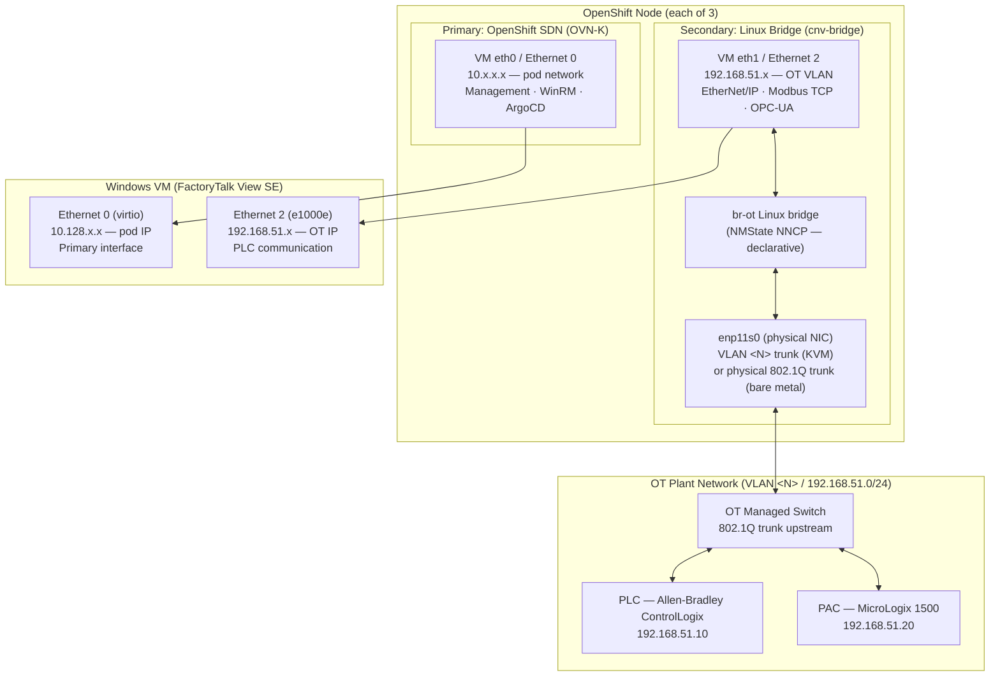
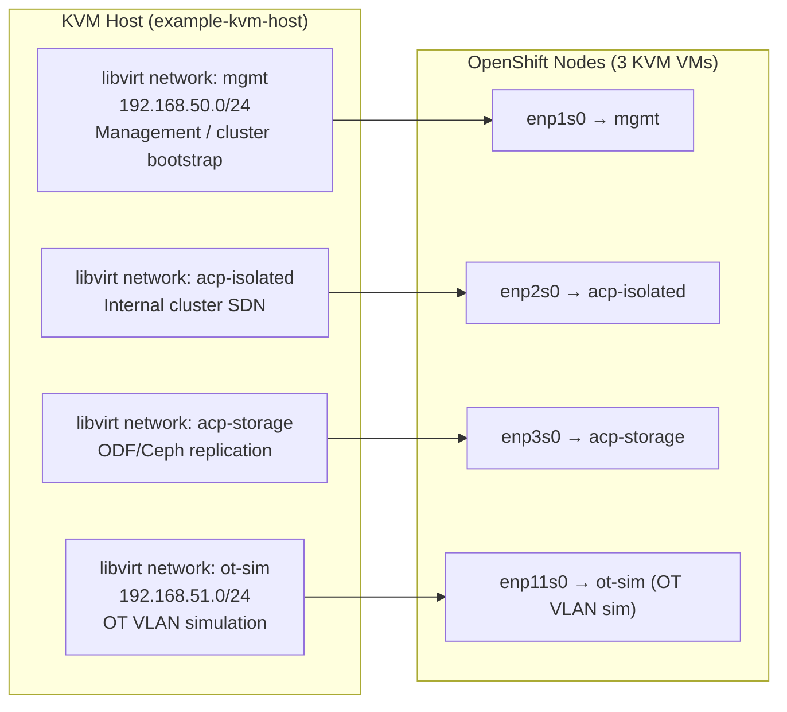
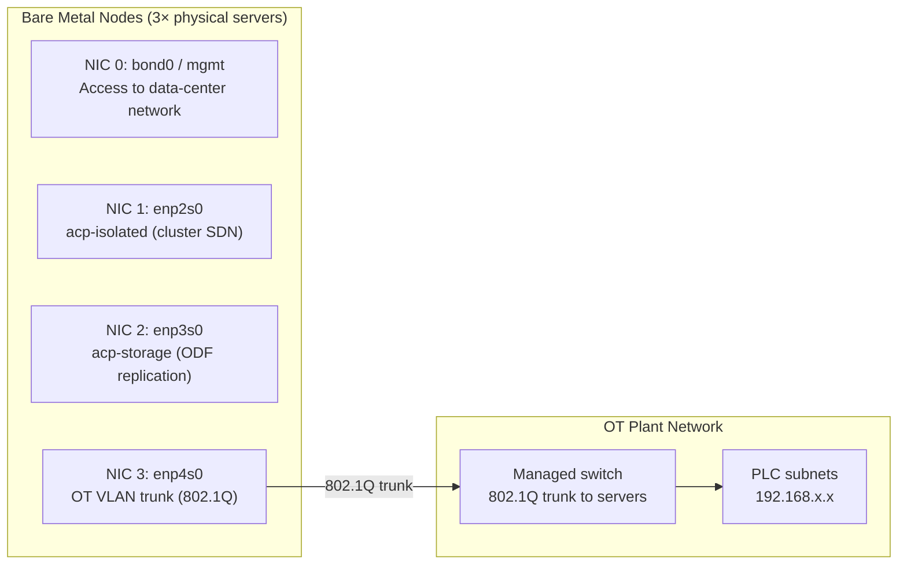

# Pattern 03 — OT Network Isolation: Layer-2 PLC Connectivity

> **ADRs**: [ADR-005](../docs/adrs/005-multus-cni-plc-vlan-bridging.md)  
> **Validated**: v1.5.0 (June 17, 2026 — Layer-2 ARP confirmed on KVM virtio)

## Problem Statement

Industrial HMI/SCADA software (FactoryTalk, Ignition, WonderWare, etc.) communicates with PLCs and PACs over Layer-2 industrial protocols — EtherNet/IP, Modbus TCP, OPC-UA. These protocols require:

- **Direct Layer-2 adjacency** or routed IP reachability to the PLC subnet
- **Static or DHCP IP** in the OT VLAN address space (not in the OpenShift pod network)
- **No NAT** — industrial protocols frequently use source IP for device identification, and NAT breaks them
- **Low-latency forwarding** — PLC scan cycles run at 1-100 ms; dropped frames cause faults

The OpenShift SDN (OVN-Kubernetes) is a routed overlay network in the `10.x.x.x` range. VMs on the SDN cannot directly reach PLCs on a `192.168.x.x` OT VLAN without explicit routing or NAT — both of which break industrial protocols.

**The solution**: Attach a second NIC to each OT VM, bridged directly to the physical OT VLAN, using Multus CNI.

---

## Architecture: Dual-NIC VM



---

## Implementation: NMState + Multus CNI

### Step 1 — NMState NodeNetworkConfigurationPolicy

Declare the Linux bridge on every OT node. NMState operator applies this declaratively (no manual SSH to nodes):

```yaml
apiVersion: nmstate.io/v1
kind: NodeNetworkConfigurationPolicy
metadata:
  name: ot-vlan-bridge
spec:
  nodeSelector:
    matchLabels:
      workload-type: windows-licensed   # only OT-capable nodes
  desiredState:
    interfaces:
      - name: br-ot
        type: linux-bridge
        state: up
        bridge:
          options:
            stp:
              enabled: false
          port:
            - name: enp11s0     # physical NIC on OT VLAN trunk
```

**KVM note**: The fourth NIC (`enp11s0`) was added to KVM VMs via `virsh attach-interface` as a hotplug (see ADR-005). The NIC connects to the `ot-sim` libvirt network (OT VLAN simulation). On bare metal, this is a physical NIC on an 802.1Q trunk port.

### Step 2 — NetworkAttachmentDefinition

This is the Multus NAD that VMs reference:

```yaml
# manifests/network/ot-vlan-reference.yaml
apiVersion: k8s.cni.cncf.io/v1
kind: NetworkAttachmentDefinition
metadata:
  name: ot-vlan  # rename to match your OT VLAN, e.g. ot-vlan100
  namespace: example-vm-poc
  annotations:
    k8s.v1.cni.cncf.io/resourceName: bridge.network.kubevirt.io/br-ot
spec:
  config: |
    {
      "cniVersion": "0.3.1",
      "name": "ot-vlan",
      "type": "cnv-bridge",
      "bridge": "br-ot",
      "macspoofchk": false
    }
```

**Why `cnv-bridge` and NOT `macvlan`**: macvlan creates virtual interfaces that inherit the parent's MAC and cannot communicate back to the host. KVM virtio interfaces do not support macvlan mode. `cnv-bridge` connects the VM's tap device directly to the Linux bridge, which handles forwarding at L2. This is the same mechanism as QEMU bridge networking.

### Step 3 — VirtualMachine NIC attachment

```yaml
spec:
  template:
    spec:
      domain:
        devices:
          interfaces:
            - name: default        # primary: OpenShift SDN
              masquerade: {}
              model: virtio
            - name: ot-vlan        # secondary: OT VLAN bridge
              bridge: {}
              model: e1000e        # MUST match pipeline NIC model (ADR-021 constraint #6)
      networks:
        - name: default
          pod: {}
        - name: ot-vlan
          multus:
            networkName: ot-vlan  # match NAD name above
```

**Critical**: The `model` on the secondary NIC must match whatever the golden image pipeline used when building the PVC. If the PVC was built with `e1000e`, the runtime VM must also use `e1000e`. Mismatches produce `AgentConnected: True` with no network connectivity — a silent false positive.

### Step 4 — Conditional NIC injection in pipelines

Builder VMs (used during golden image construction) do NOT need the OT VLAN attachment — they only need SDN access to download media. The `golden-image-clone` pipeline conditionally omits the secondary NIC when the `SECONDARY_NET` parameter is empty:

```
If SECONDARY_NET == "" → single-NIC VM (builder/utility)
If SECONDARY_NET == "ot-vlan" → dual-NIC VM (production workload)
```

An empty `networkName` in a Multus attachment causes the KubeVirt admission webhook to reject the VM: `CNI delegating plugin must have a networkName`.

---

## Network Topology Variants

### KVM / Dev Environment



### Bare Metal / Production



On bare metal, the NAD requires the `vlan` field for 802.1Q tagging:
```json
{
  "type": "cnv-bridge",
  "bridge": "br-ot",
  "vlan": 100  # replace with your OT VLAN ID
}
```

---

## Routing from AAP to OT VMs

A critical operational detail: the Ansible Automation Platform execution environment (EE) pods run on the OpenShift pod network (`10.x.x.x`). They can reach VM pod IPs but **cannot route to OT VLAN IPs** (172.16.x.x or 192.168.x.x) because there is no route from the cluster SDN to the Multus bridge network.

**Rule**:
- Use `ansible_host = <pod IP>` (from `status.interfaces[0].ipAddress`) for WinRM connections from AAP
- Use `ansible_host = <OT VLAN IP>` (from `status.interfaces[name='ot-vlan'].ipAddress`) only for inter-VM communication (e.g., FT Directory server address, peer replication IPs)

When parsing VM interface status, filter carefully — some interfaces lack a `name` field:
```yaml
# Jinja2 filter to get OT VLAN IP safely
ot_ip: >-
  {{ vm_status.interfaces
     | selectattr('name', 'defined')
     | selectattr('name', 'equalto', 'ot-vlan')
     | map(attribute='ipAddress')
     | first | default('') }}
```

---

## Validation Checklist

Before declaring OT network connectivity working:

```
[ ] NMState NNCP status = Available on all target nodes
[ ] br-ot bridge appears in `ip link` on each node
[ ] NAD ot-vlan created in target namespace
[ ] VM secondary NIC model matches pipeline PVC NIC model
[ ] VM status.interfaces shows ot-vlan entry with non-empty IP
[ ] ARP from node br-ot interface to VM OT IP succeeds (3/3)
[ ] From VM: ping to PLC gateway IP succeeds
[ ] From VM: EtherNet/IP CIP connection to PLC succeeds (FT Linx)
```

---

## Known Failure Modes

| Failure | Symptom | Fix |
|---------|---------|-----|
| macvlan on KVM virtio | No L2 forwarding, VM unreachable on OT VLAN | Use `cnv-bridge` only — macvlan is incompatible with virtio |
| Empty `networkName` in NAD | KubeVirt admission webhook rejects VM | Only inject secondary NIC when `SECONDARY_NET` param is non-empty |
| NIC model mismatch | `AgentConnected: True` but no network | Match NIC model between pipeline PVC and runtime VM manifest |
| AAP EE pods cannot route to OT VLAN | WinRM timeout for 172.16.x.x hosts | Use pod IP for AAP→VM WinRM; use OT IP only for VM→VM communication |
| dnsmasq wildcard not applying | Internal DNS doesn't resolve `*.apps.*` | `virsh net-destroy && virsh net-start` (not SIGHUP) after updating libvirt XML |
