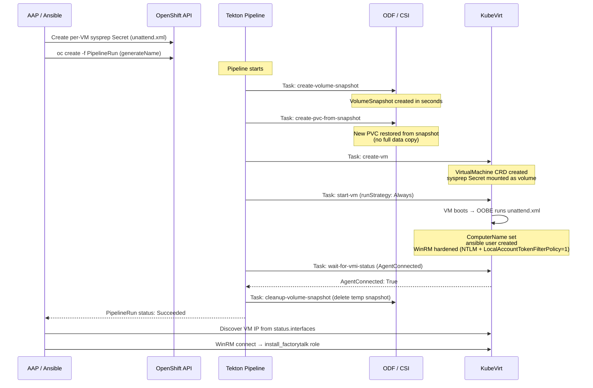

# Pattern 04 — Tekton Pipelines for VM Lifecycle

> **ADRs**: [ADR-021](../docs/adrs/021-tekton-pipeline-vm-lifecycle-management.md) · [ADR-026](../docs/adrs/026-multi-vm-deployment-orchestration-tekton-aap-hybrid.md)  
> **Validated**: v1.2.0 (June 16, 2026)

## Problem Statement

VM lifecycle operations — install OS, snapshot, clone, delete — involve both Kubernetes API operations (create PVC, create VM, patch status) and guest-OS operations (configure WinRM, install software). No single tool handles both cleanly:

- **Tekton** has full Kubernetes API access but no SSH/WinRM capability
- **Ansible** has excellent SSH/WinRM support but no native Kubernetes pipeline model
- **vSphere CLI tools** don't exist for KubeVirt

**The solution**: Use Tekton for all Kubernetes-native operations (PVC creation, VM lifecycle, snapshot/clone) and Ansible (via AAP) for all guest-OS operations. Tekton pipelines are triggered and monitored by Ansible playbooks.

---

## Pipeline Inventory

Four pipelines are deployed to the target namespace:

| Pipeline | Purpose | Trigger |
|----------|---------|---------|
| `windows-bios-installer` | Fresh Windows install from ISO into a PVC | One-time vanilla baseline creation |
| `factorytalk-image-importer` | Import a `.img.gz` archive into an RBD PVC | One-time for pre-captured FactoryTalk images |
| `golden-image-clone` | CSI snapshot + clone golden PVC → new VM PVC | Per-VM deployment |
| `delete-vm` | Stop VM + delete PVC cleanly | Teardown or re-deploy |

---

## Pipeline Architecture

```mermaid
graph TB
    subgraph Upstream["Upstream KubeVirt Tasks (v0.18.0 — operator-deployed)"]
        T1["create-vm<br/>Creates VirtualMachine CRD"]
        T2["start-vm<br/>Sets runStrategy: Always"]
        T3["wait-for-vmi-status<br/>Polls AgentConnected"]
        T4["stop-vm<br/>Sets runStrategy: Halted"]
        T5["delete-vm<br/>Removes VM + VMI"]
        T6["modify-data-object<br/>Creates DataVolume"]
    end

    subgraph Custom["Custom Snapshot/Clone Tasks"]
        T7["create-volume-snapshot<br/>VolumeSnapshot from PVC"]
        T8["create-pvc-from-snapshot<br/>PVC restore from snapshot"]
        T9["cleanup-volume-snapshot<br/>Delete temp snapshot"]
        T10["delete-data-object<br/>Delete DV or PVC"]
    end

    subgraph Pipelines["Assembled Pipelines"]
        P1["windows-bios-installer<br/>ISO → PVC → VM → install → snapshot"]
        P2["factorytalk-image-importer<br/>img.gz → DataVolume → PVC"]
        P3["golden-image-clone<br/>snapshot → clone PVC → VM → OOBE"]
        P4["delete-vm<br/>stop → delete PVC → cleanup"]
    end

    T1 --> P1
    T2 --> P1
    T3 --> P1
    T7 --> P1
    T8 --> P3
    T7 --> P3
    T9 --> P3
    T1 --> P3
    T2 --> P3
    T3 --> P3
    T6 --> P2
    T4 --> P4
    T5 --> P4
    T10 --> P4
```



---

## Golden Image Clone Pipeline — Step by Step

This is the most frequently run pipeline and the core of the multi-VM deployment pattern.



---

## Tekton RBAC

The `pipeline` ServiceAccount requires permissions that span three API groups:

```yaml
rules:
  # VM lifecycle
  - apiGroups: ["kubevirt.io"]
    resources: ["virtualmachines", "virtualmachineinstances"]
    verbs: ["get", "list", "watch", "create", "update", "patch", "delete"]
  # PVC + DataVolume management
  - apiGroups: ["cdi.kubevirt.io"]
    resources: ["datavolumes", "datasources"]
    verbs: ["get", "list", "watch", "create", "update", "patch", "delete"]
  - apiGroups: [""]
    resources: ["persistentvolumeclaims"]
    verbs: ["get", "list", "watch", "create", "update", "patch", "delete"]
  # Per-VM sysprep Secrets
  - apiGroups: [""]
    resources: ["secrets"]
    verbs: ["get", "list", "create", "update", "delete"]
  # CSI snapshots
  - apiGroups: ["snapshot.storage.k8s.io"]
    resources: ["volumesnapshots"]
    verbs: ["get", "list", "watch", "create", "delete"]
  # VM power operations (subresource)
  - apiGroups: ["subresources.kubevirt.io"]
    resources: ["virtualmachines/start", "virtualmachines/stop", "virtualmachines/restart"]
    verbs: ["update"]
```

---

## Ansible ↔ Tekton Integration Pattern

Ansible orchestrates Tekton. The core loop in `deploy-multi-vm-site.yml`:

```yaml
# 1. Trigger pipeline
- name: Submit golden-image-clone PipelineRun
  kubernetes.core.k8s:
    state: present
    definition:
      apiVersion: tekton.dev/v1
      kind: PipelineRun
      metadata:
        generateName: "clone-{{ vm_name }}-"
        namespace: "{{ namespace }}"
      spec:
        pipelineRef:
          name: golden-image-clone
        params:
          - name: SOURCE_PVC
            value: "{{ golden_pvc }}"
          - name: TARGET_PVC
            value: "{{ vm_name }}-os-disk"
          - name: VM_NAME
            value: "{{ vm_name }}"
          - name: SYSPREP_SECRET
            value: "sysprep-{{ vm_name }}"
          - name: SECONDARY_NET
            value: "{{ ot_vlan_nad | default('') }}"

# 2. Wait for completion (poll every 10s, timeout 600s)
- name: Wait for PipelineRun to complete
  kubernetes.core.k8s_info:
    api_version: tekton.dev/v1
    kind: PipelineRun
    namespace: "{{ namespace }}"
    label_selectors:
      - "tekton.dev/pipeline=golden-image-clone"
      - "app.kubernetes.io/instance={{ vm_name }}"
  register: pr_status
  until: >-
    pr_status.resources | length > 0 and
    pr_status.resources[0].status.conditions[0].reason in ['Succeeded', 'Failed']
  retries: 60
  delay: 10
  failed_when: >-
    pr_status.resources[0].status.conditions[0].reason == 'Failed'
```

---

## Task Timeouts — Mandatory

From ADR-021 and validated failures:

```yaml
# Both of these tasks MUST have explicit timeouts
- name: create-vm-root-disk
  timeout: 10m0s    # API throttling post-cluster-restart can delay this

- name: create-vm
  timeout: 10m0s    # Same reason
```

Without timeouts, these tasks hang indefinitely after cluster restarts due to client-side API throttling. Kill and recreate the PipelineRun after any cluster restart.

---

## Pipeline Deployment — Idempotent Bootstrap

```bash
# hack/setup-tekton-vm-pipelines.sh
# Idempotent — safe to re-run

./hack/setup-tekton-vm-pipelines.sh [namespace]
# Deploys in order:
# [1] Verify oc login, Tekton API, KubeVirt API
# [2] Create namespace (if not exists)
# [3] Deploy upstream KubeVirt tasks (kubevirt-tekton-tasks.yml)
# [4] Deploy custom snapshot/clone tasks
# [5] Deploy 4 VM lifecycle pipelines
# [6] Create pipeline ServiceAccount + RBAC
```

---

## PipelineRun Profiles

Three profiles are pre-defined for different deployment environments:

| Profile | File | Use Case |
|---------|------|---------|
| Bare Metal | `windows-bios-pipelinerun-baremetal.yaml` | Physical 3-node cluster, full KVM accel |
| Nested KVM (dev) | `windows-bios-pipelinerun-nested-kvm.yaml` | TCG emulation, 60-90 min install |
| Named Site (bare metal) | `windows-bios-pipelinerun-site-specific.yaml` | Named-site variant |

The key difference between profiles is the `VirtualMachinePreference` name and `useEmulation` setting:

```yaml
# Bare metal profile
vmPreferenceName: windows.2k19.bios
useEmulation: "false"
expectedInstallDuration: "20 minutes"

# Nested-KVM profile
vmPreferenceName: windows.2k19.nested-kvm
useEmulation: "true"
expectedInstallDuration: "90 minutes"
```

---

## Known Failure Modes

| Failure | Symptom | Fix |
|---------|---------|-----|
| Task hang post-cluster-restart | `modify-data-object` stuck >10 min, `client-side throttling` in logs | Add `timeout: 10m0s`; kill + recreate PipelineRun |
| `DRIVER_PNP_WATCHDOG` BSOD | Blue screen during Windows install via pipeline | Only use `relaxed/vapic/vpindex/spinlocks` in nested-kvm preference |
| Empty `SECONDARY_NET` webhook rejection | VM rejected: `CNI delegating plugin must have a networkName` | Conditionally omit interface/network blocks when `SECONDARY_NET` is empty |
| Pipeline ServiceAccount missing permissions | PipelineRun fails with `forbidden` on `virtualmachines` | Apply Role + RoleBinding from `setup-tekton-vm-pipelines.sh` |
| HyperConverged `deployTektonTaskResources: false` | Upstream KubeVirt tasks not present in namespace | Set `deployTektonTaskResources: true` in HyperConverged CR |
