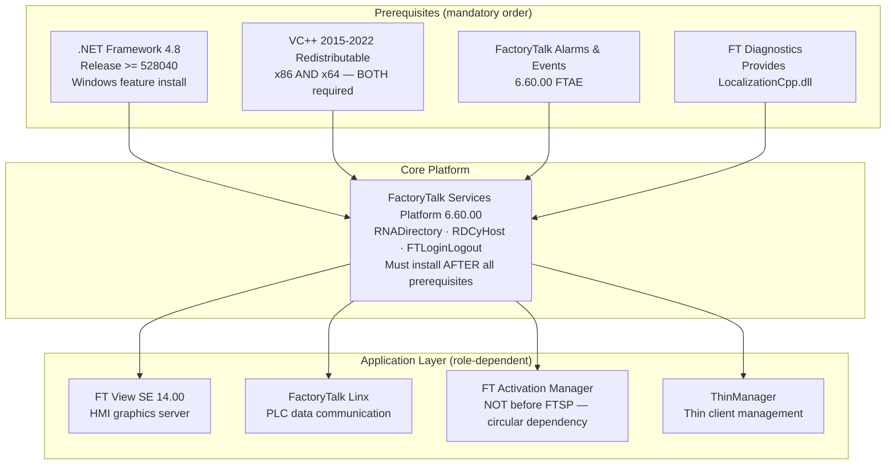
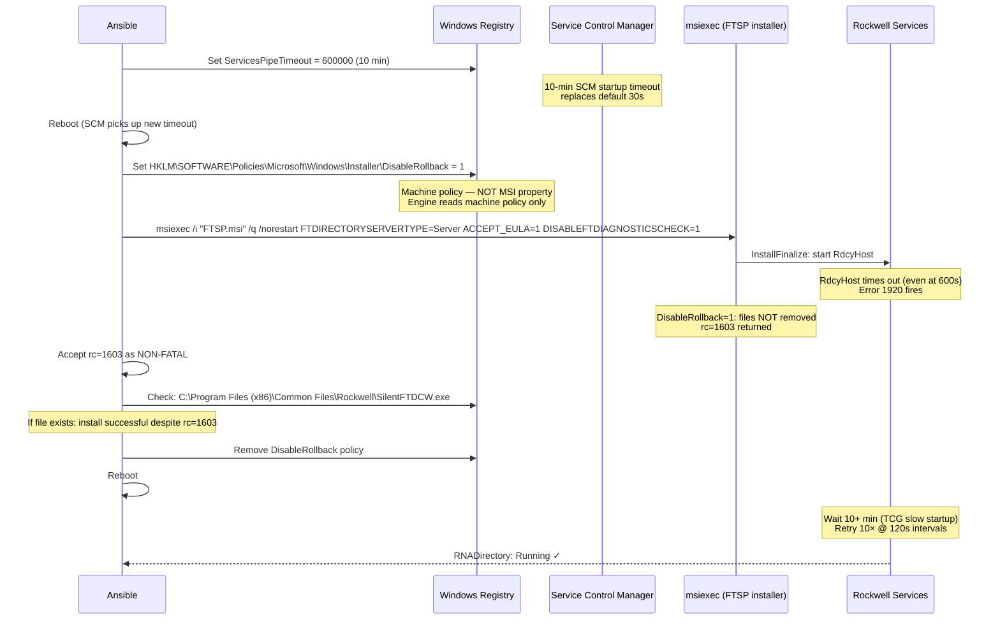

# Pattern 05 — Rockwell FactoryTalk Deployment

> **ADRs**: [ADR-023](../docs/adrs/023-factorytalk-workload-validation-role.md) · [ADR-025](../docs/adrs/025-multi-vm-factorytalk-site-architecture.md) · [ADR-027](../docs/adrs/027-factorytalk-silent-install-tcg-emulation.md)  
> **Validated**: v1.8.0 (July 7, 2026 — Pair tier)

## Problem Statement

Rockwell FactoryTalk software is not a normal Windows application. It has:

- **Strict installation order requirements** — each product has prerequisites that must be installed first, in a specific sequence, or services will silently fail
- **Timing-sensitive MSI behavior** — services start during installation, and if they time out (common under virtualization), the entire installation rolls back by default
- **Distributed directory architecture** — FT Directory is a custom RPC-based system (not Active Directory) that requires specific network and DNS topology
- **Domain authentication requirements** — FactoryTalk Security wraps Windows domain authentication in ways that require understanding both AD and FT-specific credential models

This pattern documents every hard-won lesson from deploying FactoryTalk on KubeVirt under software emulation (TCG). Many of these apply broadly to any legacy Windows middleware.

---

## FactoryTalk Product Family — What Gets Installed



> **Root cause of service crashes**: If `.NET 4.8`, `VC++ Redistributable`, or `FT Diagnostics` are missing when FTSP installs, the service DLLs are not present. `RNADirectory.exe` and `RdcyHost.exe` exit with `-1073741515` (`STATUS_DLL_NOT_FOUND`) on every startup. The error message `LocalizationCpp.dll was not found` confirms the diagnostics package was not installed first.

---

## Silent Installation Under TCG Emulation

The most significant deployment challenge. Under software emulation, ALL Windows services start slowly — 5-15× slower than bare metal. The Windows Installer (MSI) has a 30-second service start timeout hardcoded. FactoryTalk Services Platform starts `RdcyHost` as part of `InstallFinalize`, immediately exhausting this timeout.

### Default behavior (BROKEN under TCG)

```
msiexec /i FTSP.msi /q
→ InstallFinalize: starts RdcyHost
→ 30s timeout → Error 1920
→ MSI rollback: removes ALL installed files
→ Installer reports failure, nothing installed
```

### Validated workaround sequence



### What DOES NOT work

| Approach | Why it fails |
|----------|-------------|
| `DISABLEROLLBACK=1` MSI property | MSI engine reads machine policy only; property is ignored |
| `MSIFASTINSTALL=3` | Only affects cabinet extraction speed, not service timeouts |
| `ServicesPipeTimeout=180000` | 3 minutes is still insufficient; WinEvent ID:7009 shows 180s exceeded |
| Manual `Start-Service` after failed install | Same 180s SCM timeout; service fails to start |
| `msiexec /a` (administrative install) | No service start during admin install, so services are never registered |
| Running FTSP before prerequisites | `STATUS_DLL_NOT_FOUND` on every restart |

### Ansible implementation

```yaml
# roles/install_factorytalk/tasks/install_prerequisites.yml (summary)
- name: Install .NET Framework 4.8
  win_feature:
    name: NET-Framework-45-Features
    state: present

- name: Install VC++ Redistributables (x86 + x64)
  win_package:
    path: "C:\\FTInstall\\vc_redist.x64.exe"
    arguments: "/install /quiet /norestart"

- name: Install FT Diagnostics (provides LocalizationCpp.dll)
  win_shell: >
    msiexec /i "C:\FTServicesExtract\Common\6.60.00-FTSP\FTDiagnostics.msi"
    /q /norestart ACCEPT_EULA=1
  register: ftdiag_result
  failed_when: ftdiag_result.rc not in [0, 3010]

# roles/install_factorytalk/tasks/install_ftsp.yml (summary)
- name: Set ServicesPipeTimeout to 10 minutes
  win_regedit:
    path: HKLM:\SYSTEM\CurrentControlSet\Control
    name: ServicesPipeTimeout
    type: dword
    data: 600000

- name: Reboot to apply SCM timeout
  win_reboot:
    reboot_timeout: 600

- name: Set DisableRollback machine policy
  win_regedit:
    path: HKLM:\SOFTWARE\Policies\Microsoft\Windows\Installer
    name: DisableRollback
    type: dword
    data: 1

- name: Install FactoryTalk Services Platform
  win_shell: >
    msiexec /i "C:\FTServicesExtract\Common\6.60.00-FTSP\setup.msi"
    /q /norestart FTDIRECTORYSERVERTYPE=Server
    ACCEPT_EULA=1 DISABLEFTDIAGNOSTICSCHECK=1
  register: ftsp_result
  failed_when: ftsp_result.rc not in [0, 1603, 3010]

- name: Accept rc=1603 if SilentFTDCW.exe exists
  win_stat:
    path: 'C:\Program Files (x86)\Common Files\Rockwell\SilentFTDCW.exe'
  register: ftdcw_stat
  failed_when: >-
    ftsp_result.rc == 1603 and not ftdcw_stat.stat.exists
```

---

## FT Directory Architecture

FactoryTalk Directory is a proprietary distributed directory service (not LDAP/AD) that all FactoryTalk products use to discover each other. Understanding its topology is essential for multi-VM sites.

```mermaid
graph TB
    subgraph FTDirPair["FT Directory Pair (Primary + Secondary)"]
        Primary["RDS Primary<br/>ft-primary-01<br/>• FT Directory HOST<br/>• Owns the shared directory DB<br/>• RNADirectory: Running<br/>• SilentFTDCW installed here only"]
        Secondary["RDS Secondary<br/>ft-secondary-01<br/>• Connects to Primary's directory<br/>• FTSetDirSvr.exe -sso ft-primary-01<br/>• ConnectionState: CONNECTED"]
    end

    subgraph Data["Data / Communication Tier"]
        Linx["FT Linx Server<br/>• Connects to FT Directory<br/>• Manages PLC connections<br/>• EtherNet/IP CIP sessions to PLCs"]
    end

    subgraph HMI["HMI Tier (1..N servers)"]
        HMI["FT View SE HMI Servers (1..N)<br/>• Connects to FT Directory<br/>• Loads .gfx display files<br/>• Binds tags via FT Linx<br/>• N=1 minimum; N&gt;1 for redundancy"]
    end

    subgraph PLC["OT Network"]
        PLC1["ControlLogix PLC<br/>192.168.51.10"]
    end

    Primary <-->|RPC sync| Secondary
    Primary --> Linx
    Primary --> HMI
    Linx <-->|EtherNet/IP| PLC1

    subgraph AD["Windows Domain (otvlan.local)"]
        DC["AD Domain Controller<br/>• Kerberos / NTLM<br/>• DNS for otvlan.local<br/>• FactoryTalk uses AD credentials"]
    end

    DC --> Primary
    DC --> Secondary
    DC --> HMI
```

### Critical rules for FT Directory

1. **SilentFTDCW runs only on the Primary**. Running it on a secondary removes the primary's computer entry from the shared directory. Secondaries only run `FTSetDirSvr.exe -sso <primary_hostname>`.

2. **Boot order matters**. FT Directory must be Running before any client connects. Boot tier sequence: DC (tier 0) → Primary FT Directory (tier 1) → Secondaries (tier 2) → HMI/Data servers (tier 3).

3. **Standard Security mode eliminates manual grants**. FT Security in Standard mode uses Active Directory group membership for authorization. Users in AD groups automatically get FactoryTalk access — no manual per-user grants in the FT administration console.

4. **Computer names must be registered in AD before FT can use them**. The FT directory server registers a computer account in AD. This means the AD DC must be fully operational (not just booted — fully provisioned with the domain) before the FT Primary starts.

---

## Validation — 13-Check Protocol

The `validate_factorytalk` role runs 13 read-only checks after every deployment. Environment-aware timeouts (TCG vs bare metal) prevent false failures.

```
Check 01: RNADirectory service = Running
Check 02: RdcyHost service = Running
Check 03: FTLoginLogout service = Running
Check 04: FT Diagnostics service = Running
Check 05: SilentFTDCW.exe exists at Common Files\Rockwell\
Check 06: WinRM NTLM auth succeeds (LocalAccountTokenFilterPolicy=1)
Check 07: qemu-guest-agent responding (AgentConnected: True)
Check 08: Primary → Secondary DCOM connectivity (port 135)
Check 09: Primary → Secondary SMB connectivity (port 445)
Check 10: Primary → Secondary DNS resolution (otvlan.local)
Check 11: FT Directory ConnectionState = CONNECTED (on secondary)
Check 12: Network Directory registered in FT
Check 13: No critical Windows Event Log errors in last 60 minutes
```

Timeout configuration by environment:

```yaml
# vars/factorytalk_timeouts.yml
validate_factorytalk_timeouts:
  tcg:
    service_start_wait_sec: 600    # 10 min — TCG is 5-15× slower
    service_retry_count: 10
    service_retry_delay: 60
  hardware:
    service_start_wait_sec: 120    # 2 min — normal bare-metal startup
    service_retry_count: 5
    service_retry_delay: 30
```

---

## Deployment Sequence for a Complete FT Site

```mermaid
graph TD
    Start(["Start: deploy-multi-vm-site.yml"])

    Start --> Phase1["Phase 1: Provision VMs<br/>(Tekton golden-image-clone, parallel)"]
    Phase1 --> WaitOOBE["Wait: OOBE completes<br/>AgentConnected: True<br/>on all VMs"]

    WaitOOBE --> BootTier0["Boot Tier 0: AD Domain Controller<br/>bootstrap-winrm → promote_ad_dc role<br/>domain: otvlan.local"]
    BootTier0 --> WaitDC["Wait: DC operational<br/>DNS resolving otvlan.local<br/>Kerberos tickets working"]

    WaitDC --> BootTier1["Boot Tier 1: FT Primary + all Secondaries<br/>(parallel, same tier)"]
    BootTier1 --> WinRM1["bootstrap-winrm<br/>LocalAccountTokenFilterPolicy check<br/>domain join to otvlan.local"]

    WinRM1 --> InstallPrereq["install_factorytalk/install_prerequisites<br/>.NET 4.8 · VC++ x86+x64 · FT Diag · FTAE"]
    InstallPrereq --> InstallFTSP["install_factorytalk/install_ftsp<br/>ServicesPipeTimeout → reboot → DisableRollback<br/>msiexec → accept rc=1603 → reboot → wait 10 min"]
    InstallFTSP --> ConfigPrimary["configure-multi-vm-site<br/>Primary: SilentFTDCW → register FT Directory<br/>Secondary: FTSetDirSvr → connect to primary"]

    ConfigPrimary --> BootTier2["Boot Tier 2: Data Servers<br/>(FT Linx, RSLinx Enterprise)"]
    BootTier2 --> InstallLinx["Install FT Linx<br/>Configure PLC connections<br/>EtherNet/IP endpoints from ADR-005"]

    InstallLinx --> BootTier3["Boot Tier 3: HMI Servers<br/>(FT View SE)"]
    BootTier3 --> InstallViewSE["install-factorytalk-view-se.yml<br/>FT View SE + display server setup"]

    InstallViewSE --> Validate["validate-multi-vm-site.yml<br/>13-check protocol on all VMs<br/>AAP Job Template: Validate FT Site"]
    Validate --> End(["Deployment complete"])
```



---

## WinRM Configuration — the Critical Prerequisite

All Ansible-to-Windows communication in this project uses WinRM with NTLM authentication. The default Windows WinRM configuration blocks non-built-in local accounts from remote admin access (UAC token filtering). This is the single most common cause of `ntlm: credentials rejected` errors.

**Mandatory registry setting** (applied by golden image / sysprep unattend.xml):

```powershell
# Set LocalAccountTokenFilterPolicy = 1
# This allows non-built-in admin accounts (e.g., 'ansible') to use WinRM with full token
Set-ItemProperty -Path 'HKLM:\SOFTWARE\Microsoft\Windows\CurrentVersion\Policies\System' `
  -Name 'LocalAccountTokenFilterPolicy' -Type DWord -Value 1
```

If WinRM is initially unreachable (e.g., on an imported VMware VM), use QEMU guest agent exec to set this registry key before attempting WinRM:

```bash
virtctl guestosinfo <vm-name>
virtctl exec <vm-name> -- powershell.exe \
  "Set-ItemProperty -Path 'HKLM:\\SOFTWARE\\...\\System' -Name LocalAccountTokenFilterPolicy -Type DWord -Value 1"
```

**WinRM timeouts under TCG** — Ansible inventory settings:

```yaml
ansible_winrm_operation_timeout_sec: 120
ansible_winrm_read_timeout_sec: 180
ansible_winrm_transport: ntlm
ansible_port: 5985
```

---

## Known Failure Modes

| Failure | Symptom | Fix |
|---------|---------|-----|
| Prerequisites missing | ALL Rockwell services `Stopped`; `STATUS_DLL_NOT_FOUND` (-1073741515) | Install .NET 4.8 + VC++ + FT Diagnostics BEFORE FTSP — in that order |
| `LocalizationCpp.dll was not found` | `FTLoginLogout.exe` fails on startup | Install FT Diagnostics package before FTSP |
| rc=1603 with no files | FTSP rolled back | Verify `DisableRollback=1` is a machine **policy** (not MSI property) |
| WinRM NTLM rejected | `ntlm: the specified credentials were rejected` | Set `LocalAccountTokenFilterPolicy=1` (non-built-in accounts need this) |
| SilentFTDCW on secondary corrupts shared directory | Primary's computer entry disappears from FT Directory | NEVER run SilentFTDCW on secondary VMs |
| FT View SE installed before FTSP services running | View SE fails to register with FT Directory | Validate FTSP services Running before installing View SE |
| Self-extracting archive hangs WinRM | Task never returns | Use `Start-Process -WindowStyle Hidden -PassThru` + `async: 10`/`poll: 0` |
| MSI path with mixed slashes | `msiexec` returns 1619 (invalid package) | Use backslashes only in MSI paths |
