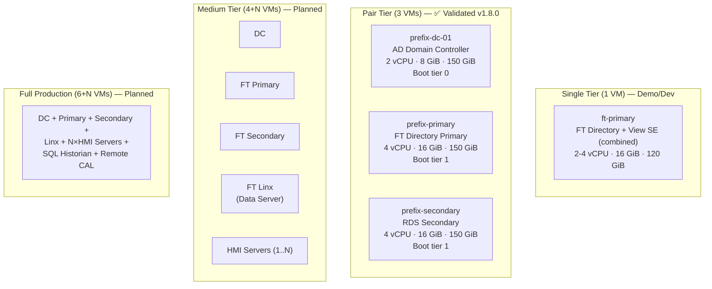
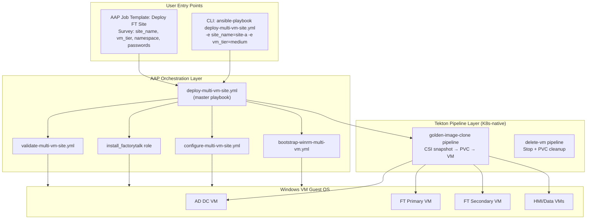

# Pattern 06 — Multi-VM Site Architecture & Orchestration

> **ADRs**: [ADR-025](../docs/adrs/025-multi-vm-factorytalk-site-architecture.md) · [ADR-026](../docs/adrs/026-multi-vm-deployment-orchestration-tekton-aap-hybrid.md)  
> **Validated**: Pair tier (3 VMs) — v1.8.0, July 7, 2026

## Problem Statement

A single FactoryTalk SCADA site is not one VM — it is a coordinated set of VMs with role-specific software, boot dependencies, network topology requirements, and licensing constraints. Deploying 5-7 VMs correctly requires:

- Parallel provisioning where dependencies allow
- Strict boot sequencing (AD before FT Directory, FT Directory before HMI)
- Role-specific guest-OS configuration (different Ansible roles per VM type)
- Site-scoped naming (all VMs share a prefix, e.g., `site-a-`)
- Idempotent re-runs (skip healthy VMs, reconfigure failed ones)
- Self-service deployment with RBAC, audit logging, and survey prompts

---

## Deployment Tiers



---

## Full Production VM Specifications

| Role | CPU | RAM | OS Disk | Boot Tier | Notes |
|------|-----|-----|---------|-----------|-------|
| AD Domain Controller | 2 vCPU | 8 GiB | 150 GiB | 0 | DNS for `otvlan.local` |
| FT Directory Primary | 4 vCPU | 16 GiB | 150 GiB | 1 | RDS Primary, FTSP host |
| RDS Secondary | 4 vCPU | 16 GiB | 150 GiB | 2 | Connects to Primary via FTSetDirSvr |
| FT Linx (Data Server) | 4 vCPU | 16 GiB | 80 GiB | 2 | PLC EtherNet/IP connections |
| HMI Server (×N) | 4 vCPU | 16 GiB | 120 GiB | 3 | FT View SE display server; N≥1, N≥2 for redundancy |
| SQL Server (Historian) | 8 vCPU | 32 GiB | 500 GiB + state PVC | 4 | VantagePoint data collection |
| Remote CAL Server | 2 vCPU | 8 GiB | 80 GiB | 1 | FT View SE concurrent CALs |

**Total (full production, N HMI Servers)**: (26 + 4N) vCPU · (104 + 16N) GiB · ~(1.1 TiB + 120N GiB) storage *(base excludes HMI; each HMI Server adds 4 vCPU · 16 GiB · 120 GiB)*

> **Scheduling constraint**: All VMs must be scheduled on nodes with label `workload-type: windows-licensed` (ADR-009, Windows licensing compliance). With 3 licensed nodes, 5+ VM deployments should use soft anti-affinity to spread VMs across nodes for drain headroom.

---

## Orchestration Architecture: AAP + Tekton Hybrid



**Why not pure Tekton?** Tekton Tasks run as containers — no WinRM, no SSH, no Ansible modules. Guest-OS configuration (domain join, software install, FT Directory registration) requires Ansible.

**Why not pure Ansible?** Ansible has no native CSI snapshot/clone capability and no VM lifecycle APIs for KubeVirt. Replicating the snapshot/clone logic in Ansible means duplicating proven Tekton task code.

**The split**: Tekton handles everything Kubernetes-native (PVC, VM CRD, VolumeSnapshot). Ansible handles everything guest-OS (WinRM, PowerShell, software installation).

---

## Boot Tier Enforcement

Boot ordering is enforced at the Ansible play level with explicit `wait_for` checks. This is intentionally simple and debuggable:

```yaml
# Phase 2: Boot Ordering (from deploy-multi-vm-site.yml)
- name: "Tier 0: Wait for AD Domain Controller"
  hosts: localhost
  tasks:
    - name: Wait for DC AgentConnected
      kubernetes.core.k8s_info:
        api_version: kubevirt.io/v1
        kind: VirtualMachineInstance
        name: "{{ site_name }}-dc-01"
        namespace: "{{ namespace }}"
      register: vmi_status
      until: >-
        vmi_status.resources | length > 0 and
        vmi_status.resources[0].status.conditions |
        selectattr('type', 'equalto', 'AgentConnected') |
        selectattr('status', 'equalto', 'True') | list | length > 0
      retries: 60
      delay: 30

- name: "Tier 1: Configure AD DC"
  hosts: "{{ site_name }}-dc-01"
  roles:
    - promote_ad_dc

- name: "Tier 1: Wait for AD fully operational"
  hosts: localhost
  tasks:
    - name: Verify DNS resolves otvlan.local
      # ... dns resolution check
    - name: Proceed to FT Primary (tier 1)
      # ... trigger Tekton clone for ft-primary if not yet running
```

---

## Dynamic Inventory

The `multi-vm-site.yml.j2` Jinja2 template generates the Ansible inventory at runtime from discovered VM IP addresses:

```yaml
# inventory/multi-vm-site.yml.j2
all:
  children:
    domain_controllers:
      hosts:
        {{ site_name }}-dc-01:
          ansible_host: "{{ dc_pod_ip }}"
          ansible_user: ansible
          ansible_password: "{{ vanilla_admin_password }}"
          ansible_connection: winrm
          ansible_winrm_transport: ntlm
          ansible_winrm_operation_timeout_sec: 120
          ansible_winrm_read_timeout_sec: 180

    ft_directory_primary:
      hosts:
        {{ site_name }}-primary:
          ansible_host: "{{ primary_pod_ip }}"
          ft_role: primary
          ft_directory_server: "{{ site_name }}-primary"

    ft_directory_secondary:
      hosts:
        {{ site_name }}-secondary:
          ansible_host: "{{ secondary_pod_ip }}"
          ft_role: secondary
          ft_directory_server: "{{ site_name }}-primary"   # points to primary

    hmi_servers:
      hosts:
        
        {{ hmi.name }}:
          ansible_host: "{{ hmi.pod_ip }}"
          ft_display_path: "{{ hmi.display_path }}"
        
```

IP addresses are discovered at runtime by querying `status.interfaces` from the KubeVirt API, then injected into the template via Ansible vars.

---

## Idempotent Re-run Pattern

Every operation checks current state before acting:

```yaml
# Example: skip clone if PVC already exists
- name: Check if VM PVC already exists
  kubernetes.core.k8s_info:
    api_version: v1
    kind: PersistentVolumeClaim
    name: "{{ vm_name }}-os-disk"
    namespace: "{{ namespace }}"
  register: existing_pvc

- name: Clone VM only if PVC does not exist
  include_tasks: clone-vm.yml
  when: existing_pvc.resources | length == 0

# Example: skip FTSP install if SilentFTDCW.exe already present
- name: Check if FTSP already installed
  win_stat:
    path: 'C:\Program Files (x86)\Common Files\Rockwell\SilentFTDCW.exe'
  register: ftsp_installed

- name: Install FTSP
  include_tasks: install_ftsp.yml
  when: not ftsp_installed.stat.exists
```

---

## Storage Sizing by Tier

| Tier | VMs | OS PVCs | Extra PVCs | Total Raw | ODF Usable (3× replication) |
|------|-----|---------|-----------|-----------|---------------------------|
| Single | 1 | 1×120 GiB | — | 120 GiB | 40 GiB |
| Pair | 3 | 2×150 + 1×150 GiB | — | 450 GiB | 150 GiB |
| Medium | 6 | 6×120 GiB | — | 720 GiB | 240 GiB |
| Full | 6+N (N≥1 HMI) | 5×120 GiB + N×120 GiB + 1×500 GiB | +state PVC (500 GiB) | ~1.9 TiB + N×120 GiB | ~640 GiB + N×40 GiB |

> The 3-node KVM dev cluster has ~400 GiB ODF usable capacity (1.2 TiB raw / 3× replication). This is sufficient for Single and Pair tiers. Medium and Full tiers require bare-metal nodes with larger ODF disks, or additional storage nodes.

---

## HA and Live Migration

All VMs use `evictionStrategy: LiveMigrate`. When a node is cordoned (for maintenance or OS patching), KubeVirt automatically live-migrates the VMs to other nodes without downtime.

**Prerequisites for Live Migration**:
- Shared RBD storage (not local disk) — already true with ODF/Ceph
- `ReadWriteMany` access mode on OS PVCs
- Minimum 4 nodes for draining a node with 5+ VMs (`3 nodes - 1 drained = 2` is insufficient for 5 VMs)

For bare-metal production, a 4th node dedicated to Windows VMs is strongly recommended when running 5+ VMs.

---

## Known Failure Modes

| Failure | Symptom | Fix |
|---------|---------|-----|
| `ErrorUnschedulable` — insufficient memory | 9th+ VM fails to schedule | Stop a non-essential VM before new deploys: `oc patch vm ... --type merge -p '{"spec":{"runStrategy":"Halted"}}'` |
| AAP EE pods can't route to OT VLAN IPs | WinRM timeout for 172.x hosts | Use pod IPs (10.x) for AAP→VM WinRM; use OT IPs only for VM→VM communication |
| DC not fully operational before FT Primary starts | FT Directory fails to register computer account in AD | Wait for AD DNS resolution (not just `AgentConnected`) before proceeding to tier 1 |
| Tekton pipeline hangs post-cluster-restart | PipelineRun stuck >10 min | Kill PipelineRun (`oc delete pr <name>`), recreate after cluster is stable |
| Over-committed host | OOM kills, VM freezes | `hack/check-host-capacity.sh` before any deployment; target ≥4 vCPU + 16 GiB free |
