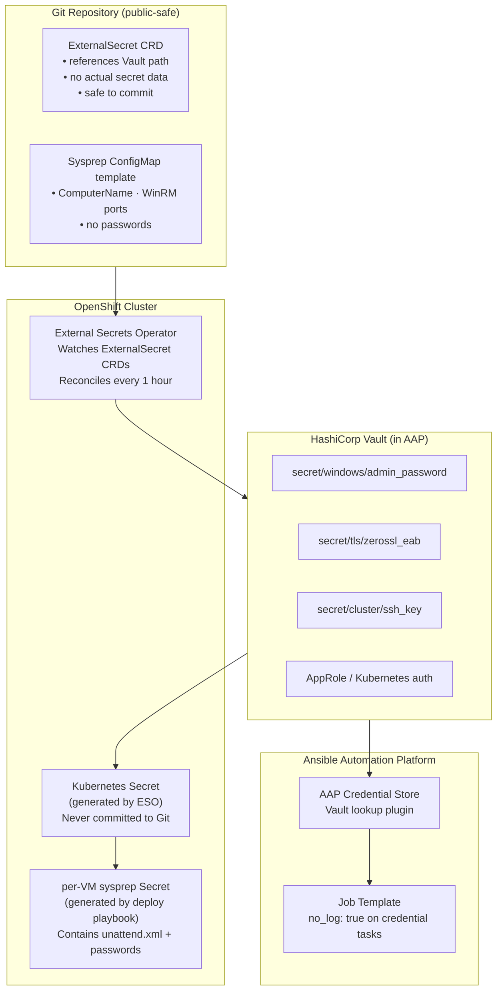
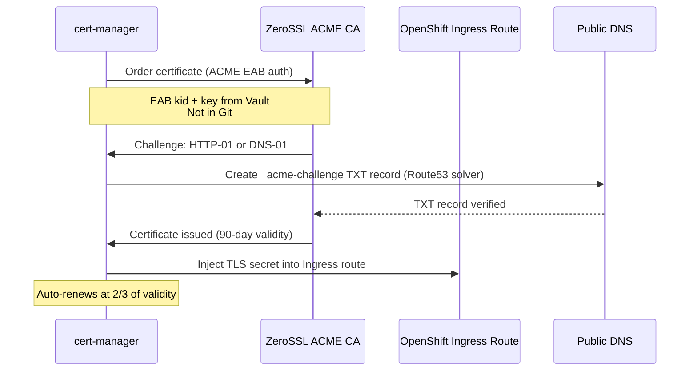

# Pattern 07 — GitOps, Secrets, and Compliance

> **ADRs**: [ADR-006](../docs/adrs/006-gitops-argocd-vm-management.md) · [ADR-008](../docs/adrs/008-ansible-aap-secret-management-cve-2025-14377.md) · [ADR-009](../docs/adrs/009-windows-licensing-compliance-node-pinning.md) · [ADR-013](../docs/adrs/013-tls-cert-manager-zerossl.md) · [ADR-015](../docs/adrs/015-gitops-secrets-management-external-secrets-operator.md)  
> **Status**: GitOps (ArgoCD) — deferred v1.1 | Secrets (ESO) — deferred v1.1 | TLS — Validated v1.0.0

## Problem Statement

Running OT workloads in a regulated, security-conscious environment requires:

- **No secrets in Git** — Windows passwords, Vault tokens, ZeroSSL EAB credentials must never be committed to the repository
- **Auditable automation** — every playbook execution logged with who triggered it, what changed, and what the result was
- **Windows licensing compliance** — licensed Windows VMs must only run on nodes covered by active Microsoft licenses
- **TLS everywhere** — all cluster ingress routes must have valid, auto-renewed certificates
- **GitOps drift detection** — VM manifests in Git should match cluster state; drift should be detected and reconciled automatically

---

## Secrets Architecture



### Rule: ExternalSecret, never Secret YAML

```yaml
# ✅ Safe to commit — ExternalSecret (no secret data)
apiVersion: external-secrets.io/v1beta1
kind: ExternalSecret
metadata:
  name: win-sysprep-secret
  namespace: example-vm-poc
spec:
  refreshInterval: 1h
  secretStoreRef:
    name: vault-backend
    kind: ClusterSecretStore
  target:
    name: win-sysprep-credentials
    creationPolicy: Owner
  data:
    - secretKey: admin_password
      remoteRef:
        key: secret/windows
        property: admin_password
    - secretKey: ansible_password
      remoteRef:
        key: secret/windows
        property: ansible_password

# ❌ NEVER commit — raw Secret YAML
apiVersion: v1
kind: Secret
metadata:
  name: win-sysprep-secret
data:
  admin_password: UjNkaDR0MTIzIQ==   # base64 — NEVER in Git
```

---

## CVE-2025-14377 Mitigation

CVE-2025-14377 affects Ansible Automation Platform credential exposure in task output. The mitigation is `no_log: true` on any task that touches credentials.

**Mandatory for all playbooks in this repo**:

```yaml
# Any task using credentials
- name: Set admin password via WinRM
  win_user:
    name: Administrator
    password: "{{ admin_password }}"
    update_password: always
  no_log: true    # ← MANDATORY — prevents credential in job output

- name: Domain join
  win_domain_membership:
    dns_domain_name: otvlan.local
    domain_admin_user: "Administrator@otvlan.local"
    domain_admin_password: "{{ domain_admin_password }}"
    state: domain
  no_log: true    # ← MANDATORY

- name: Install FTSP with license key
  win_shell: |
    msiexec /i ... SERIAL="{{ ft_serial_key }}" ...
  no_log: true    # ← MANDATORY
```

**Ansible AAP config**: `ansible.cfg` is **gitignored**. It contains the Automation Hub token. Verify with `git check-ignore -v ansible.cfg` before any `git add`.

---

## TLS: cert-manager + ZeroSSL

All OpenShift ingress routes are automatically issued and renewed TLS certificates via cert-manager + ZeroSSL (an ACME CA that does not require a credit card for free tier):



**ZeroSSL EAB credentials** must be in Vault (path `secret/tls/zerossl_eab`) before running `site-post-install.yml`. Pass them as `-e @~/acme-vars.yml` for the initial bootstrap before ESO is configured.

**TLS rotation recovery**: If `oc` breaks with `x509: certificate signed by unknown authority` after rotation, remove `certificate-authority-data` from the kubeconfig and add `validate_certs: false` to the inventory for the pre-rotation bootstrap window.

---

## Windows Licensing Compliance

Microsoft Windows Server licensing requires that licensed VMs only run on covered physical nodes. In a KubeVirt cluster, VMs can migrate to any node — without controls, a VM could drift to an unlicensed node.

**Solution**: Node Selectors + Taints (ADR-009)

```yaml
# Label licensed nodes
oc label node control-0 workload-type=windows-licensed
oc label node control-1 workload-type=windows-licensed
# control-2 intentionally NOT labeled (unlicensed)

# Taint unlicensed nodes
oc adm taint node control-2 windows-licensed=false:NoSchedule

# All Windows VM manifests include:
spec:
  template:
    spec:
      nodeSelector:
        workload-type: windows-licensed
      tolerations: []   # no toleration for the NoSchedule taint
```

**Live Migration**: KubeVirt respects NodeSelector during migration — a VM will only migrate to nodes matching its selector. This means Live Migration itself cannot violate licensing compliance, as long as the node selector is present on every Windows VM.

---

## GitOps (ArgoCD) — Deferred, but Architecture Ready

ArgoCD is deferred to v1.1 (currently `Proposed` status in ADR-006), but the manifests and architecture are in place.

**What GitOps enables for VMs**:
- VM manifests committed to `manifests/virtualmachines/` are continuously reconciled against cluster state
- Drift detection: if a VM is manually scaled or modified in the cluster, ArgoCD marks it `OutOfSync`
- Automated rollback: revert a VM config change by reverting a Git commit

**Current state without ArgoCD**: VMs are deployed via `deploy-multi-vm-site.yml` and are not continuously reconciled. The Git repo is the intended source of truth, but enforcement requires ArgoCD.

**ArgoCD Application structure** (once enabled):

```yaml
# manifests/argocd/ot-vms-application.yaml
apiVersion: argoproj.io/v1alpha1
kind: Application
metadata:
  name: ot-windows-vms
  namespace: openshift-gitops
spec:
  source:
    repoURL: https://github.com/your-org/gitops-repo
    path: manifests/virtualmachines
    targetRevision: HEAD
  destination:
    server: https://kubernetes.default.svc
    namespace: example-vm-poc
  syncPolicy:
    automated:
      prune: false      # Never auto-delete VMs
      selfHeal: true    # Auto-correct drift
```

Note: `prune: false` is intentional. Auto-deleting a running VM from a Git commit revert would be catastrophic in production.

---

## Security Checklist

Before any deployment or commit:

```
[ ] ansible.cfg gitignored (verify: git check-ignore -v ansible.cfg)
[ ] No raw Secret YAML in any file being committed
[ ] All credential tasks have no_log: true
[ ] ZeroSSL EAB credentials in Vault (not in repo)
[ ] Windows admin passwords in Vault (pulled via ESO / AAP credential store)
[ ] Windows VM manifests have nodeSelector: workload-type=windows-licensed
[ ] VM PVCs do not use local storage (must be ODF RBD for live migration)
[ ] External Secrets refresh interval ≤ 1h (stale secrets cause auth failures)
```

---

## Known Failure Modes

| Failure | Symptom | Fix |
|---------|---------|-----|
| `ansible.cfg` token committed | Automation Hub token in version history | Gitignore is set; check with `git check-ignore -v ansible.cfg` before `git add` |
| ESO stale secret | Auth failures after Vault rotation | Set `refreshInterval: 1h` on all ExternalSecrets |
| TLS rotation breaks `oc` | `x509: certificate signed by unknown authority` | Remove `certificate-authority-data` from kubeconfig; add `validate_certs: false` for bootstrap window |
| VM migrates to unlicensed node | Licensing violation | All Windows VMs must have `nodeSelector: workload-type: windows-licensed` |
| ArgoCD prune deletes running VM | Production outage | Never enable ArgoCD `prune: true` for VM Applications |
