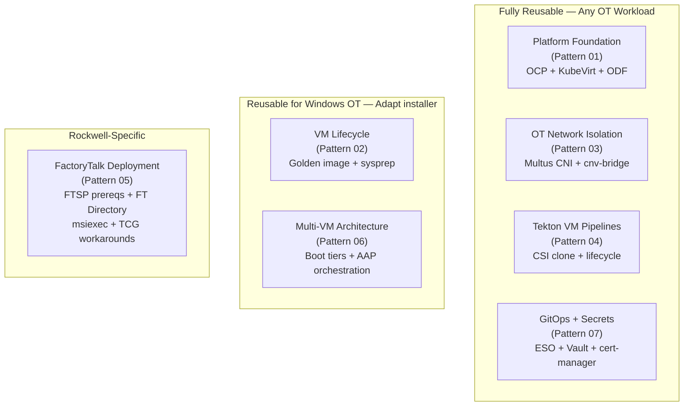
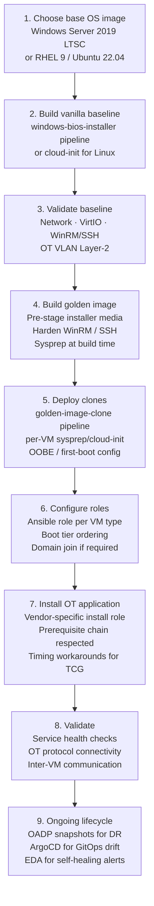
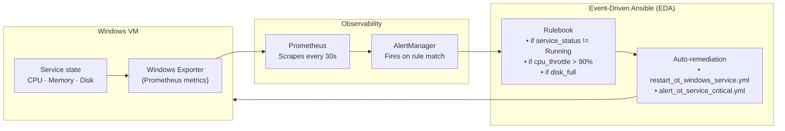

# Pattern 08 — Generalizing to Non-Rockwell OT Workloads

> **Reference patterns**: All of [01](01-platform-foundation.md) through [07](07-gitops-secrets-compliance.md)

## Overview

Every pattern in this folder was built specifically for Rockwell FactoryTalk on OpenShift Virtualization. But the *architecture* — converged OCP cluster, CDI ingestion, golden image pipeline, Multus OT VLAN, Tekton lifecycle, AAP orchestration — applies to any legacy Windows OT/HMI workload, and several patterns apply to Linux-based OT workloads as well.

This document describes how to adapt each pattern to common non-Rockwell scenarios.

---

## The Reusable Technology Stack



---

## Adapting by OT Platform

### Wonderware / AVEVA System Platform

AVEVA System Platform (formerly Wonderware) has a similar multi-VM topology to FactoryTalk:

| FT Component | AVEVA Equivalent | Notes |
|---|---|---|
| FT Directory (RDS) | ArchestrA IDE / Galaxy | Galaxy repository is the equivalent of FT Directory |
| FT View SE | AVEVA HMI (InTouch) | Windows application, same WinRM install pattern |
| FT Linx | Device Integration | OPC-DA/OPC-UA to PLCs |
| RDS Secondary | Galaxy Replica | Same primary/secondary concept |
| SQL Historian | AVEVA Historian | SQL Server-based, same storage pattern |

**What changes in Pattern 05**:
- AVEVA uses a `.exe` bootstrapper (`setup.exe`), not direct `msiexec` calls
- Galaxy repository uses SQL Server Express — add SQL Server install to prerequisites
- AVEVA license server may require outbound Internet access (check with AVEVA support)
- `ServicesPipeTimeout` extension may still be needed under TCG

**What stays the same**:
- Windows Server 2019, WinRM NTLM, `LocalAccountTokenFilterPolicy=1`
- Boot tier ordering (SQL → Galaxy → InTouch)
- Multus CNI for OPC-DA/OPC-UA network access
- Golden image pattern with media pre-staged

---

### Ignition by Inductive Automation

Ignition is architecturally simpler than FactoryTalk — it's a Java-based web application that runs on Windows or Linux:

| FT Component | Ignition Equivalent |
|---|---|
| FT Directory | Ignition Gateway (single VM, web-based config) |
| FT View SE | Ignition Perspective (browser-based, no local install) |
| FT Linx | Ignition OPC-UA Module |
| RDS Secondary | Redundant Gateway (EAM module) |
| Historian | Ignition Tag Historian (built-in) |

**What changes**:
- Pattern 05 is almost entirely replaced — Ignition install is a single `.exe` or `.run` with no prerequisite chain
- TCG timing issues are less severe (Java starts faster than Rockwell services)
- Linux deployment possible: use a RHEL 9 or Ubuntu VM base image instead of Windows Server
- No `msiexec`, no `DisableRollback`, no `ServicesPipeTimeout`

**What stays the same**:
- Patterns 01, 03, 04 — platform, network, Tekton pipelines
- Golden image concept (pre-install Ignition, snapshot, clone)
- Multus CNI for OPC-UA to PLC connectivity
- Pattern 07 — Vault for Ignition gateway credentials, ZeroSSL TLS for Ignition HTTPS

**Linux variant**:

```yaml
# VirtualMachinePreference for Linux-based Ignition
spec:
  devices:
    preferredDiskBus: virtio
    preferredInterfaceModel: virtio
  cpu:
    preferredCPUTopology: cores
  # No Hyper-V features needed
  # No useEmulation needed for simple Linux VMs
```

---

### OSIsoft PI / AVEVA PI

PI Data Archive and PI AF Server are Windows-based with complex installation:

| FT Component | PI Equivalent |
|---|---|
| FT Directory | PI Data Archive (primary state server) |
| SQL Historian | PI Asset Framework (AF) Server |
| RDS Secondary | PI High Availability (collective member) |
| FT View SE | PI Vision (web-based, runs on Windows Server) |

**Key differences from Rockwell**:
- PI uses a custom installer (`Setup Kit`) with a GUI wizard — `/silent` mode available
- PI Collective (HA) uses a different replication mechanism than FT Directory pairs
- PI interfaces (OPC, DeltaV) run as Windows services with similar timing characteristics to FTSP
- `ServicesPipeTimeout` extension recommended for PI under TCG

**Golden image additions**:
- PI Setup Kit extracted to `C:\PISetup\`
- PI AF Server prerequisites (SQL Server) pre-installed in golden image

---

### WonderWare / Citect SCADA (Schneider Electric)

Citect SCADA is Windows-based and supports both standalone and client/server topologies.

| FT Component | Citect Equivalent |
|---|---|
| FT Directory | Citect SCADA Server (I/O Server) |
| FT View SE | Citect SCADA Client |
| FT Linx | Citect Communications drivers |

**Notable difference**: Citect does not use a separate domain controller in most configurations — it has its own user authentication. However, for multi-VM deployments, a domain is still recommended for centralized credential management.

---

## The Generic OT VM Deployment Template

Based on all validated patterns, here is the generalized template for any OT Windows workload:



### Checklist per new OT application

**Before you start**:
- [ ] Does the application require Windows or can it run on Linux?
- [ ] What are the installation prerequisites? (document before automating)
- [ ] Does the installer start services during MSI `InstallFinalize`? (if yes: `ServicesPipeTimeout` + `DisableRollback`)
- [ ] What is the distributed topology? (how many VMs, which communicates with which)
- [ ] What ports are needed for OT protocol access? (EtherNet/IP = 44818/2222, OPC-UA = 4840, Modbus = 502)
- [ ] Does the application have its own user/security model? (separate from Windows auth)
- [ ] What is the backup/restore mechanism? (VSS? Application-consistent quiesce?)

**Architecture decisions**:
- [ ] Golden image: single shared (for homogeneous VMs) or per-role (for heterogeneous stacks)?
- [ ] Boot tier ordering: document before implementing
- [ ] Multus NAD: what VLAN ID? static IPs or DHCP?
- [ ] Windows licensing: which nodes are licensed? Add node selectors
- [ ] Secrets: all credentials in Vault before first playbook run

---

## Extending Beyond OT — General Windows Workload Migration from VMware

The entire platform is equally applicable to migrating any VMware Windows workload to OpenShift Virtualization, not just OT software. Common candidates:

| VMware Workload | Migration Path | OT-Specific Concerns |
|----------------|---------------|---------------------|
| ERP (SAP, Oracle) | CDI import of `.vmdk` → RBD PVC | None — standard IT workload |
| SQL Server clusters | CDI import or fresh install | Storage: dedicated RBD PVC for data |
| Windows File Servers | CDI import | SMB access from outside cluster |
| Legacy .NET web apps | CDI import or fresh install | Same WinRM/Ansible pattern |
| Industrial historians (OSIsoft, AVEVA) | Golden image + clone | OT network access (Multus) |
| HMI/SCADA (Ignition, Citect) | Golden image + clone | OT network + boot ordering |
| Rockwell FactoryTalk | Golden image + clone | Full Pattern 05 |

**The CDI import path** (ADR-003 Path 1) is the fastest way to migrate an existing VMware VM:
1. Export VMware VM to `.vmdk` or `.raw`
2. Convert: `qemu-img convert -f vmdk -O raw source.vmdk target.raw`
3. Compress: `gzip target.raw → target.img.gz`
4. Upload: `virtctl image-upload --image-path=target.img.gz --pvc-name=migrated-vm-os-disk`
5. Create `VirtualMachine` CRD pointing to the new PVC
6. Boot and validate

> **VMware import known issue**: Imported VMware images must keep the SATA disk bus. Do NOT switch to virtio disk. The Windows BCD boot configuration references SATA/AHCI controller IDs. Switching requires offline BCD editing or a fresh install.

---

## EDA Self-Healing (Pattern Extension)

Pattern 11 (EDA — ADR-011, deferred v1.1) extends this entire stack with event-driven automatic remediation. Once deployed, the same pattern applies to any OT workload:



The same EDA rulebooks that monitor `RNADirectory` (FactoryTalk) can monitor:
- Ignition Gateway service state
- PI Data Archive buffer status
- AVEVA System Platform ArchestrA service
- Any Windows Service by name via `win_service` facts
