# Non-Hub Based ACP Core Services Installation
This pattern gives a technical look at installing the core services on top of an ACP without using a hub.

## Table of Contents
* [Abstract](#abstract)
* [Problem](#problem)
* [Context](#context)
* [Forces](#forces)
* [Solution](#solution)
* [Resulting Content](#resulting-context)
* [Examples](#examples)
* [Rationale](#rationale)

## Abstract
| Key | Value |
| --- | --- |
| **Platform(s)** | Red Hat OpenShift |
| **Scope** | Platform Installation |
| **Tooling** | <ul><li>Helm</li><li>Red Hat OpenShift GitOps</li></ul> |
| **Pre-requisite Blocks** | <ul><li>[Getting Started with Helm](../../blocks/helm-getting-started/README.md)</li><li>[GitOps Deployment](../../blocks/gitops-deployment-k8s/README.md)</li><li>[Bootstrapping GitOps Functionality](../../blocks/bootstrapping-gitops/README.md)</li><li>[Local Storage for Converged Storage](../../blocks/local-storage-for-converged-storage/README.md)</li><li>[Network Configuration on an ACP](../../blocks/acp-network-configuration/README.md)</li><li>[Automated Certificate Management on ACP](../../blocks/acp-cert-management/README.md)</li><li>[Converged Storage with OpenShift Data Foundation](../../blocks/converged-storage-odf/README.md)</li><li>[General Networking Configuration for Virtualization]()</li><li>[Installing IT Automation Functionality on an ACP]()</li><li>[Deploying Virtualization Functionality]()</li></ul> |
| **Pre-requisite Patterns** | <ul><li>[ACP Standard Architecture]()</li><li>[Red Hat Provided ACP Standard Services]()</li></ul> |
| **Example Application** | N/A |

## Problem
**Problem Statement:** After installation of an ACP, installation of core services is required to transform the base cluster into a production-ready platform for multiple types of workloads. This should be obtainable without a hub cluster.

## Context
This pattern can be applied after the installation of a base cluster to transform it into an ACP, which is ready to run multiple types of workloads concurrently, and provides a base set of functionality to support those workloads.

A few key assumptions are made:
- The intended context of the platform aligns to the [Standard HA ACP Architecture](../acp-standardized-architecture-ha/README.md)
- The platform has been installed according to the [ACP Installation](../non-hub-acp-install/README.md) pattern, or similar pattern.
- Sufficient capacity exists on the platform for these services.
- A workstation device is available that can communicate with the platform.

## Forces
**Simplicity:** This pattern favors using code and tooling over manual installation of the individual components, to allow for ease of installation.
**Local Autonomy:** This pattern delegates responsibility for the deployment of these services to the platform itself, allowing for completely isolated or disconnected management of them.
**GitOps-Style Deployment:** This pattern uses modern tooling and a modern process to achieve the end result, which give greater visibility and control into the changes and configuration of the platform, as all definitions and configurations are stored as code.
**Out of the Box Experience:** This pattern's end result is a consumable platform built for multiple types of workloads, with multiple services working in coordination.

## Solution
A standard ACP's core servics provide for a consumable, flexible platform that can address many different application or workload needs on the same set of hardware. These core services are installed and configured in waves or phases, as some rely on other service's offerings to function.

Combining the need to install in waves, along with the desire to have the platform handle the installation autonomously require the use of modern tooling and modern processes, which allow for a very low-involvement automated installation process.

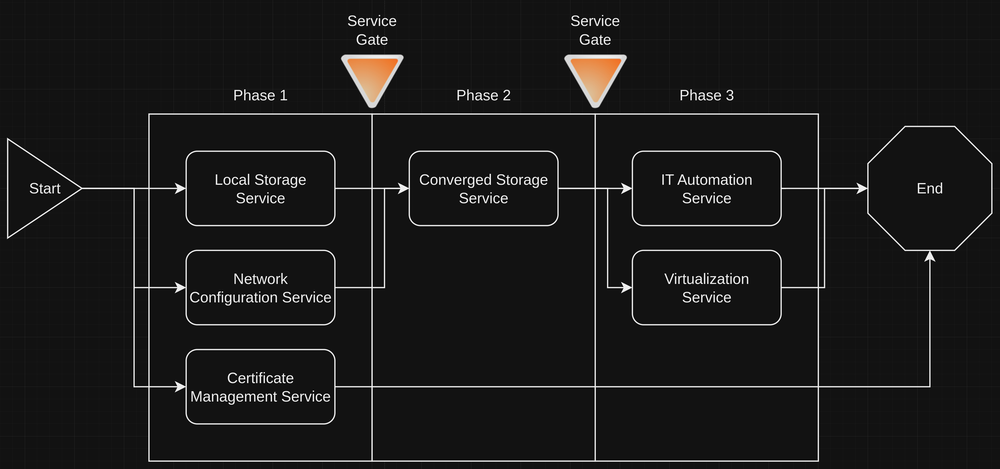

The installation waves will be broken down below, along with visualizations and supporting blocks.

### Phase 0 - Installation of Tooling and Loading Service Definitions
The first phase is a "meta" phase: preparring the platform to become responsible for managing services on itself. This involves two main steps:
1. Installing the required tooling
2. Loading in the definitions for services

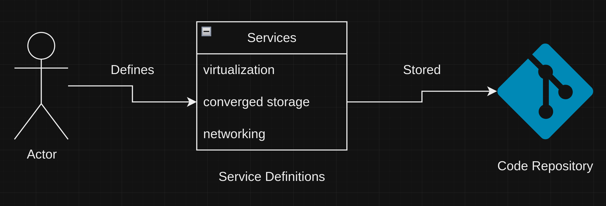

The service definitions include both the installation requirements and the configuration, if required.

In OpenShift terms, installation of these services is accomplished by installing an operator, and optionally, creating instances of software that operator is responsible for. The installed software is then consumed to drive availabiltiy of services. For more information, check [Installing Operators](../../blocks/installing-operators-yaml/).

Once the service definitions are created and stored, the next step is to have the platform install the tooling that will ultimately become responsible for managing the platform and services.

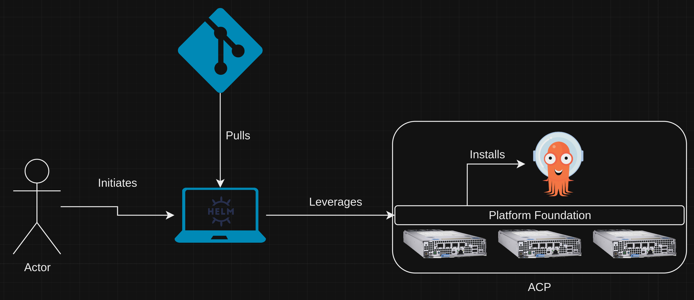

The same mechanisms that the tooling will consume to manage the platform and install services are used to install the that very tooling.

Finally, a bit of configuration is done to tell the tooling where to find the service definitions, along with installation support code, so the process can begin.

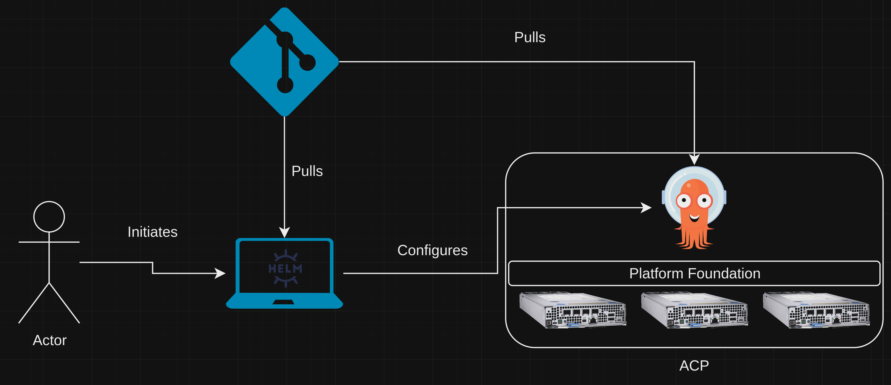

This last step hands configuration information and responsibility off to the platform so service installation and configuration can begin.

### Phase 1 Services - Local Storage, Network Configuration, and Certificate Management
The first phase encompasses three main areas, each of which is independent of one another, but may be required by other services. As with all phases going forward, the installation and configuration of these services is driven by tooling, based on input from the service definitions supplied earlier.

#### Local Storage Service
The local storage service is responsible for discovering local block devices, based on filter criteria, in the underlying hardware systems. Once the devices are discovered, they are presented in a storage class that will be consumed by the converged storage service later. This discovery and presentation is a requirement before converged storage can consume the underlying block devices.

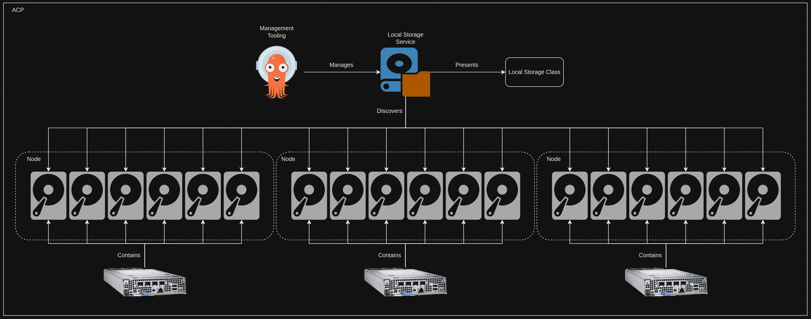

The local storage service's discovery configuration is provided as part of the service definition, provided earlier.

#### Network Configuration Service
As part of the [installation process](../non-hub-acp-install/README.md) for an ACP, a network configuration for the primary interface is provided and configured during platform initialization. However, this only encompasses the primary link used by the cluster; other links, such as the ones for storage, need to be configured.

In keeping with the mantra of declarative state management, the network configuration service takes a declared intended state for interfaces and applies the desired configuration. If the configuration is valid, success is reported. If the configuration is invalid, the configuration is rolled back, favoring connectivity and availability over bad changes.

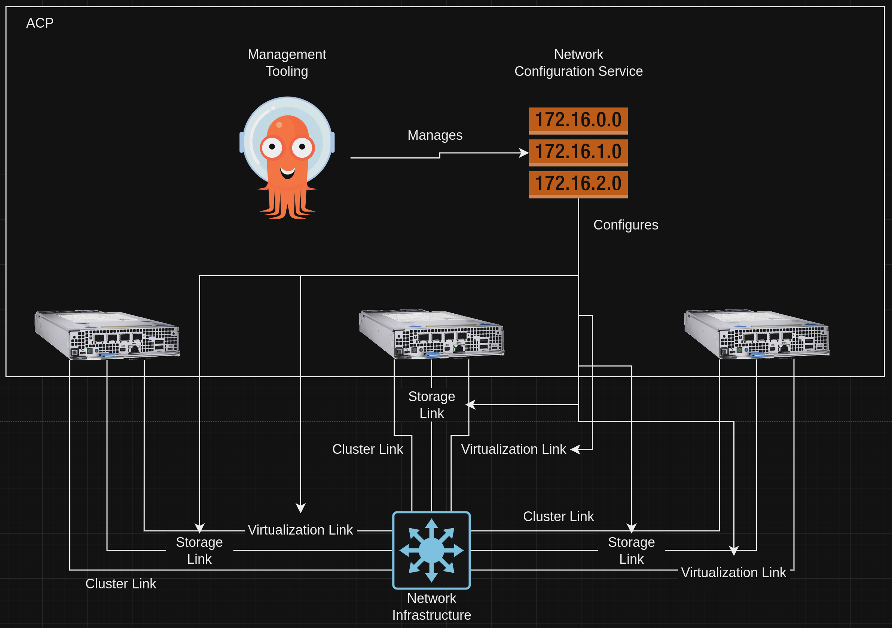

Similiar to the local storage service, the network configuration service configuration is provided as part of the service definition.

#### Certificate Management Service
Further functionality is provided by the certificate management service, which is responsible for communicating with certificate issuers or authorities, configuring resolvers, and managing the issued certificate lifecycles, including renewal and rotation. These certificates can then be applied to various components of the platform, if desired.

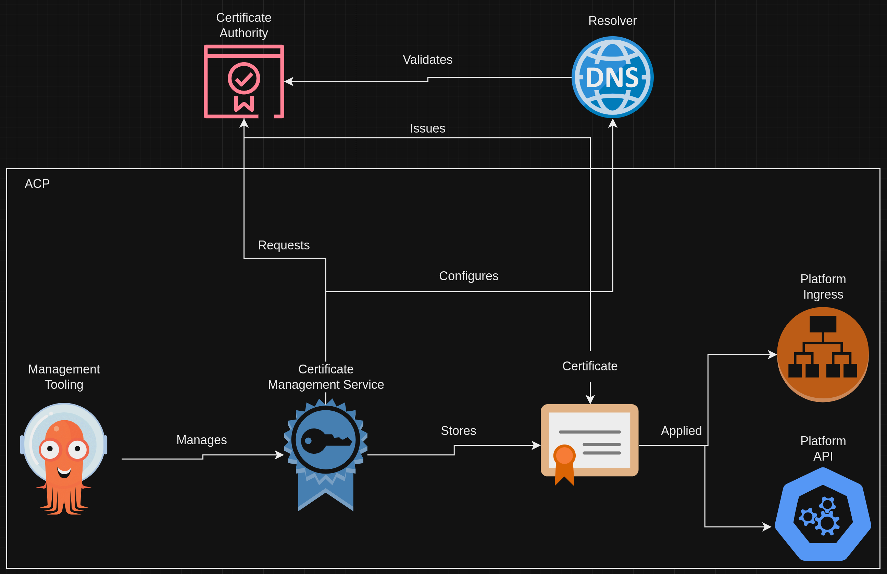

An important note: the configuration of the platform's inress and API functionality is the responsibility of the management tooling, not the the certificate management service, however they work together to achieve the desired configuration.

### Phase 2 Services - Converged Storage
The second phase consumes the network configuration service and local storage service to provide converged storage, which will be consumed by the phase 3 services.

Since this phase consumes previous services, it is the responsibility of the management tooling to wait for a healthy state of the phase 1 services, then initiate the installation and configuration of the converged storage service.

#### Converged Storage Service
The converged storage service consumes local storage devices, and presents different types of storage that can be consumed by workloads. This service is also responsible for data replication between nodes and devices, as well as snapshotting and DR functionality if desired.

This service provides storage that workloads can leverage as they are scheduled to nodes, and also rescheduled to other nodes, as the data is made available over the network. In addition, different types of storage are made available, such as filesystem volumes, block volumes, and even object store. A specialized storage class for virtual machines is also provided.

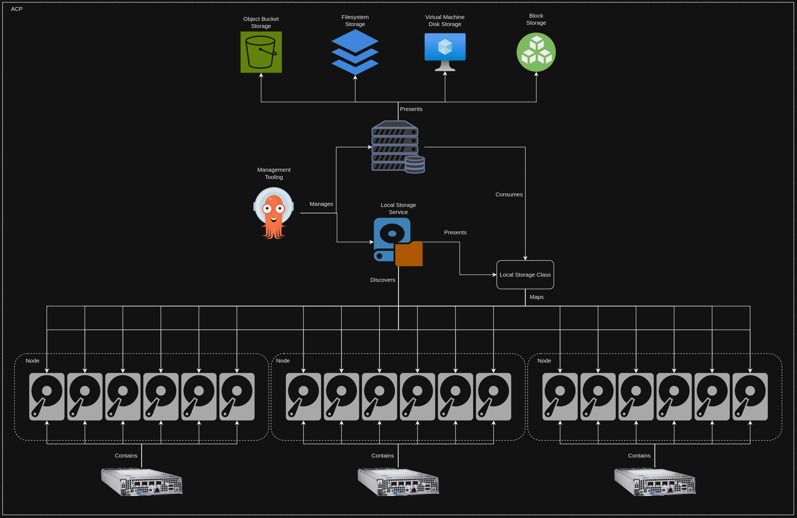

The hardware requirements of this service scale as the number of devices in each node increases, so ensure proper sizing is done to support workloads and services.

### Phase 3 Services - IT Automation and Virtualization
The last phase completes the deployment of services to the platform, transforming it from a generic cluster into a fully functional ACP. This phase consumes services out of the first two phases to achieve an operational state.

Once again, the management tooling is responsible for ensuring the health of the services in phases 1 and 2 before deploying this phase.

#### Virtualization Service
The virtualization service provides the functionality to run virtual machines on the platform alongside containerized applications. This service allows the compute and storage resources of the cluster to be aggregrated and consumed by virtual machines, nearly identically to how other hypervisors operate.

In addition, a set of pre-defined virtual machine sizes, compute profiles, and installation sources are pre-loaded by this service, to enable rapid deployment of virtual machines. Also, for highly available/multi-node ACPs, live migration is pre-configured to allow virtual machines to move between nodes as needed.

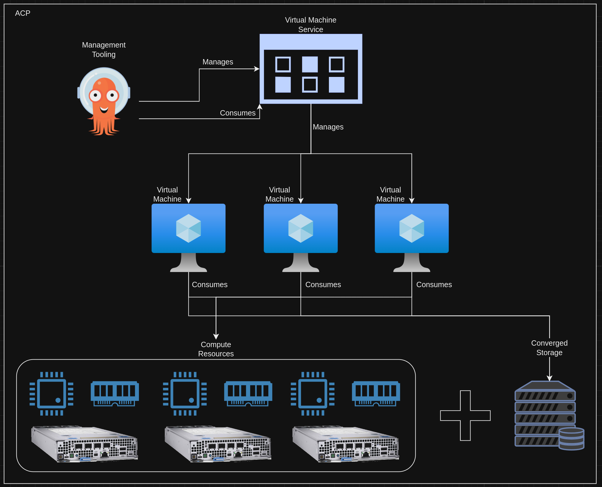

As virtual machine functionality is presented by the service, the management tooling can also be used for application deployment where virtual machines are required, consuming the virtual machine service as needed.

#### IT Automation Service
The last core service is IT automation functionality, which provides automation capabilities for application deployment, network automation, and more. This service serves dual purposes: it can provide automation functionality for resources on the cluster, such as virtual machines, and for assets outside of the cluster, such as switches and firewalls.

The intention is to use it for anything that isn't platform native, as in something not directly managed or orchestrated by the platform.

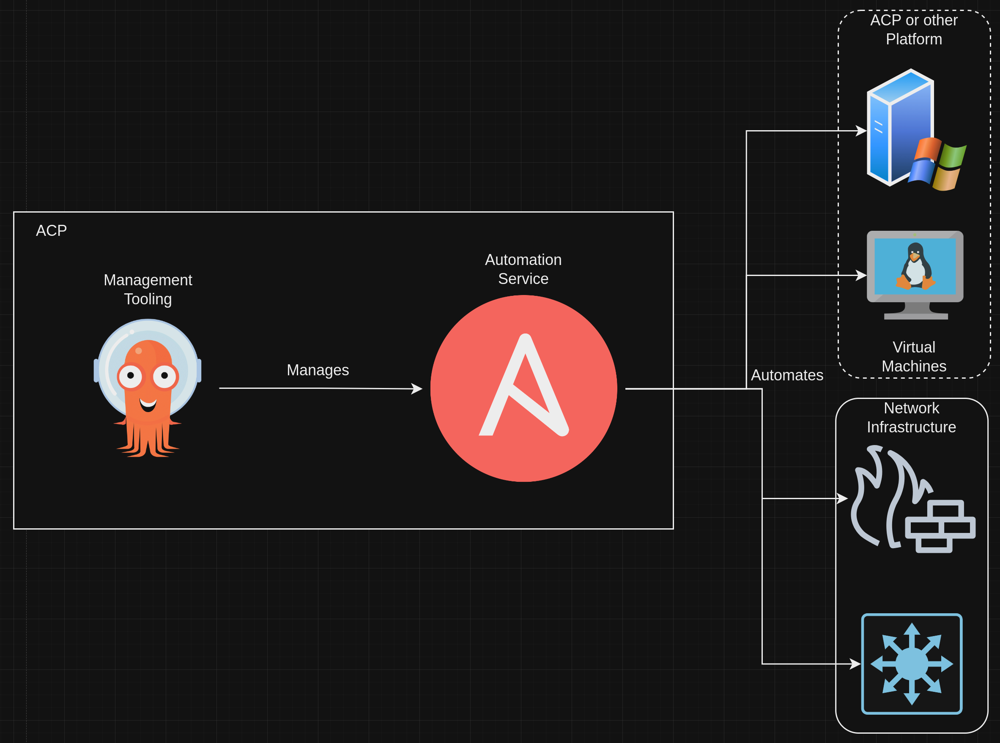

The converged storage service is consumed to support the underlying database, which maintains state.

This service provides tons of functionality, as under the covers, this service is an entire platform offering.

## Resulting Context
The resulting context is a flexible platform that provides core services for consumption as workloads are deployed. The summation of these core services is the ability to run multiple types of workloads on a common platform, instead of needing dedicated or unique compute solutions. The installation and management of these services should be driven by code, allowing for ease of deployment and ease of operations over time.

While some up-front information is gathered, the services attempt to make sane default choices, relative to the standardized ACP architecture.
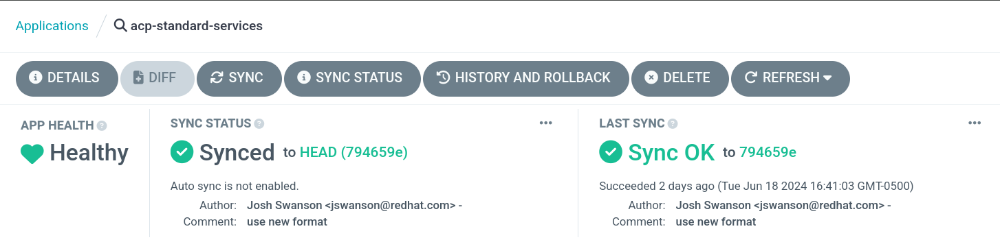

## Examples
A common example for this platform is the deployment of a virtualized workload, which requires automation to complete the installation.

This example consumes many of the offered services directly and indirectly:
| Service | Consumption Description |
| --- | --- |
| Network Configuration | Support connectivity to virtual machines |
| Local Storare | Consumed by converged storage service |
| Converged Storage | Consumed by virtual machines for data disks |
| Converged Storage | Consumed by virtualization service for virtual machine installation sources |
| Converged Storage | Consumed by IT automation service for maintaining state |
| Virtualization | Consumed by deployment tooling to deploy virtual machines |
| IT Automation | Consumed by deployment tooling to finish application deployment within virtual machines |

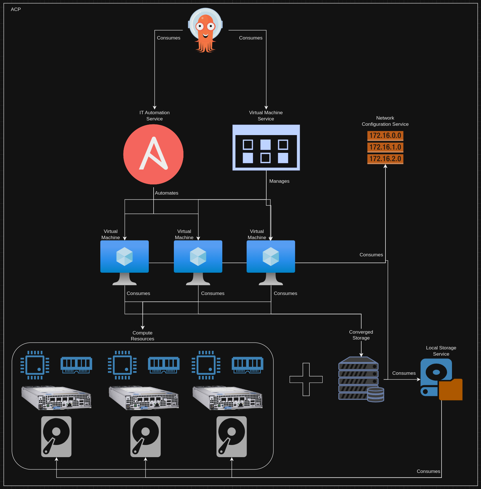

Virtualized workloads consume nearly the full suite of core services, showcasing the functionality and adaptability of a platform providing them.

## Rationale
Most end consumers of converged platforms are interested in consuming the resources and functionality of the underlying hardware to run workloads. This pattern provides an opinionated way to assemble the core platform functionality with supporting services to meet this goal: consumable resources that can be leveraged for many different types of workloads. In addition, these workloads can run alongside one another without issue.

## Footnotes

### Version
1.0.0

### Authors
- Josh Swanson (jswanson@redhat.com)