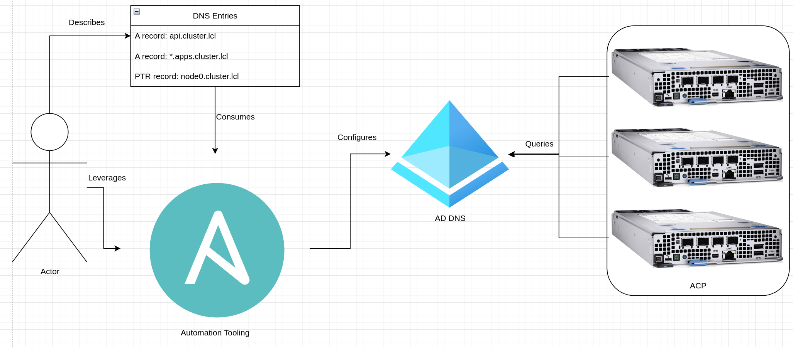

# Non-Hub Based Automated ACP Installation
This pattern gives a technical look at installing a core platfrom through an automated process, without needing a hub and hub services.

## Table of Contents
* [Abstract](#abstract)
* [Problem](#problem)
* [Context](#context)
* [Forces](#forces)
* [Solution](#solution)
* [Resulting Content](#resulting-context)
* [Examples](#examples)
* [Rationale](#rationale)

## Abstract
| Key | Value |
| --- | --- |
| **Platform(s)** | Red Hat OpenShift |
| **Scope** | Platform Installation |
| **Tooling** | <ul><li>Red Hat Ansible</li></ul> |
| **Pre-requisite Blocks** | <ul><li>[Example ACP Networking](../../blocks/example-network-config/README.md)</li><li>[DNS for ACPs](../../blocks/dns-for-acp/README.md)</li><li>[Agent Config and Install Config](../../blocks/agent-config-and-install-config/README.md)</li><li>[Installation Media Automation](../../blocks/install-media-playbook/README.md)</li><li>[Installation via Out-of-Band Management](../../blocks/install-via-oob/README.md)</li></ul> |
| **Pre-requisite Patterns** | <ul><li>[ACP Standard Architecture](../acp-standardized-architecture-ha/README.md)</li></ul> |
| **Example Application** | N/A |

## Problem
**Problem Statement:** Installing an ACP requires a few pre-requisite steps be completed to enable smooth and successful installation of the core platform. These steps should be outlined and automated to enable installation without the use of a full hub of hub services.

## Context
This pattern can be applied for installing ACPs at sites without needing the full set of hub services available, such as during evaluations or at sites that don't have full connectivity. It is intended to automate away some of the installation burden, balanced with the lack of those core services.

A few key assumptions are made:
- The intended context of the platform aligns to the [Standard HA ACP Architecture](../acp-standardized-architecture-ha/README.md)
- Sufficient hardware is available and ready for installation
- Physical connections, such as power and networking, have been made to the target hardware
- Installation content is available over the network, either from the internet or from a local mirror
- A system capable of running openshift installation and ansible command-line tooling is available

## Forces
**Time to Value:** This pattern is focused on getting a single ACP up and available at a site, as opposed to scaling the process over many sites in parallel.
**Simplicity:** This pattern favors a straightforward process leveraging direct automation over a more refined, process driven setup typically used for operating at scale.
**Resource Efficency:** The required compute capacity to run the process is significantly lower than running a hub and hub services, at the cost of a more complex day 2+ management experience.

## Solution
A standard ACP can be built by an automated process which combines the functionality of the automation tooling, along with additional resources, to drive the installation process.

An example topology, as visualized below, will be used to represent an example ACP being installed.

This process is broken down into five main pieces along specific configuration or task domains.

### Part 1 - Network Configuration
The upstream networking devices to which the bare metal systems are connected require proper configuration to allow installation. This configuration should, as much as possible, be managed by an automated process.

The intention is to represent the network as universal concepts, such as VLANs and subnets, and have the automation layer translate them into the correct terms and commands against the various network devices. This abstracts away the complexity associated with each vendor's product portfolio.

With the network described in understandable terms and the automation tooling responsible for the application against the various network devices, consistency and accuracy are more easily achieved, allowing for a successful ACP installation.

### Part 2 - DNS Setup
Highly available ACPs require external, preconfigured DNS before being able to be installed. DNS functionality is offered by many different software stacks, however the core functionality requirements remain similar across them: the ability to serve up forward records, including a wildcard record, and reverse records.

For example, Active Directory can offer DNS, and could be used to support an ACP:

In this configuration, the required DNS entries are created by the automation tooling in Active Directory DNS. Then, nodes of the ACP and others query it for those records during install and during normal operation.

### Part 3 - Defining Cluster Context
Two main configuration files drive the contextualization and installation of an ACP: `agent-config.yaml` and `install-config.yaml`. These files define and enable the installation process to complete.

Automation tooling can be used to allow key values to be represented more simply, for easier understanding, then translated in to the complex format for installation purposes.

Leverating automation tooling in this method reduces the overall barrier to entry for getting an ACP installed.

### Part 4 - Generating Installation Media
After the required cluster context has been converted into installation files, a different set of CLI-based tools are leveraged to create installation media. These tools consume the created files and generate bootable images that bare metal systems can be provisioned with.

These tools also validate the installation files created earlier as to ensure success of installation.

Using automation can coordinate calling the appropriate tooling at the correct time, and ensure all tooling is referencing the correct installation files for the desired ACP.

### Part 5 - Automated Install via Out-of-Band Management
After the installation media is created, it can be presented to the target installation systems through a few different methods. A common approach is to copy the tooling to a system that can be accessed by the target installation devices over a network. The installation media could also be written to portable storage and directly connected to the target devices.

Most server grade devices feature out of band management that can be used to preform the installation remotely, and to further ease the process, automation tooling can leverage these out of band management interfaces to configure and run the install.

## Resulting Context
The resulting context is the ability to consistently install ACPs onto target hardware, leveraging automation tooling. Once the process is finished, an ACP, aligned to the HA ACP architecture, is installed and ready to start being utilized.

## Examples

## Rationale

## Footnotes

### Version
1.0.0

### Authors
- Josh Swanson (jswanson@redhat.com)