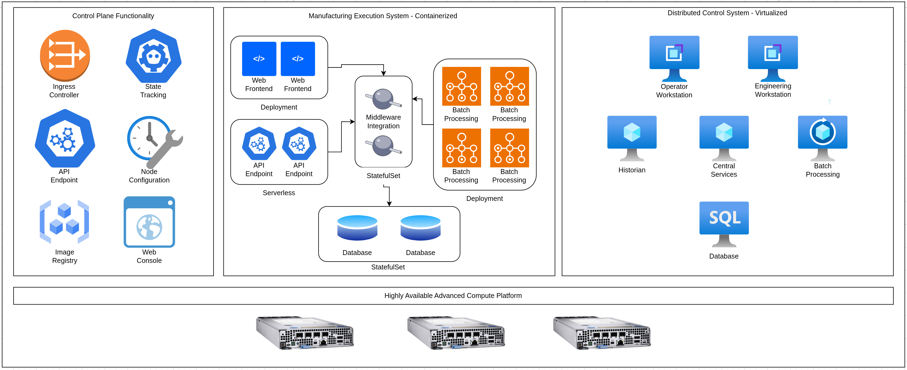
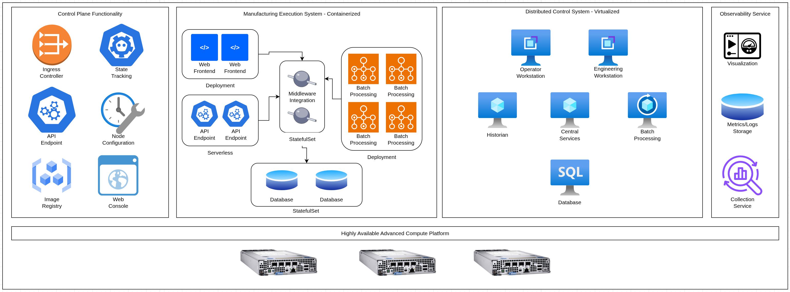
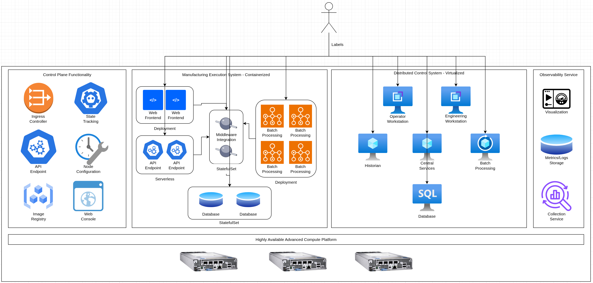
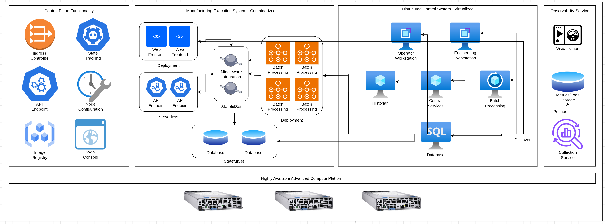
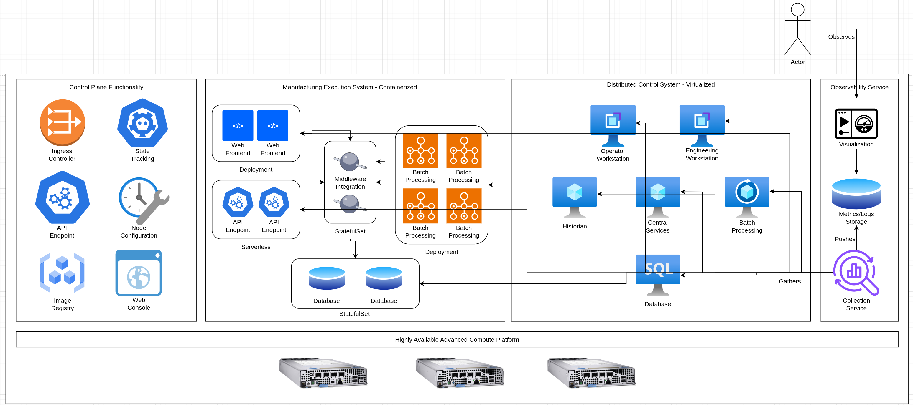
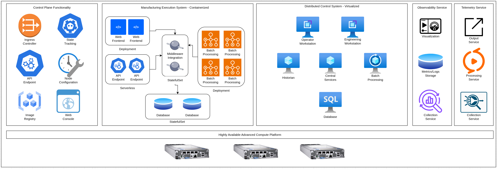
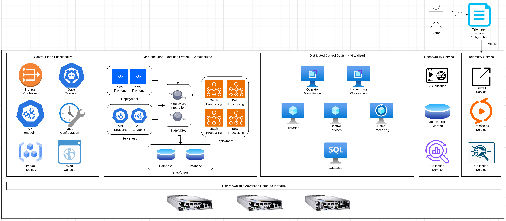
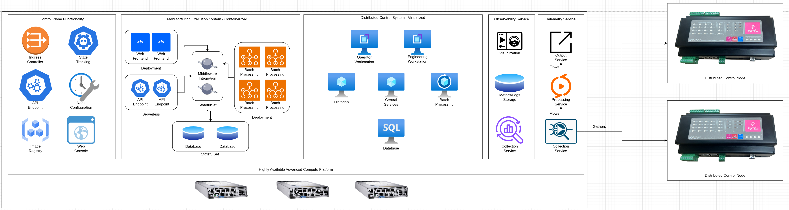
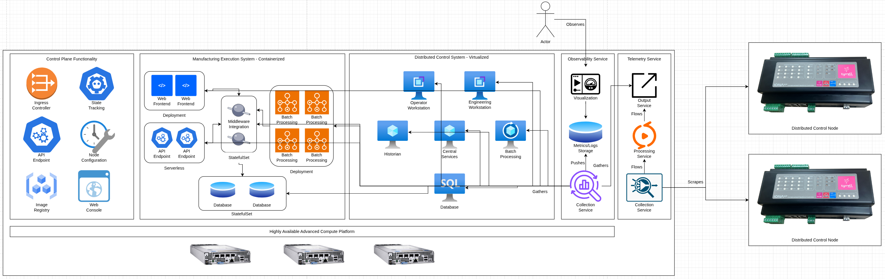
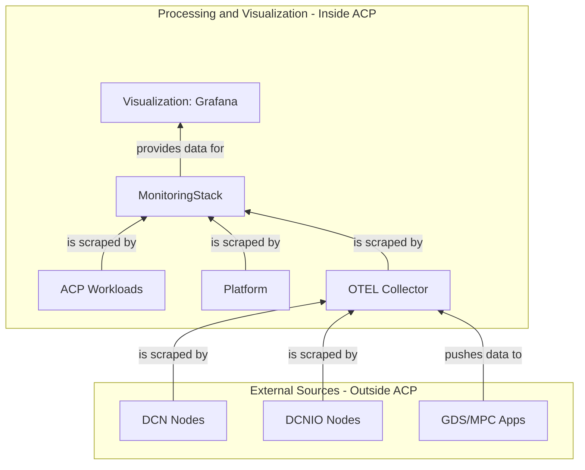

# Observability and Telemetry on an ACP
This pattern outlines a solution for [observability](https://opentelemetry.io/docs/concepts/observability-primer/#what-is-observability) and telemetry on an ACP, and for DCNs (and related devices) within the same network boundry as an ACP. It can be used as part of a enterprise-wide observability and telemtry approach, however this pattern will focus on the ACP and "lower" layers within a single site.

ACPs provide a level of observability and telemetry out-of-the-box, with the main focus being to track the health and performance of the platform itself. This can be extended to additional workloads running on the platform for deeper visibility and better efficiency when troubleshooting.

In addition, ACPs can provide [OpenTelemetry](https://opentelemetry.io/) aligned functionality for workloads on the platform, as well as workloads or devices running external to the platform, but are reachable by the platform.

## Table of Contents
* [Abstract](#abstract)
* [Problem](#problem)
* [Context](#context)
* [Forces](#forces)
* [Solution](#solution)
* [Resulting Content](#resulting-context)
* [Examples](#examples)
* [Rationale](#rationale)

## Abstract
| Key | Value |
| --- | --- |
| **Platform(s)** | Advanced Compute Platform |
| **Scope** | Installation |
| **Tooling** | <ul><li>Red Hat Advanced Cluster Management</li></ul> |
| **Pre-requisite Blocks** | N/A |
| **Pre-requisite Patterns** | <ul><li>[ACP Standardized Architecture - Highly Available](../acp-standardized-architecture-ha/README.md)</li><li>[ACP Standardized Architecture - Non-Highly Available](../acp-standardized-architecture-non-ha/README.md)</li></ul> |
| **Example Application** | N/A |

## Problem
**Problem Statement:** ACPs provide a full suite of hosting and automation capabilities to support many different types of workloads, however a key element to proper operation of a platform or system is visibility into the performance, metrics, and logs of the components of the system. In addition, metrics, logs, and traces are often generated non-standard formats, making them hard to visualize and correlate.

ACPs should be able to provide the functionality to ingest, normalize, transform, store, and visualize key information about the platform itself, along with workloads hosted on the platform. In addition, the platform should be able to scrape or ingest metrics, logs, and traces from other elements of a system, such as DCNs or their applications, assuming there is sufficient network connectivity. 

## Context
This pattern is best applied when there is a need for visibilty into the performance of a system, when an ACP is hosting some or all of the required components. This pattern's soluction provides deeper insights into overall performance, and can help with troubleshooting, right-sizing, and other operational tasks, which often require a holistic view of a system and the components.

This pattern focues on the "infrastructure" pieces provided by an ACP. Metrics, logs, and traces are often functions of  operating systems, platforms, and applications, with an ACP acting as the centralized place to collect, store, and visualize these metrics. Optionally, normalizations, filtering, and other common operations for incoming metrics, logs, and traces can be handled by the ACP, offloading the requirement from smaller, less resource-heavy devices and platforms.

A few key assumptions are made:
- The intended context of the platform aligns to the [Standard HA ACP Architecture](../acp-standardized-architecture-ha/README.md), the [Standard Non-HA ACP Architecture](../acp-standardized-architecture-non-ha/README.md), or any valid ACP architecture as needed.
- The standard set of [ACP Services](../rh-acp-standard-services/README.md) are available for consumption.
- Connectivity from the various devices and applications to/from the ACP is available when external sources of information is desired.

Observability and telemetry are often sprawling and complicated topics. This pattern will provide an opinionated look, using some base examples, however the functionality outlined here is highly extensable. This pattern is not intended to capture every possible scenario, instead, it provides the foundational base from which a proper system-level view can be built.

## Forces
- **Highly Automated:** This pattern outlines how an ACP installs and manages the various components and pieces required to build a full obersability and telemetry stack, with all elements managed by the ACP itself.
- **Simplicity:** This pattern's solution is designed to allow for non-IT personnel to state the need for various components within a full observability and telemetry stack, and allow for the platform to install and manage those components without needing to understand the full install/lifecycle process.
- **Scalablility:** This pattern's solution allows for a large amount of information to be ingested and processed by the platform, and even for it to be deployed in a highly-available state, according to requirements.
- **Customization:** This pattern's solution allows for full customization of the various components within a obersvability and telemetry stack, allowing for the ingestion, storage, and visualization of metrics, logs, and traces, with full customization of the ingestion and visualization processes.

## Solution
The solution is to leverage two of an ACP's core services to provide a full stack solution:

| Service | Description |
| --- | --- |
| Telemetry | Provides functionality around gathering, modifying, curating, and forwarding metrics, logs, and more for storage and visualization, aligned to the [OpenTelemetry framework](https://opentelemetry.io/) |
| Observability | Provides the ability to deploy platform-managed monitoring and visualizaton stacks used to automatically capture, store, and visualize system information |

These two core services have some overlapping functionality, but in this solution are used in conjunction with each other to provide a holistic approach to building an obervability and monitoring stack.

When leveraged together, these services compliment each other, allowing for metrics, logs, and traces from within the platform, and from external to the platform, to be collected, aggregrated, normalized, stored, and visualized.

The Telemetry service is aligned to the OpenTelemetry standard, and allows for centralized aggregration and standardization of information from the various components of a system.

In this example, the OTel Collector and Observability Frontends/APIs are hosted and managed by the ACP.

The Observability service provides the storage and visualization services to allow for ingestion of the normalized data from the telemetry service, allowing for system-wide visualization and drill-down functionality when needed. In addition, it can automatically gather metrics, logs, and other information from workloads running on the platform automatically, which provides easy-to-consume functionality when deploying workloads to an ACP.

The [Examples](#examples) section will outline a few common scenarios that leverage these standard ACP services.

## Examples
This section of this pattern will focus on two key use cases for the solution of this pattern:
- Observability of workloads running on the ACP
- Combining observability and telemetry for workloads on the ACP and external to the ACP

### Observability of Workloads Running on the ACP
The observability service provides easily-consumed functionality around gathering and displaying information, such as metrics, for workloads running on the platform. 

For example, consider the following base ACP, which is hosting virtualized and containerized workloads that form a full system:

To gain further insights into the system, two actions are required:
1. The Observability service is enabled on the platform - this service can be enabled at installation time, or later on. It also can be disabled if it's no longer needed.

2. The various workloads that compromise the system are tagged so the Observability service starts collection metrics.

Once the workloads are tagged, the Observability service will automatically start gathering metrics and information about the workloads, and store that information.

Now, the gathered information can be visualized:

### Combining Observability and Telemetry for Workloads on the ACP and External to the ACP
The telemetry service allows for collection, processing, aggregration, filtering, and forwarding of metrics, logs, and traces from workloads both internal and external to the ACP, as long as networking connectivity is available.

Similar to the Telemetry service, two steps are needed to enable this service and leverage its functionality:
1. Enablement of the Telemetry service - this service can be enabled at installation time, or later on. It can also be disabled if it's no longer needed.

2. Applying a configuration to the Telemetry service - this configuration tells the Telemetry service where to start gathering metrics from, and also to optionally listen for incoming logs from external sources.

Once the configuration is applied, the platform automatically deploys (or redeploys) the various components of the telemetry service, which then begin operating according to the configuration.

In this example, the configuration contained information about two external DCNs which should be scraped for metrics. Once the configuration was applied, the collection service began scraping metrics from the DCNs. These metrics then flowed through the processing service, and became avaiable for consumption via the output service.

To integrate the Observability and Telemetry services, a label is added to the Telemetry's output service, which the Observability service discovers, and begins gathering metrics from - allowing for a full flow from the external DCNs to the visualization function of the Observability service, faciliated by the Telemetry service.

This can be further extended to include logs or traces from applications, or from other external sources. For example, this setup scrapes and ingests metrics and logs from workloads and embedded devices to gain further insights into the overall system:

This now allows for insights and visibility into a full system, even if parts of the system are external to the ACP.

## Rationale
The rationale for this pattern is to address the need for visibility into complex systems: their performance, steady state, and overall health. The various infrastructure components that faciliate this should be managed by the platform itself, and be extensible to both external data sources, as well as to new or evolving workloads on the platform over time. This pattern's solution addresses these concerns using standard services available on an ACP.

## Footnotes

### Version
1.0.0

### Authors
- Josh Swanson (jswanson@redhat.com)