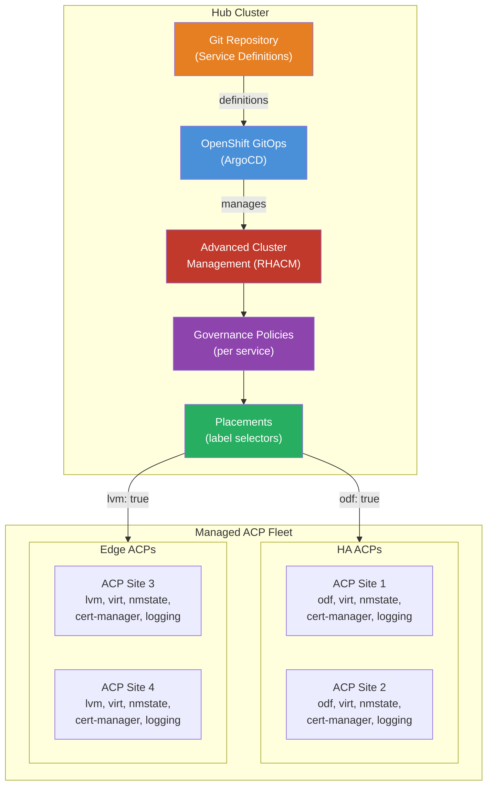
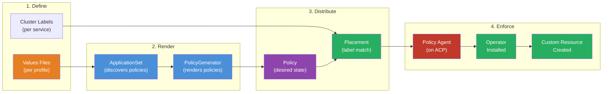
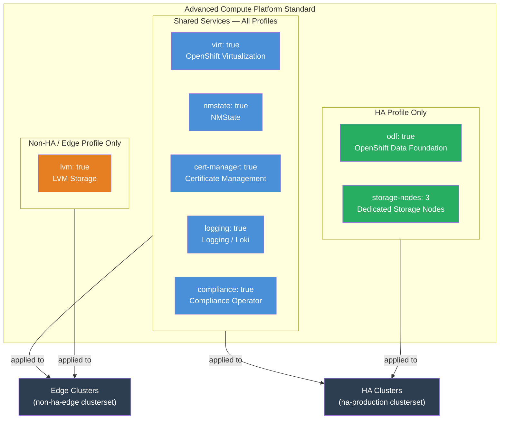
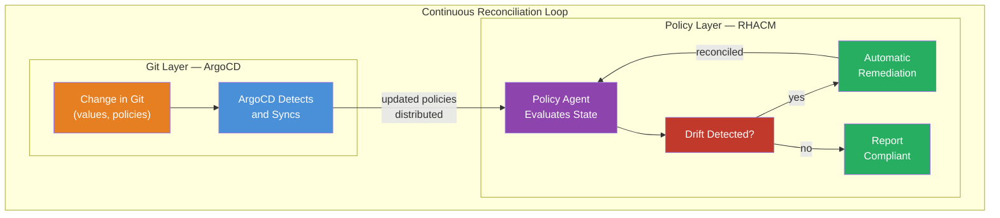
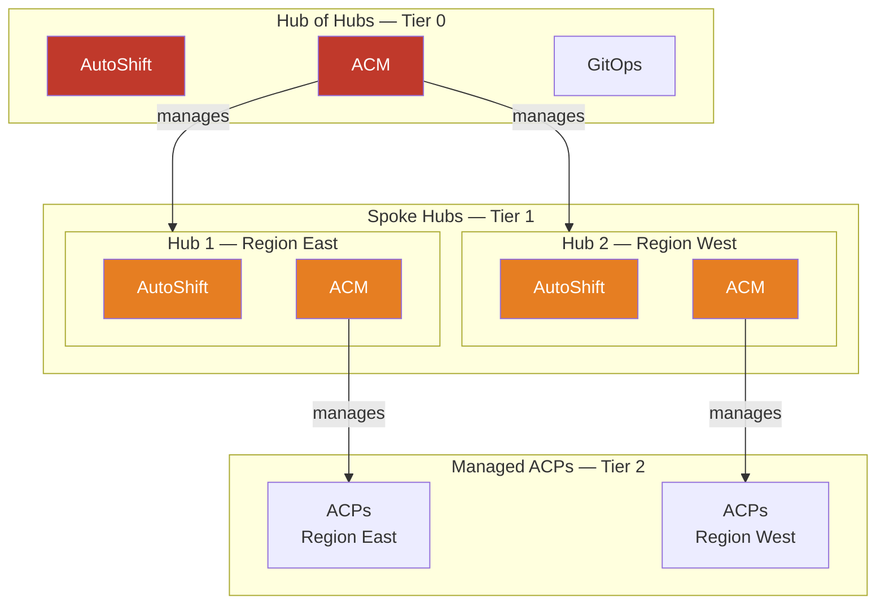

# Policy-Driven Deployment of ACP Standard Services from a Hub
This pattern outlines a solution for deploying and enforcing the standard set of ACP services from a centralized hub using a policy-driven, label-based model. Rather than individually configuring each ACP's core services, a hub defines the desired service portfolio as policies, which are then automatically targeted to and enforced on ACPs based on their assigned profiles.

This approach enables fleet-wide consistency, site-specific customization, and continuous compliance — all managed from a central point, with responsibility for service deployment and reconciliation delegated to the ACPs themselves.

## Table of Contents
* [Abstract](#abstract)
* [Problem](#problem)
* [Context](#context)
* [Forces](#forces)
* [Solution](#solution)
* [Resulting Context](#resulting-context)
* [Examples](#examples)
* [Rationale](#rationale)

## Abstract
| Key | Value |
| --- | --- |
| **Platform(s)** | Advanced Compute Platform |
| **Scope** | Service Deployment, Fleet Management |
| **Tooling** | <ul><li>Red Hat Advanced Cluster Management for Kubernetes</li><li>Red Hat OpenShift GitOps</li><li>AutoShift</li></ul> |
| **Pre-requisite Blocks** | <ul><li>[Deploying ACP Standard Services with AutoShift](../../blocks/autoshift-acp-services/README.md)</li></ul> |
| **Pre-requisite Patterns** | <ul><li>[ACP Standardized Architecture - Highly Available](../acp-standardized-architecture-ha/README.md)</li><li>[ACP Standardized Architecture - Non-Highly Available](../acp-standardized-architecture-non-ha/README.md)</li><li>[Hub Standard Services](../rh-hub-standard-services/README.md)</li><li>[ACP Standard Services](../rh-acp-standard-services/README.md)</li><li>[Automated ACP Installs from a Hub](../automated-acp-install-from-hub/README.md)</li></ul> |
| **Example Application** | N/A |

## Problem
**Problem Statement:** After ACPs are installed at distributed sites, each platform requires a consistent set of core services — virtualization, storage, networking configuration, certificate management, observability, and more — as outlined in the [ACP Standard Services](../rh-acp-standard-services/README.md) pattern. Installing and maintaining these services individually on each ACP is manual, error-prone, and does not scale.

Organizations face several challenges:
- **Inconsistency across sites:** Without a centralized deployment mechanism, service versions, configurations, and installation states drift between ACPs, making support and troubleshooting difficult.
- **Scaling complexity:** As the number of ACPs grows from a handful to hundreds or thousands, the manual effort to install and maintain services grows linearly with each site.
- **Profile variance:** Not all ACPs are identical — highly available multi-node clusters need different storage (ODF) than compact or single-node edge deployments (LVM). Managing these differences per-site adds significant complexity.
- **Compliance drift:** Services can be manually changed, removed, or misconfigured on individual ACPs. Without continuous enforcement, platform drift goes undetected until an outage or audit.
- **Version control:** Operator versions, channels, and update policies must be managed consistently across the fleet, with the ability to pin versions for stability or allow automatic updates as appropriate.

A hub should be able to declare the desired service portfolio for classes of ACPs, automatically deploy those services, and continuously enforce the desired state — without requiring per-site intervention.

## Context
This pattern builds on the [Hub Standard Services](../rh-hub-standard-services/README.md) pattern, which establishes the hub's core management capabilities, and the [ACP Standard Services](../rh-acp-standard-services/README.md) pattern, which defines what services an ACP should offer. This pattern connects the two: how the hub deploys and enforces those ACP services at scale.

A few key assumptions are made:
- A hub cluster is operational with the standard [Hub Services](../rh-hub-standard-services/README.md), including Red Hat Advanced Cluster Management (RHACM) and Red Hat OpenShift GitOps.
- One or more ACPs have been installed, either manually or via the [Automated ACP Install](../automated-acp-install-from-hub/README.md) pattern, and are registered as managed clusters in RHACM.
- Network connectivity between the hub and ACPs is available, though it does not need to be persistent — ACPs can operate autonomously during connectivity interruptions.
- The set of services to deploy on ACPs aligns with the [ACP Standard Services](../rh-acp-standard-services/README.md), though additional services can be added.

### Key Concepts
This pattern relies on two foundational concepts from RHACM:

**Governance Policies:** RHACM policies define the desired state of a resource on a managed cluster. Policies are created on the hub and distributed to managed clusters based on placement rules. Each policy specifies what should exist (e.g., an operator subscription, a custom resource) and whether violations should be reported only ("inform") or automatically remediated ("enforce").

**Placement and Labels:** RHACM Placement resources use label selectors to determine which managed clusters a policy targets. Clusters are assigned labels that describe their profile (e.g., `virt: true`, `odf: true`), and policies match against those labels. This decouples "what to deploy" from "where to deploy it."

## Forces
- **Consistency at Scale:** The same service definitions should be applied identically across all ACPs of a given profile, regardless of how many sites exist. Changes to the service definition should propagate automatically.
- **Profile-Based Targeting:** Different ACP architectures require different service configurations. The solution must support multiple profiles (HA, non-HA, edge, GPU-enabled) without requiring separate management pipelines.
- **Continuous Enforcement:** Services should not only be deployed, but continuously reconciled. If a service is modified or removed on an ACP, the hub should detect and remediate the drift automatically.
- **Delegated Responsibility:** While the hub defines what services should exist, the ACPs themselves should be responsible for the actual deployment and lifecycle of those services. This ensures ACPs remain functional during hub connectivity interruptions.
- **Version Control:** Operators should be deployable at specific versions with controlled upgrade paths, or allowed to follow automatic channel-based upgrades, configurable per-profile or per-cluster.
- **Auditability:** The current state of service deployment across the fleet should be visible from the hub, with clear compliance status per policy, per cluster, and per profile.

## Solution
The solution uses a policy-driven model where the hub defines the desired ACP service portfolio as RHACM governance policies, each targeting clusters based on labels. An Infrastructure-as-Code (IaC) framework — [AutoShift](https://github.com/auto-shift/autoshiftv2) — provides the structure, templating, and lifecycle management for these policies, using OpenShift GitOps to declaratively manage RHACM.

### Architecture Overview



### How It Works
The flow from service definition to deployed service follows this path:



1. **Define:** Service profiles are defined in values files. Each profile specifies which services to enable via labels (e.g., `virt: true`, `odf: true`) along with operator subscription details (channel, source, version).

2. **Render:** An ArgoCD ApplicationSet discovers all policy directories in the Git repository. For each directory, the RHACM PolicyGenerator renders the service's desired state into governance policies, with placement rules based on the labels.

3. **Distribute:** RHACM distributes each rendered policy to managed clusters whose labels match the policy's placement selector. A policy for virtualization targets clusters with `virt: true`; a policy for ODF targets clusters with `odf: true`.

4. **Enforce:** On each targeted ACP, the RHACM policy agent evaluates the policy and applies the desired state — installing the operator, creating the custom resource, and continuously reconciling any drift.

### Label-Based Profile Model
The label model is what enables different ACP profiles to receive different services from the same set of policies:



Each policy has its own placement with a label selector. Shared services use labels present on all profiles. Profile-specific services use labels that only appear on the relevant profiles. Adding a new profile is as simple as creating a new values file with the appropriate labels — no changes to policies or placements are needed.

### Policy Standards and Governance
Policies are grouped under configurable ACM Governance standards, providing organizational structure in the RHACM console:

| Standard | Scope | Example Policies |
| --- | --- | --- |
| **Advanced Compute Platform Hub** | Hub infrastructure | ACM, ACS, GitOps, DNS, MetalLB, cluster-install |
| **Advanced Compute Platform** | Managed ACP services | Virtualization, storage (ODF/LVM), NMState, cert-manager, logging, compliance |

These standards appear as filterable groupings in the RHACM Governance dashboard, giving operators a single-pane view of compliance across the fleet.

### Visualization and Fleet-Wide Visibility
A key advantage of the policy-driven approach is centralized visibility into the state of every service on every ACP, all from the hub. The RHACM Governance dashboard provides multiple levels of insight:

```
┌──────────────────────────────────────────────────────────────┐
│                    ACM Governance Dashboard                   │
│                                                              │
│  Standard: Advanced Compute Platform                         │
│  ┌──────────────────────────────┬────────────┬────────────┐  │
│  │ Policy                       │ Clusters   │ Status     │  │
│  ├──────────────────────────────┼────────────┼────────────┤  │
│  │ openshift-virtualization     │ 12/12      │ Compliant  │  │
│  │ openshift-data-foundation    │ 8/8        │ Compliant  │  │
│  │ lvm                         │ 4/4        │ Compliant  │  │
│  │ nmstate                     │ 12/12      │ Compliant  │  │
│  │ cert-manager                │ 12/12      │ Compliant  │  │
│  │ logging                     │ 12/12      │ Compliant  │  │
│  │ compliance-operator         │ 11/12      │ VIOLATION  │  │
│  └──────────────────────────────┴────────────┴────────────┘  │
│                                                              │
│  1 policy violation on acp-site-7                            │
│  compliance-operator: Subscription not found                 │
└──────────────────────────────────────────────────────────────┘
```

| View | What It Shows | Use Case |
| --- | --- | --- |
| **Standard view** | All policies grouped by standard, with aggregate compliance | Fleet-level service health at a glance |
| **Cluster view** | All policies targeting a specific cluster, with individual compliance status | Per-site service audit |
| **Policy view** | A single policy's compliance across all targeted clusters | Service-specific rollout tracking |
| **Category/Control view** | Policies grouped by compliance framework categories (e.g., CM Configuration Management) | Regulatory audit preparation |

This visibility is not a separate dashboard or tool — it is built into RHACM and populated automatically as policies are deployed. Every service that AutoShift manages is visible as a policy, and every policy has a compliance status per cluster, providing a complete picture of the fleet's service state at all times.

In hub-of-hubs deployments, the Multicluster Global Hub extends this visibility across tiers — the top hub can see policy compliance from all spoke hubs and their managed ACPs, providing a single-pane view across the entire organization.

### Continuous Enforcement and Reconciliation
A critical characteristic of this approach is **constant reconciliation**. Policies are not applied once and forgotten — they are continuously evaluated and enforced. This happens at multiple layers:



| Layer | Reconciliation Behavior |
| --- | --- |
| **ArgoCD (GitOps)** | Continuously watches the Git repository for changes. When a values file or policy definition changes, ArgoCD automatically syncs the ApplicationSet, re-rendering and distributing updated policies. Self-heal ensures that if someone manually modifies a policy object on the hub, ArgoCD restores it to the Git-defined state. |
| **RHACM Policy Agent** | On each managed ACP, the policy agent continuously evaluates the enforced policies against the cluster's actual state. If an operator is removed, a custom resource is modified, or a configuration drifts from the policy-defined state, the agent automatically remediates — reinstalling the operator, recreating the resource, or correcting the configuration. |
| **Operator Lifecycle Manager** | On the ACP itself, OLM ensures the installed operator stays running and healthy. If an operator pod crashes, OLM restarts it. Combined with the RHACM policy ensuring the subscription exists, this creates a multi-layer self-healing stack. |

This means that at any given time, the actual state of every ACP in the fleet is being actively reconciled toward its defined state — from the Git repository through the hub and down to the individual ACP. Manual changes on an ACP are automatically reverted, preventing configuration drift across the fleet.

Each policy operates in one of two modes:

| Mode | Behavior | Use Case |
| --- | --- | --- |
| **Enforce** | Detects and automatically remediates drift | Production — services are restored if modified or removed |
| **Inform** | Detects and reports drift without remediating | Dry-run / staging — verifies what would be deployed without making changes |

A fleet-wide dry-run mode is available for initial rollouts or testing:
```yaml
autoshift:
  dryRun: true
```

When dry run is enabled, all policies switch to inform mode, allowing operators to review what the policies would deploy before committing to enforcement.

### Operator Version Control
Operators can be deployed at specific versions or allowed to upgrade automatically:

| Strategy | Configuration | Behavior |
| --- | --- | --- |
| **Automatic** | Set channel only (e.g., `virt-channel: stable`) | Operator follows channel upgrades automatically |
| **Pinned** | Set channel and version (e.g., `virt-version: kubevirt-hyperconverged.v4.19.0`) | Operator is locked to the specified version; upgrades require a values change |

Pinning is useful for production environments that require controlled upgrade windows, while automatic upgrades suit development or staging environments.

### Hub-of-Hubs Scaling
For organizations with hundreds or thousands of ACPs, the solution supports a hub-of-hubs topology:



Each tier operates its own AutoShift instance independently. The Hub of Hubs treats spoke hubs as managed clusters, deploying their infrastructure. Each spoke hub then independently manages its own ACPs. Policy standards can be named per-tier (e.g., "Region East Platform") for clear organizational separation.

The Multicluster Global Hub syncs policy status across tiers, providing fleet-wide visibility from the top hub without requiring shared configuration.

## Resulting Context
After implementing policy-driven ACP service deployment, organizations gain:

- **Fleet-wide consistency** — every ACP of a given profile runs the same services at the same versions, with no per-site manual configuration
- **Continuous compliance** — drift is detected and remediated automatically, with visibility into compliance status from the hub
- **Profile-based flexibility** — different ACP architectures receive appropriate services without requiring separate management workflows
- **Scalable operations** — adding a new ACP to the fleet requires only assigning it to a clusterset; its services are deployed automatically based on its profile labels
- **Controlled upgrades** — operator versions can be managed fleet-wide from a single values change, with dry-run validation before enforcement
- **Auditable state** — the RHACM Governance dashboard provides real-time visibility into which services are deployed, compliant, or drifting across the entire fleet

The hub becomes the single source of truth for what ACP services should look like, while the ACPs remain responsible for running those services locally — preserving autonomy during connectivity interruptions.

## Examples

### Example 1: Adding a New ACP to the Fleet
When a new ACP is installed and registered with the hub, it requires only a clusterset assignment and label application to receive its full service portfolio:

```bash
oc label managedcluster new-acp-site-5 \
  cluster.open-cluster-management.io/clusterset=ha-production --overwrite
```

Once labeled, RHACM automatically matches the ACP against all policies whose placement selectors match the `ha-production` clusterset's labels. Within minutes, the full suite of services — virtualization, ODF storage, NMState, cert-manager, logging, and compliance — begins deploying on the new ACP, with no additional configuration required.

### Example 2: Rolling Out a New Service Across the Fleet
An organization decides to deploy the Compliance Operator across all managed ACPs. A single change to the shared values adds the service:

```yaml
managedClusterSets:
  ha-production:
    labels:
      compliance: 'true'
      compliance-channel: stable
      compliance-source: redhat-operators
      compliance-source-namespace: openshift-marketplace
      compliance-subscription-name: compliance-operator
```

After committing this change and syncing:
1. ArgoCD detects the change and re-renders the ApplicationSet
2. The compliance policy's placement matches all clusters with `compliance: true`
3. RHACM distributes the policy to all matched ACPs
4. Each ACP's policy agent installs the Compliance Operator

The same process works for removing a service (removing the label) or changing a version (updating the version label).

### Example 3: Controlled Operator Upgrade
An organization needs to upgrade OpenShift Virtualization across the fleet but wants to validate on a subset first:

**Step 1:** Pin the new version on a single test cluster:
```yaml
clusters:
  test-acp:
    labels:
      virt-version: 'kubevirt-hyperconverged.v4.20.0'
```

**Step 2:** After validation, apply to the full clusterset:
```yaml
managedClusterSets:
  ha-production:
    labels:
      virt-version: 'kubevirt-hyperconverged.v4.20.0'
```

**Step 3:** Monitor compliance from the RHACM Governance dashboard — all ACPs should show compliant once the upgrade completes.

## Rationale
The rationale for this pattern is to address the operational challenge of managing ACP services at scale, driven by:

1. **Operational efficiency:** Manually installing and maintaining services on individual ACPs does not scale. A centralized, policy-driven approach reduces the per-site effort to near-zero, while providing stronger guarantees about consistency and compliance.

2. **Separation of concerns:** The hub defines "what should be deployed" through policies and profiles. The ACPs handle "how to deploy it" through their local policy agents and operators. This separation aligns with the ACP architecture's emphasis on local autonomy with centralized oversight.

3. **Change management:** By expressing the service portfolio as code in a Git repository, all changes are version-controlled, auditable, and reviewable. Dry-run mode enables safe validation of changes before enforcement, and per-cluster overrides enable controlled rollouts.

4. **Platform completeness:** This pattern connects the [Hub Standard Services](../rh-hub-standard-services/README.md) (which establishes the hub's management capabilities) with the [ACP Standard Services](../rh-acp-standard-services/README.md) (which defines what services ACPs should run). It provides the operational mechanism to bridge that gap at scale.

## Footnotes

### Version
1.0.0

### Authors
- Josh Swanson (jswanson@redhat.com)
