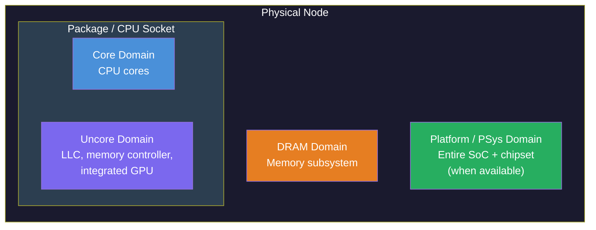
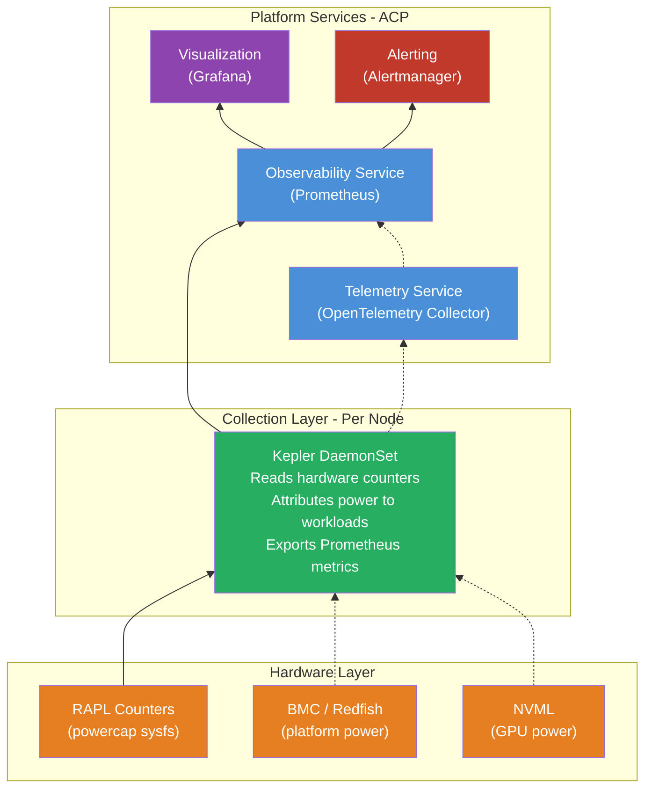
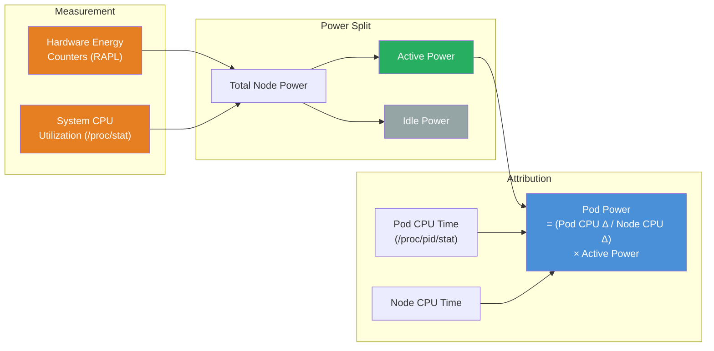
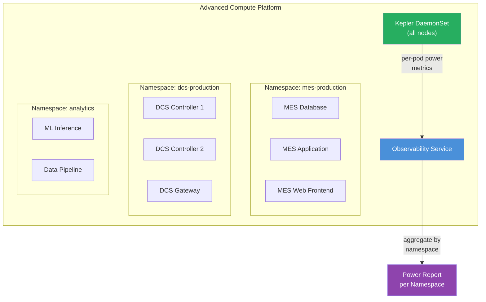
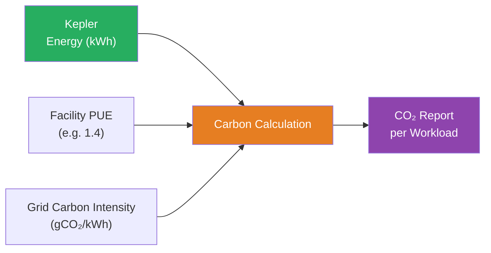

# Power Utilization Tracking of Workloads on an ACP
This pattern outlines a solution for tracking power utilization of workloads running on an Advanced Compute Platform. It enables per-pod, per-namespace, and per-node visibility into power consumption, providing the data necessary to optimize energy efficiency, attribute energy costs, and support sustainability initiatives.

ACPs, being based on Red Hat OpenShift and running on bare-metal hardware, are uniquely positioned to leverage hardware-level power telemetry and attribute that power consumption to individual workloads. This pattern covers the architecture for collecting, attributing, storing, and visualizing power data across the platform.

## Table of Contents
* [Abstract](#abstract)
* [Problem](#problem)
* [Context](#context)
* [Forces](#forces)
* [Solution](#solution)
* [Resulting Context](#resulting-context)
* [Examples](#examples)
* [Rationale](#rationale)

## Abstract
| Key | Value |
| --- | --- |
| **Platform(s)** | Advanced Compute Platform |
| **Scope** | Observability, Sustainability |
| **Tooling** | <ul><li>Kepler (Kubernetes-based Efficient Power Level Exporter)</li><li>Red Hat Cluster Observability Operator</li><li>Red Hat's build of OpenTelemetry</li></ul> |
| **Pre-requisite Blocks** | <ul><li>[Power Monitoring with Kepler on an ACP](../../blocks/power-monitoring-kepler/README.md)</li></ul> |
| **Pre-requisite Patterns** | <ul><li>[ACP Standardized Architecture - Highly Available](../acp-standardized-architecture-ha/README.md)</li><li>[ACP Standardized Architecture - Non-Highly Available](../acp-standardized-architecture-non-ha/README.md)</li><li>[Observability and Telemetry on an ACP](../observability-and-telemetry-acp/README.md)</li></ul> |
| **Example Application** | N/A |

## Problem
**Problem Statement:** ACPs host diverse workloads — containerized applications, virtual machines, AI/ML models, and control systems — all consuming power from the underlying hardware. However, without dedicated tooling, operators have no visibility into how much power individual workloads consume. Power is measured at the facility or circuit level, leaving a significant blind spot between "the server is drawing X watts" and "this specific workload is responsible for Y watts of that draw."

This lack of visibility creates several challenges:
- Inability to attribute energy costs to specific workloads, teams, or business functions
- No data-driven basis for optimizing workload placement or scheduling for energy efficiency
- Difficulty reporting on sustainability metrics or carbon footprint at a workload level
- Limited ability to identify power-hungry workloads that could be optimized or right-sized
- No mechanism to set power budgets or alerts for specific namespaces or workloads

An ACP should provide the capability to measure, attribute, and visualize power consumption at the workload level, using the same platform-managed approach as other core services.

## Context
This pattern is best applied when there is a need for visibility into the power consumption of workloads running on an ACP deployed on bare-metal hardware. It builds on the existing [Observability and Telemetry](../observability-and-telemetry-acp/README.md) pattern, extending the observability stack with power-specific metrics.

A few key assumptions are made:
- The ACP is deployed on **bare-metal hardware** with modern Intel (Sandy Bridge or later) or AMD (Zen or later) processors that support hardware power metering via RAPL (Running Average Power Limit).
- The intended context of the platform aligns to the [Standard HA ACP Architecture](../acp-standardized-architecture-ha/README.md) or the [Standard Non-HA ACP Architecture](../acp-standardized-architecture-non-ha/README.md).
- The standard set of [ACP Services](../rh-acp-standard-services/README.md) are available for consumption, particularly the Observability and Telemetry services.
- Workloads run as pods (containerized applications) or virtual machines managed by OpenShift Virtualization.

Power utilization tracking on virtualized infrastructure (ACPs running as VMs on a hypervisor) is limited, as most hypervisors do not expose hardware power management subsystems to guest operating systems. In these environments, model-based estimation is used instead of direct hardware measurement, which reduces accuracy.

### Hardware Power Metering
Modern processors provide built-in energy counters through a feature called RAPL (Running Average Power Limit). RAPL exposes energy consumption across several power domains:



| Domain | What It Measures | Availability |
| --- | --- | --- |
| **Package (PKG)** | Entire CPU socket — cores, cache, memory controller | All RAPL-capable CPUs |
| **Core (PP0)** | CPU cores only | Common on most processors |
| **Uncore (PP1)** | Integrated GPU, on-die interconnect | Client CPUs only (not servers) |
| **DRAM** | Memory subsystem | Server processors (Haswell+) |
| **Platform (PSys)** | Entire SoC including chipset | Skylake+ client processors |

These domains are hierarchical — Package encompasses Core and Uncore. The readings are exposed via the Linux powercap framework at `/sys/class/powercap/` and provide microjoule-level accuracy with approximately 1ms update rates.

In addition to RAPL, platform-level power can be read from the Baseboard Management Controller (BMC) via Redfish or IPMI, providing whole-node power draw including fans, NICs, PSU losses, and other components not covered by RAPL.

## Forces
- **Platform-Managed:** Power monitoring should be deployed and managed by the ACP itself, following the same patterns as other core services, with enablement and configuration handled through standard platform mechanisms.
- **Non-Intrusive:** Power monitoring must not require changes to workloads themselves. Metrics should be gathered transparently, with no application-level instrumentation required.
- **Granularity:** The solution must attribute power at the pod and namespace level, not just the node level, to enable meaningful cost attribution and optimization decisions.
- **Integration:** Power metrics should integrate with the existing observability and telemetry stack, using the same storage and visualization infrastructure already deployed on the ACP.
- **Accuracy:** Where hardware counters are available (bare-metal deployments), the solution should use direct measurement rather than estimation, providing trustworthy data for reporting and decision-making.

## Solution
The solution leverages [Kepler](https://sustainable-computing.io/) (Kubernetes-based Efficient Power Level Exporter), a CNCF sandbox project, deployed as a DaemonSet on the ACP. Kepler reads hardware power meters, attributes power consumption to individual workloads using CPU-time proportional modeling, and exports the results as Prometheus metrics.

These metrics are then consumed by the ACP's existing Observability service for storage and visualization, and optionally by the Telemetry service for aggregation and forwarding.

### Kepler and Red Hat OpenShift
Red Hat previously offered a productized distribution of Kepler as the "Power Monitoring for Red Hat OpenShift" operator, which reached Technology Preview (v0.5) but was discontinued before reaching General Availability. No further releases are planned for the Red Hat-supported operator.

The upstream community Kepler project remains actively developed under the CNCF, with significant re-architecture in v0.10.0+ that improved accuracy, reduced privilege requirements, and eliminated the dependency on eBPF. Kepler can be deployed on an ACP through several routes:

| Deployment Method | Description |
| --- | --- |
| **Community Kepler Operator** | The upstream [kepler-operator](https://github.com/sustainable-computing-io/kepler-operator) is available via OperatorHub and manages the full Kepler lifecycle through a `PowerMonitor` custom resource. Requires cert-manager and Prometheus Operator as prerequisites. |
| **Helm Chart (OCI)** | The recommended quick-start method. Kepler publishes a Helm chart as an OCI artifact at `quay.io/sustainable_computing_io/charts/kepler`. |
| **Kustomize Manifests** | Manifests in the [Kepler repository](https://github.com/sustainable-computing-io/kepler) can be applied directly via `kubectl kustomize`. |

The [implementation block](../../blocks/power-monitoring-kepler/README.md) covers each deployment method in detail.

### Architecture Overview
The power utilization tracking solution adds a power collection layer beneath the existing observability stack:



> Solid lines represent the primary data flow. Dashed lines represent optional or experimental paths.

### Power Attribution Model
Kepler uses a CPU-time proportional energy attribution model to distribute node-level power measurements to individual workloads:



The attribution formula:
```
Pod Power = (Pod CPU Time Δ / Node CPU Time Δ) × Node Active Power
```

This model calculates independently at each level — process, container, pod, and VM — each getting its own ratio against the node total. Idle power is distributed proportionally by workload size.

### Metrics Available
Kepler exposes a comprehensive set of Prometheus metrics across multiple levels:

| Level | Key Metrics | Description |
| --- | --- | --- |
| **Node** | `kepler_node_cpu_watts`, `kepler_node_cpu_joules_total` | Total CPU power draw per node, with active/idle breakdown |
| **Pod** | `kepler_pod_cpu_watts`, `kepler_pod_cpu_joules_total` | Per-pod power, labeled with pod name, namespace, and power domain zone |
| **Container** | `kepler_container_cpu_watts`, `kepler_container_cpu_joules_total` | Per-container power and CPU time consumed |
| **VM** | `kepler_vm_cpu_watts`, `kepler_vm_cpu_joules_total` | Per-VM power for OpenShift Virtualization workloads |
| **GPU** | `kepler_node_gpu_watts`, `kepler_pod_gpu_watts` | GPU power via NVML (experimental) |
| **Platform** | `kepler_platform_watts` | Whole-node power from BMC/Redfish (experimental) |

Metrics include a `zone` label indicating the RAPL power domain (package, core, dram, uncore), allowing drill-down into specific hardware components.

### Integration with ACP Services
Power monitoring integrates with two existing ACP core services:

| Service | Role in Power Monitoring |
| --- | --- |
| **Observability** | Scrapes, stores, and visualizes Kepler metrics. Provides dashboards for power trends, namespace breakdowns, and per-pod attribution. Powers alerting rules for power thresholds. |
| **Telemetry** | Optionally aggregates and forwards power metrics alongside other telemetry data. Enables multi-site power reporting when forwarding to a centralized hub. |

This integration follows the same model described in the [Observability and Telemetry](../observability-and-telemetry-acp/README.md) pattern — Kepler metrics are automatically discovered and scraped once the Observability service is configured.

### Controls and Actions from Power Data
While Kepler is primarily an observability tool — it measures and reports but does not enforce power limits — its metrics enable several operational controls:

| Control | Mechanism | Description |
| --- | --- | --- |
| **Power Alerts** | Alertmanager rules | Alert when a namespace or pod exceeds a power threshold |
| **Power Budgets** | Policy-as-Code (OPA/Kyverno) | Enforce energy budgets per namespace using admission policies |
| **Right-Sizing** | Manual or VPA-assisted | Identify over-provisioned workloads consuming disproportionate power |
| **Consolidation** | Load-aware scheduling (Trimaran) | Pack workloads onto fewer nodes, allowing idle nodes to enter low-power states |
| **Carbon Reporting** | External calculation | Multiply energy data by grid carbon intensity for sustainability reporting |

> There is no built-in Kubernetes-native power quota mechanism analogous to CPU or memory limits. Power-based controls rely on policy enforcement or scheduling decisions informed by Kepler metrics.

## Resulting Context
After deploying power utilization tracking on an ACP, operators gain:

- **Per-pod power visibility** — the ability to see exactly how much power each workload consumes, attributed from hardware measurements
- **Namespace-level power aggregation** — enabling cost attribution to teams, applications, or business functions
- **Trend analysis** — historical power data stored in Prometheus, enabling identification of power consumption changes over time
- **Alerting** — proactive notification when workloads exceed expected power envelopes
- **Sustainability data** — a foundation for calculating and reporting carbon footprint at the workload level
- **Optimization insights** — data to drive workload consolidation, right-sizing, and scheduling improvements

This data integrates seamlessly with the existing observability infrastructure, requiring no additional storage or visualization services beyond what the ACP already provides.

## Examples
This section outlines two key use cases for power utilization tracking on an ACP.

### Example 1: Namespace-Level Power Attribution for Cost Allocation
Consider an ACP hosting workloads from multiple teams, each deployed into their own namespace:



With Kepler deployed, the observability service can aggregate power consumption by namespace using:
```promql
sum by (pod_namespace)(kepler_pod_cpu_watts)
```

This produces a per-namespace power breakdown that can be used for internal cost allocation. For example, over a billing period:
```promql
sum by (pod_namespace)(
  increase(kepler_pod_cpu_joules_total[30d])
) / 3600000
```

This query returns energy in kilowatt-hours per namespace over 30 days, which can then be multiplied by the local energy rate to produce a cost figure.

### Example 2: Power-Aware Alerting and Optimization
An operator wants to be notified when a workload's power consumption spikes unexpectedly, which could indicate a runaway process, a misconfiguration, or a workload that should be right-sized.

Using the Observability service's alerting capabilities, a `PrometheusRule` is defined:
```yaml
apiVersion: monitoring.coreos.com/v1
kind: PrometheusRule
metadata:
  name: power-alerts
  namespace: openshift-monitoring
spec:
  groups:
    - name: power-utilization
      rules:
        - alert: HighPodPowerConsumption
          expr: kepler_pod_cpu_watts > 50
          for: 10m
          labels:
            severity: warning
          annotations:
            summary: "Pod {{ $labels.pod_name }} consuming high power"
            description: >
              Pod {{ $labels.pod_name }} in namespace
              {{ $labels.pod_namespace }} has been consuming
              more than 50W of CPU power for over 10 minutes.
        - alert: NamespacePowerBudgetExceeded
          expr: sum by (pod_namespace)(kepler_pod_cpu_watts) > 200
          for: 30m
          labels:
            severity: critical
          annotations:
            summary: "Namespace {{ $labels.pod_namespace }} exceeding power budget"
            description: >
              Namespace {{ $labels.pod_namespace }} has been
              consuming more than 200W total for over 30 minutes.
```

This enables proactive management of power consumption, catching anomalies before they impact energy costs or thermal limits.

### Example 3: Carbon Footprint Reporting
By combining Kepler's energy data with grid carbon intensity, organizations can calculate and report their carbon footprint at the workload level:



The formula:
```
CO₂ (grams) = Energy (kWh) × PUE × Carbon Intensity (gCO₂/kWh)
```

Where:
- **Energy** comes directly from Kepler metrics
- **PUE** (Power Usage Effectiveness) is a facility-level multiplier accounting for cooling, lighting, and other overhead (typically 1.2–1.6)
- **Carbon Intensity** is the grams of CO₂ per kilowatt-hour for the local electrical grid, available from sources such as Electricity Maps or WattTime

This enables workload-level carbon reporting aligned with the GHG Protocol, supporting corporate sustainability goals.

## Rationale
The rationale for this pattern is to address the growing need for power visibility in compute environments, driven by:

1. **Energy cost attribution:** As platforms consolidate diverse workloads, the ability to attribute energy costs to specific teams, applications, or business functions becomes essential for accurate chargebacks and budgeting.

2. **Sustainability reporting:** Regulatory and corporate requirements increasingly demand workload-level carbon footprint reporting. Power monitoring provides the foundational data for these calculations.

3. **Operational optimization:** Understanding power consumption patterns enables data-driven decisions about workload placement, right-sizing, and scheduling, leading to reduced energy costs and improved hardware utilization.

4. **Platform completeness:** Power monitoring extends the ACP's existing observability capabilities into a new dimension, rounding out the platform's ability to provide comprehensive visibility into all aspects of workload operation.

This pattern's solution uses a non-intrusive, platform-managed approach that aligns with the ACP's philosophy of providing consumable services that are easy to deploy and operate, while providing the depth of data needed for meaningful analysis and action.

## Footnotes

### Version
1.0.0

### Authors
- Josh Swanson (jswanson@redhat.com)
