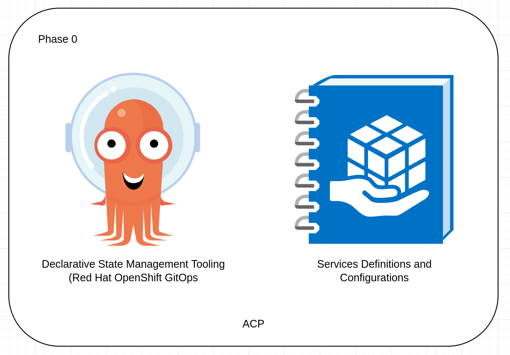
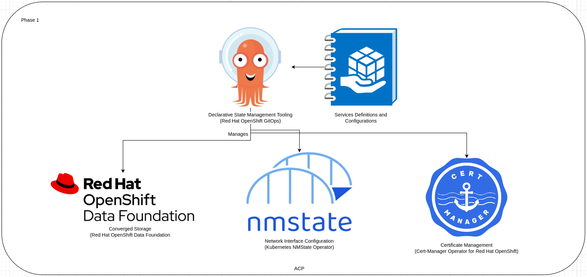
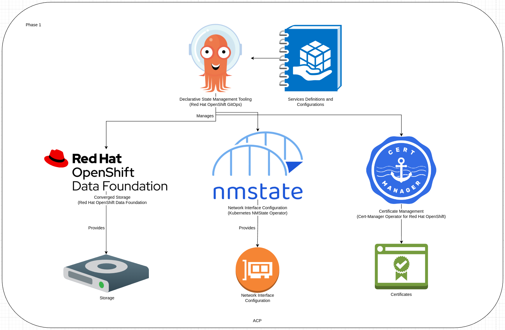
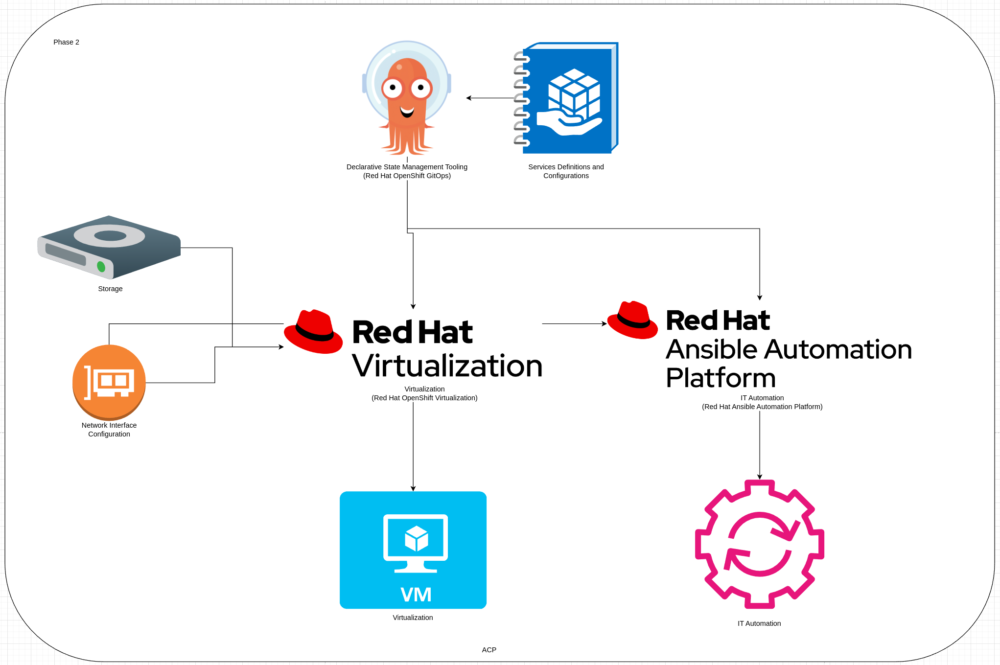

# Standardized Highly Available Computing Platform Architecture
This pattern gives a technical look at a highly available, hyper-converged style advanced computing platform on three nodes.

## Table of Contents
* [Abstract](#abstract)
* [Problem](#problem)
* [Context](#context)
* [Forces](#forces)
* [Solution](#solution)
* [Resulting Content](#resulting-context)
* [Examples](#examples)
* [Rationale](#rationale)

## Abstract
| Key | Value |
| --- | --- |
| **Platform(s)** | Red Hat OpenShift |
| **Scope** | Platform Capabilities |
| **Tooling** | <ul><li>Red Hat OpenShift GitOps</li></ul> |
| **Pre-requisite Blocks** | TBD |
| **Pre-requisite Patterns** | <ul><li>[ACP Standard Architecture](../acp-standardized-architecture-ha/README.md)</li></ul> |
| **Example Application** | N/A |

## Problem
**Problem Statement:** Industrial sites require platforms that are capable of running various types of workloads, being responsible for the scheduling of those workloads, and providing a core set of services to be consumed for supporting those workloads and external assets, if desired.

## Context
This pattern represents the Red Hat provided core services that run on top of a standard ACP. It is focused on providing these core services for workloads running on the ACP itself, along with limited support for extension beyond the platform itself.

This pattern is limited to the services provided by Red Hat, either as foundational components of the platform, or run on top of the platform, allowing for capabilities beyond the platform itself.

This pattern also assumes an ACP has been established and is available, aligned to the requirements called out in the [ACP Standard Architecture](../acp-standardized-architecture-ha/README.md) pattern.

In addition, it assumes that the underlying ACP has enough resources [CPU, memory, disk] to support the installation and operation of these resources.

## Forces
1. **Ease of Use:** This pattern attempts to provide easily consumed resources as part of a holistic solution, rather than individual product functionality.
3. **Opinionated:** These services should be installed according to best practices, and leveraged in a consistent, somewhat pre-determined manner. This is done to lower the barrier to entry, and accelerate consumption of the platform.
2. **Extensibility:** While the selection and deployment of these services are opinionated, they can be easily adjusted, changed, integrated, or extended to support use cases and workflows not necessarily covered in this pattern.

## Solution
An ACP should come "out of the box" with a set of consumable services for running workloads of all types and for automating assets near and around the ACP, as needed.

The main services, provided by Red Hat, are as follows:
| Service | Red Hat Product/Functionality | Description |
| --- | --- | --- |
| Certificate Management | [cert-manager Operator](https://www.redhat.com/en/blog/the-cert-manager-operator-is-now-generally-available-in-openshift) | Provides automatic certificate management for platform and service certificates, integrates with ACME certificate providers. |
| Converged Storage | [Red Hat OpenShift Data Foundation](https://www.redhat.com/en/technologies/cloud-computing/openshift-data-foundation) | Translates physical devices into consumable storage at the platform level across multiple storage types |
| Virtualization | [Red Hat OpenShift Virtualization](https://www.redhat.com/en/technologies/cloud-computing/openshift/virtualization) | Provides virtualization capabilities across the platform for multiple types of guests and workloads |
| Network Interface Management | [Kubernetes NMState Operator](https://access.redhat.com/documentation/en-us/openshift_container_platform/4.15/html/networking/kubernetes-nmstate) | Provides declarative configuration of network interfaces to support workloads such as storage, virtualization, and general workloads |
| IT Automation | [Red Hat Ansible Automation Platform](https://www.redhat.com/en/technologies/management/ansible) | Provides IT-level idempotent automation of workloads, networks, and more, both on the platform and outside of it |
| Declarative State Management | [Red Hat OpenShift GitOps](https://www.redhat.com/en/technologies/cloud-computing/openshift/gitops) | Provides declarative management of the platform's core services and workloads, delegating responsiblity to the platform itself |

These services provide the core set of functionality for running and operating an ACP, along with capabilities beyond the platform itself as desired. They are all shipped and supported by Red Hat.

To provide this solution, services are installed in an opinionated and ordered manner, as some rely on the others.

### Phase 0
Phase 0 is focused on enabling the platform to begin managing itself, as well as loading in the definitions of those services so the platform can install and configure them.

This phase is fairly static, as the initial responsiblities are simply being established.

### Phase 1
Phase 1 is focused on setting up storage, networking, and certificate management based on the definitions loaded in phase 0.

After installation and configuration, key services are now provided and managed:

These services provide the foundation for the "higher level" services installed in the next phase, as those services will consume them.

### Phase 2
Finally, the higher level services are installed, which consume the "lower level" services. These services are virtualization and IT automation, which rely on storage and networking provided in phase 1.

## Resulting Context
Once deployed, a highly available advanced computing platform provides the functionality to run multiple types of workloads on the same common platform. 

Some highlights:
- **Platform Consolidation:** With a software-based platform providing capabilities around running many different types of workloads, a single platform on a single hardware stack can be used to consolidate workloads from many differnet platforms.
- **Ease of Operations:** With only a single platform deployed, operators need to only learn one technology stack, and interface with one management interface for running workloads or for platform maintenance.
- **Self-Management:** OpenShift provides management of workloads as part of the platform, automatically initiating failover and recovery actions when required. These are performed without manual intervention.
- **Scalability:** As power and cooling allow for more compute, the ACP automatically consumes and presents these additional resources for workloads to consume.
- **Consistency:** As one platform is used across multiple deployment sites, workloads can easily be deployed and scaled, and training resources can be reused at each deployment location.
- **Security:** By default, an ACP comes with a high level of pre-configured, preventing the deployment of insecure workloads, and providing some segmentation between users and workloads. These are configurable, allowing for far more control and restrictions on workloads as needed.

## Examples

In this example, three core categories of workloads are running on a converged platform, leveragng the same hardware footprint and platform, despite being different types of workloads with different requirements.

These workloads are examples, however they are representitive of workloads found on ACPs.

Ultimately, these workloads all share base requirements of connectivity, storage, and a platform to orchestrate them, however how those resources are consumed is different per workload. The ACP is responsible for providing these common resources, and faciliting their consumption.

### Control Plane Functionality
This set of functions are related to the operation of the platform and how the underlying hardware is both abstracted and presented, as well as managed over time by the platform.

This functionality is related to the ongoing availablity and capabilities of the platform, and is all self-managed, self-deployed, and simply consumed by workloads or operators.

### Manufacturing Execution System - Containerized
This workload provides the core set of functions of an MES: monitoring, tracking, documenting, and controlling the production of products at a single or many sites.

In this example, the application has been containerized, leveraging native k8s functionality provided by the ACP. Since this is a "next generation" workload with requirements around running containerized workloads, the core operating concepts of the ACP, based on k8s, are heavily utilized.

### Distributed Control System - Virtualized
This workload is representitive of a supervisory system atop industrial equipment and devices, and is a more traditional workload with requirements to match.

This application is broken up into a components, however those components are deployed on top of virtual machines, which consume resources of the ACP.

## Rationale
The two main rationalizations for a modern compute platform, such as an ACP are:
1. Running Existing Applications that Power the Business
2. Providing for Next-Generation Workloads without Replatforming

A modern approach to computing, such as an ACP as outlined above, provide for both of these points without requiring the replacement of the platform when new applications are deployed.

While there's value in running the workloads found today, applications are being modernized by internal teams, by vendors, etc, and providing a consistent, capable platform allows for any type of workload to recieve the same benefits as others, regardless of the individual differences in application type, deployment method, or operating method.

## Footnotes

### Version
1.0.0

### Authors
- Josh Swanson (jswanson@redhat.com)