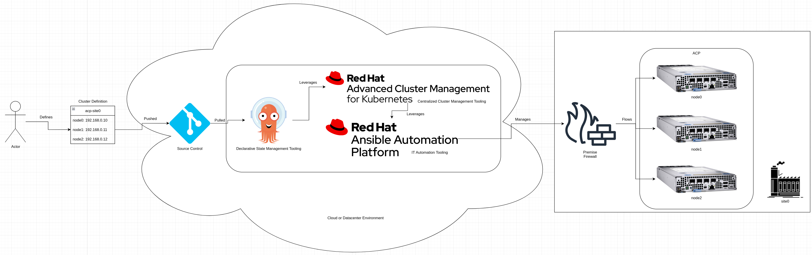
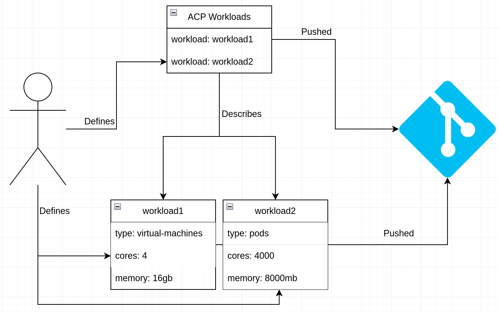
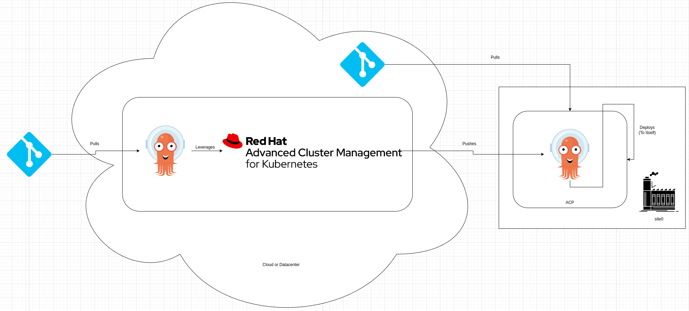
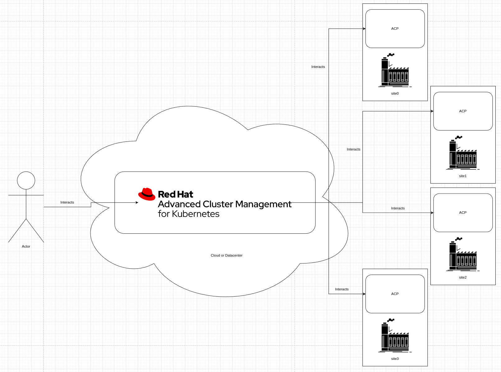

# Hub for ACPs Standard Services
This pattern gives a technical look at the core services run on a hub for managing ACPs.

## Table of Contents
* [Abstract](#abstract)
* [Problem](#problem)
* [Context](#context)
* [Forces](#forces)
* [Solution](#solution)
* [Resulting Content](#resulting-context)
* [Examples](#examples)
* [Rationale](#rationale)

## Abstract
| Key | Value |
| --- | --- |
| **Platform(s)** | Red Hat OpenShift |
| **Scope** | Platform Capabilities |
| **Tooling** | <ul><li>Red Hat OpenShift GitOps</li></ul> |
| **Pre-requisite Blocks** | TBD |
| **Pre-requisite Patterns** | <ul><li>[Highly Available ACP Standard Architecture](../acp-standardized-architecture-ha/README.md)</li><li>[Red Hat ACP Standard Services](../rh-acp-standard-services/README.md)</li></ul> |
| **Example Application** | N/A |

## Problem
**Problem Statement:** As multiple ACPs are deployed to geographically diverse sites, a central management concept is required to properly manage the platforms at scale. This central location is responsible for key functions such as update content standardization, application deployment, compliance and drift, image vulnerability scanning, app deployment delegation, and provisioning.

These core offerings represent the required functionality to operate ACPs at scale.

## Context
This pattern represents the Red Hat provided services used to run ACPs in large quantites, with a focus on having a central place to develop and deploy from. In this context, the ACPs are considered "deployment targets" that are given responsibility for managing their own workloads, while the hub is responsible for delegating that functionality as well as higher level functions.

This pattern is limited to the services and offerings shipped and supported by Red Hat.

In addition, it assumes that enough infrastructure resources [CPU, memory, disk] are available to support the installation and operation of these resources, in the form of an OpenShift cluster. This cluster does not need to be an ACP, it could be a cluster in a cloud.

This pattern also assumes some level of network connectivity is available between the hub and the ACPs. This connection does not need to be presistent or highly performant.

## Forces
1. **Central Management Point:** This pattern focuses on creating a centralized management point that can be leveraged to manage a large number of ACPs that are geographically distributed.
3. **Security Shift-Left:** As much as possible, proper security scanning and baselining should be handled centrally, then enforced across the fleet. The compute intensive work of scanning many images and application code bases should be done outside of the compute-constratined ACPs, then deployed.
2. **Consistency:** Consistency is key for any edge computing deployment, as scale makes management and operations challenging. Enforcement and reconsiliation are required to keep platforms healthy and operating as expected.
4. **Scalability:** This pattern represents a way to scale from a single site to thousands, with potential to scale even higher. This also encompasses scaling the capabilities of the centralized development and support organizations.
5. **Responsibility Delegation:** To enable local autonomy, as workloads are defined for ACPs, the definition of the workloads should be centrally pushed, however the responsibility of the starting and watching that work should fall to the ACPs, in case of hub maintenance or connectivity interruptions.

## Solution
A hub leverages a few key services to provide centralized management:

| Service | Red Hat Product/Functionality | Description |
| --- | --- | --- |
| Declarative State Management | [Red Hat OpenShift GitOps](https://www.redhat.com/en/technologies/cloud-computing/openshift/gitops) | Provides declarative management of platforms and applications, using git as the source of truth |
| Centralized Cluster Management | [Red Hat Advanced Cluster Management for Kubernetes](https://www.redhat.com/en/technologies/management/advanced-cluster-management) | Management, visibility, deployment, and lifecycle functionality provided from a central control plane |
| Compliance and Vulnerability | [Red Hat Advanced Cluster Security for Kubernetes](https://www.redhat.com/en/technologies/cloud-computing/openshift/advanced-cluster-security-kubernetes) | Provides compliance policy enforcement using industry standards, vulnerability scanning, policy violation actions, and centralized visibility |
| Image Storage and Scanning | [Red Hat Quay](https://www.redhat.com/en/technologies/cloud-computing/quay) | Provides a highly-available controlled image registry with built in image vulnerability scanning and full RBAC |
| IT Automation | [Red Hat Ansible Automation Platform](https://www.redhat.com/en/technologies/management/ansible) | Provides IT-level idempotent automation for managing networks, bare metal systems, and more |

These services and how they are leveraged are explained below.

### Declarative State Management
A common concept for application deployment and management is using a declarative approach and relying on tooling to translate that into reality.

In the same way, from a central hub, two key concepts are declared: what the ACPs themselves are, and what workloads should be run on them.

#### Declaring and Managing ACPs
To build platforms, the definition of their base configuration is loaded into a central respository, then declarative state management tooling leverages the appropriate supporting tooling to build and manage the platform. This happens from a central location to distributed locations.

In the event that there are additional configuration changes needed, additional IT automation tooling can be leveraged to enable remote building, connect installation media, and reconfigure networks to allow the process to work as desired.

#### Declaring Workloads and Delegating Responsibility
Similar to declaring a cluster in code, workloads are also described as code. The difference is how the application is defined at the hub level: the intention is to declare what the ACPs should be responsible for running instead of the workloads themselves.

As the first step, thw workloads are defined and committed to a repository. After the workloads are defined, a definition of the workloads is created, which encompasses what these workloads are, and where they can be deployed from.

Once a the target deployment platform has been built, or is ready, the hub pushes the workload definitions to the target. This is the "handoff" of responsibility to the target: it now becomes responsible for deploying and managing the workload, which begins once it knows what workloads it is responsible for.

Once complete, the connection from the hub to the target ACP could be broken, as the target is now locally responsible for the stated workloads.

### Centralized Cluster Management
To enable solution scaling, a centralized control plane is used to visualize distributed platforms and optionally, push changes out in bulk. This approach favors usability over speed: the distributed platforms will recieve the updates and apply them the next time connectivity is available. If connectivity is always available, then the changes are applied immediately.

Distributed platforms can also be group logically to allow for changes to be applied in bulk.

### Compliance and Vulnerability

### Image Storing and Scanning

### IT Automation

## Resulting Context

## Examples

## Rationale

## Footnotes

### Version
1.0.0

### Authors
- Josh Swanson (jswanson@redhat.com)