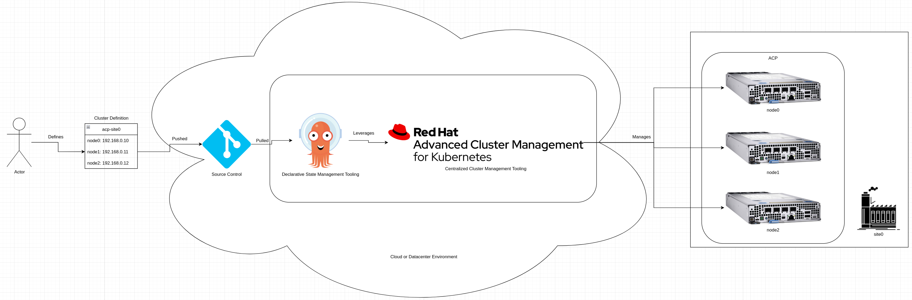

# Hub for ACPs Standard Services
This pattern gives a technical look at the core services run on a hub for managing ACPs.

## Table of Contents
* [Abstract](#abstract)
* [Problem](#problem)
* [Context](#context)
* [Forces](#forces)
* [Solution](#solution)
* [Resulting Content](#resulting-context)
* [Examples](#examples)
* [Rationale](#rationale)

## Abstract
| Key | Value |
| --- | --- |
| **Platform(s)** | Red Hat OpenShift |
| **Scope** | Platform Capabilities |
| **Tooling** | <ul><li>Red Hat OpenShift GitOps</li></ul> |
| **Pre-requisite Blocks** | TBD |
| **Pre-requisite Patterns** | <ul><li>[Highly Available ACP Standard Architecture](../acp-standardized-architecture-ha/README.md)</li><li>[Red Hat ACP Standard Services](../rh-acp-standard-services/README.md)</li></ul> |
| **Example Application** | N/A |

## Problem
**Problem Statement:** As multiple ACPs are deployed to geographically diverse sites, a central management concept is required to properly manage the platforms at scale. This central location is responsible for key functions such as update content standardization, application deployment, compliance and drift, image vulnerability scanning, app deployment delegation, and provisioning.

These core offerings represent the required functionality to operate ACPs at scale.

## Context
This pattern represents the Red Hat provided services used to run ACPs in large quantites, with a focus on having a central place to develop and deploy from. In this context, the ACPs are considered "deployment targets" that are given responsibility for managing their own workloads, while the hub is responsible for delegating that functionality as well as higher level functions.

This pattern is limited to the services and offerings shipped and supported by Red Hat.

In addition, it assumes that enough infrastructure resources [CPU, memory, disk] are available to support the installation and operation of these resources, in the form of an OpenShift cluster. This cluster does not need to be an ACP, it could be a cluster in a cloud.

This pattern also assumes some level of network connectivity is available between the hub and the ACPs. This connection does not need to be presistent or highly performant.

## Forces
1. **Central Management Point:** This pattern focuses on creating a centralized management point that can be leveraged to manage a large number of ACPs that are geographically distributed.
3. **Security Shift-Left:** As much as possible, proper security scanning and baselining should be handled centrally, then enforced across the fleet. The compute intensive work of scanning many images and application code bases should be done outside of the compute-constratined ACPs, then deployed.
2. **Consistency:** Consistency is key for any edge computing deployment, as scale makes management and operations challenging. Enforcement and reconsiliation are required to keep platforms healthy and operating as expected.
4. **Scalability:** This pattern represents a way to scale from a single site to thousands, with potential to scale even higher. This also encompasses scaling the capabilities of the centralized development and support organizations.
5. **Responsibility Delegation:** To enable local autonomy, as workloads are defined for ACPs, the definition of the workloads should be centrally pushed, however the responsibility of the starting and watching that work should fall to the ACPs, in case of hub maintenance or connectivity interruptions.

## Solution
A hub leverages a few key services to provide centralized management:

| Service | Red Hat Product/Functionality | Description |
| --- | --- | --- |
| Declarative State Management | [Red Hat OpenShift GitOps](https://www.redhat.com/en/technologies/cloud-computing/openshift/gitops) | Provides declarative management of platforms and applications, using git as the source of truth |
| Centralized Cluster Management | [Red Hat Advanced Cluster Management for Kubernetes](https://www.redhat.com/en/technologies/management/advanced-cluster-management) | Management, visibility, deployment, and lifecycle functionality provided from a central control plane |
| Compliance and Vulnerability | [Red Hat Advanced Cluster Security for Kubernetes](https://www.redhat.com/en/technologies/cloud-computing/openshift/advanced-cluster-security-kubernetes) | Provides compliance policy enforcement using industry standards, vulnerability scanning, policy violation actions, and centralized visibility |
| Image Storage and Scanning | [Red Hat Quay](https://www.redhat.com/en/technologies/cloud-computing/quay) | Provides a highly-available controlled image registry with built in image vulnerability scanning and full RBAC |
| IT Automation | Red Hat Ansible Automation Platform](https://www.redhat.com/en/technologies/management/ansible) | Provides IT-level idempotent automation for managing networks, bare metal systems, and more |

These services and how they are leveraged are explained below.

### Declarative State Management
A common concept for application deployment and management is using a declarative approach and relying on tooling to translate that into reality.

In the same way, from a central hub, two key concepts are declared: what the ACPs themselves are, and what workloads should be run on them.

#### Declaring and Managing ACPs
To build platforms, the definition of their base configuration is loaded into a central respository, then declarative state management tooling leverages the appropriate supporting tooling to build and manage the platform. This happens from a central location to distributed locations.

In the event that there are additional configuration changes needed, additional IT automation tooling can be leveraged to enable remote building, connect installation media, and reconfigure networks to allow the process to work as desired.

#### Declaring Workloads and Delegating Responsibility

####

This results in all elements of an ACP being enforcable and auditable, as all definitions of configuration live in code.

### Phase 1
Phase 1 is focused on setting up storage, networking, and certificate management based on the definitions loaded in phase 0.

After installation and configuration, key services are now provided and managed:

These services provide the foundation for the "higher level" services installed in the next phase, as those services will consume them.

### Phase 2
Finally, the higher level services are installed, which consume the "lower level" services. These services are virtualization and IT automation, which rely on storage and networking provided in phase 1.

## Resulting Context
Once all services are deployed and configured, a core set of services are available for consumption. The ease of installation is handled at deployment time, resulting in the correct sequence and service availability.

The platform is now ready to run multiple workloads in a converged state.

## Examples
Two main examples will be considered in this pattern: deployment and management of workloads of a virtualized workload, and automation of network infrastructure outside of the platform.

### Deployment and Management of a Virtualized Workload
In this example, a virtualized workload is deployed on the platform which requires post-installation automation, as well as ongoing maintenance. The platform should be responsible for managing this workload.

#### Day -1
Before deployment on day 0, the definitions and context of the application are loaded into the declarative state management tooling, along with the appropriate automation definitions. In this example, the definitions will be loaded by an actor, however this could be automated.

#### Day 0
On day 0, deployment is initiated, and the corresponding assets are created by the responsible services. The virtual machine, which consumes network configuration and storage, is created by OCP Virtualization, and the supporting automation playbooks and job templates are created via Ansible Automation Platform:

#### Day 1+
After the initial deployment, the operational pattern stabilizes for the lifecycle of the workload. OCP Virtualization keeps managing the virtual machine, while continued automation runs via Ansible Automation Platform ensure the workload is installed within the virtual machine, updated, and overall healthy.

Changes could be introducted into the available automation to undertake new workflows, such as reconfiguration of the application, if desired.

### Automation of Network Infrastructure
A second example would be leveraging the IT automation capabilities to manage a resource outside of the platform, such as network switches and firewalls.

In much the same flow as above, this example will be broken up over a few different "days" for clarity.

#### Day -1
Before beginning to automate, desired state and configurations are loaded by an actor:

#### Day 0
With the definitions loaded, the assets specificed are created by consuming Ansible Automation Platform capabilities:

#### Day 1+
Now, for initial configuration and ongoing enforcement, the IT Automation service (Ansible) consumes the created automation assets, and is capable of both configuration and enforcement against devices in the network stack:

## Rationale
The main rationale for deploying these core services are:
1. Ease of use for running multiple types of workloads
2. Extensibility through and beyond the platform as needed

As applications often have many requirements and many supporting processes, it's important to provide a high amount of functionality at the platform level, that can be configured and consumed to support workloads as they are onboarded to the platform.

In addition, as infrastucture becomes more complex, providing the capability to manage and automate removes complexity and error, and provides a more robust experience.

## Footnotes

### Version
1.0.0

### Authors
- Josh Swanson (jswanson@redhat.com)