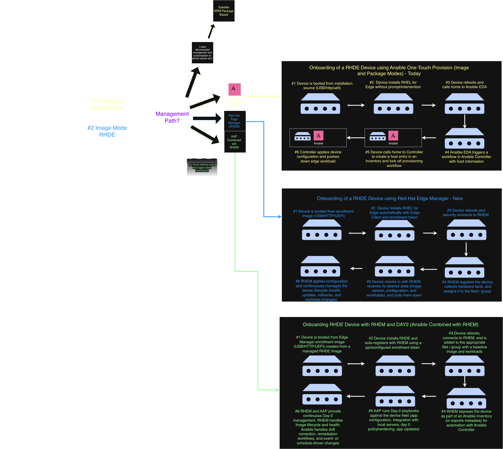

# RHDE Management - Selecting your management path
This pattern dives into the options of managing Red Hat Device Edge Devices.

## Table of Contents
* [Abstract](#abstract)
* [Problem](#problem)
* [Context](#context)
* [Solution](#solution)
* [Resulting Content](#resulting-context)
* [Examples](#examples)
* [Rationale](#rationale)

## Abstract
| Key | Value |
| --- | --- |
| **Platform(s)** | Red Hat Device Edge, Ansible Automation Platform  |
| **Scope** | Zero-Touch Provisioning, Fleet Configuration |
| **Tooling** | TBD |
| **Pre-requisite Blocks** | TBD |

## Problem
**Problem Statement:** In order to scale and manage many RHDE devicees there must be a proven mechanism to both deploy and manage day one and two operations of these devices. 

## Context

TBD

## Solution
Red Hat recomends either one or a combination depending upon requiremnts and what type of RHDE "mode" is selected.

### Red Hat Edge Device Mode Types:
1. Red Hat Package Mode - Traditional Red Hat Enterprise RPM based Linux
2. Red Hat Image Mode - Red Hat Bootable Conntainers (bootc)

###  - TBD

## Resulting Context

## Examples

## Rationale

## Footnotes

## Version
1.0.0

## Authors
- Stephen Smith (stephen.smith@redhat.com)