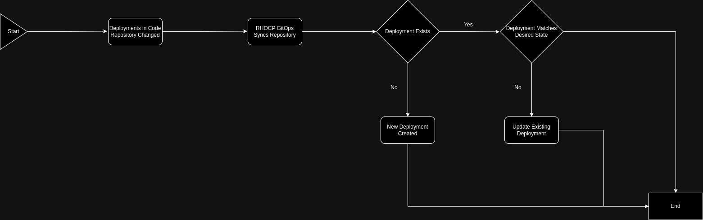

# Scaling Deployments as a Managed Service Provider
This pattern gives an opinionated look at scaling up deployment capabilities using gitops tooling from the perspective of a managed service provider.

## Abstract
| Key | Value |
| --- | --- |
| **Platform(s)** | <ul><li>Red Hat Device Edge with Microshift</li><li>Red Hat Openshift</li></ul> |
| **Scope** | Application deployment |
| **Tooling** | <ul><li>Red Hat OpenShift GitOps</li></ul> |
| **Pre-requisite Blocks** | <ul><li>[Kubernetes Core Concepts](../../blocks/k8s-core-concepts/README.md)</li><li>[Scaling GitOps Deployment](../scaling-gitops-deployment-k8s/README.md)</li><li>[Helm Getting Started](../helm-getting-started/README.md)</li><li>[GitOps Deployments](../gitops-deployment-k8s/README.md)</li><li>[App of Apps](../../blocks/app-of-apps/README.md)</li></ul>
| **Example Application** | Process Control |

## Problem
**Problem Statement:** When acting as a managed service provider, it can often be challenging to install and run many deployments of an application at scale for customers.

**Resolution:** Using modern tooling and processes, the main goals of this pattern are:
1. Increase the number of instances for customers that can be managed
2. Increase the consistency between deployments
3. Allow for customizations between deployments relative to customer requirements
4. Leverage code and code reviews as the "source of truth" for deployments

## Context
This pattern can be applied where a high number of deployments, usually for external entities such as customers, are being managed from a central location, and deployed to a single target. Current deployment processes are typically manually initiated or completely manual, and deployments have drifted or become inconsistent over time.

## Forces
1. **Scalability:** This pattern allows for easy scalability by adding or removing deployments as needed, up to a nearly limitless number of deployments across customers.
2. **Modularity:** Each deployment can be individually managed or adjusted using the same core  reduces complexity.
3. **Customization:** MSPs can customize the set of applications based on the specific needs of their customers, providing a tailored solution.
4. **Maintenance:** Day 2+ operations are all handled through the same automation path, and can include updates/upgrades, automatic rollbacks, and more.
5. **Resource Efficiency:** Since tooling and technology are responsible for the deployments, time and soft dollar expenses are saved.
6. **Isolation:** This pattern allows for isolation down to the individual deployment level, allowing for proper boundries around customers and deployments, and even multiple deployments within customers.
7. **Flexibility:** MSPs can easily onboard new customers, retire old customers, and contextualize/customize where required through one process.

## Solution

### Part 1 - Deploying GitOps
Red Hat OpenShift GitOps is shipped as an operator, and can be installed in an automated fastion. See [Installing Operators](../../blocks/installing-operators-yaml/README.md) for details. The deployed resources run on an existing cluster, and may be the same cluster as where deployments of software are being run.

### Part 2 - Configuring GitOps
Perform the basic setup of GitOps by connecting to the code repository housing application code, and if necessary, the deployment location. Full information is located in the [GitOps Deployment](../../blocks/gitops-deployment-k8s/README.md) block.

### Part 3 - Adjust Deployments to be Templated
Some adjustments to how deployments are instantiated may be made, to allow them to be isolated and customizable. Examples of this can be found in the [Scaling GitOps Deployments](../../blocks/scaling-gitops-deployment-k8s/README.md) block. The main concept is to have a "common base" template for a deployment which allows for customization, and to store customer information and allow Red Hat OpenShift GitOps to template from a code repository, which acts as the source of truth.

For adding a new deployment, the process would roughly be:

### Part 4 - Adopting New Processes
With the technology and practices in place, deployments are now completely managed via code changes, as opposed to by manual intervention or other processes. All changes should be submitted via code change, reviewed, and then deployed exclusively through automation, and not by other processes.

### Part 5 - Operate
This pattern is designed to be highly scalable, so no process changes are made simply for scaling. All ongoing operations leverage the same process regardless of scale.

## Resulting Context
Once deployed, all management of deployments, from initial roll-out to updates to deletion, are completely handled through an automated process that uses code as the source of truth.

Some highlights:
- **Simplified Application Management:** The app-of-apps pattern allows MSPs to manage multiple applications using a single Git repository. This simplifies the management process, as all configuration and deployment information is stored in one central location.
- **Enhanced Collaboration:** GitOps encourages collaboration among teams by providing a centralized repository for managing applications. This helps improve communication, as all team members can easily access and contribute to the repository.
- **Version Control:** Git provides robust version control capabilities, allowing MSPs to track changes made to applications over time. This ensures that they can easily roll back to previous versions if needed, reducing the risk of errors or downtime.
- **Automation:** GitOps promotes the use of automation for application deployment and management. By leveraging tools like GitLab CI/CD or Argo CD, MSPs can automate the deployment process, reducing manual intervention and the risk of human error.
- **Scalability:** The app-of-apps pattern is highly scalable, allowing MSPs to easily add or remove applications as needed. This scalability ensures that MSPs can quickly adapt to changing customer requirements without significant overhead.
- **Consistency:** With the app-of-apps pattern, MSPs can ensure consistency across applications by defining common configurations and deployment processes. This helps maintain a standardized environment, reducing the risk of configuration drift.
- **Security:** GitOps promotes security best practices by enforcing code reviews, access controls, and audit logs. This helps ensure that applications are deployed securely, reducing the risk of security breaches.

## Examples
Example Process from Persona Perspective:

