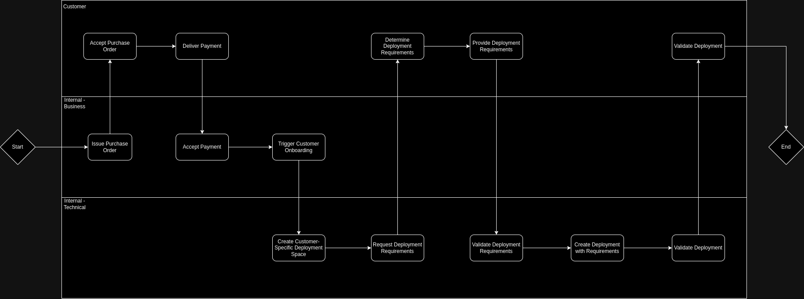
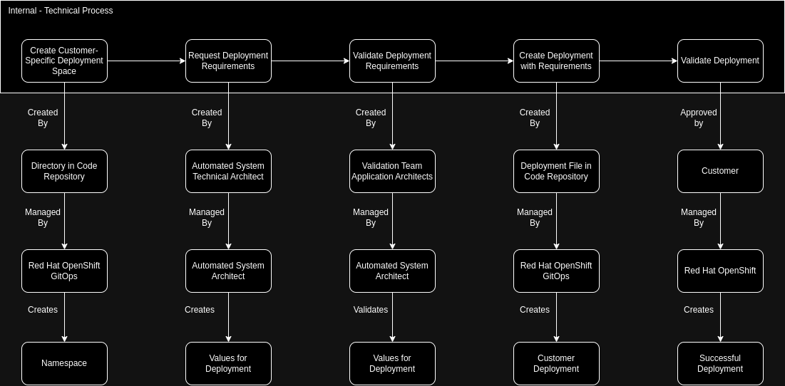
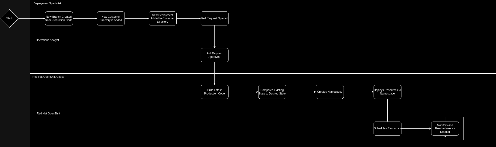

# Scaling Deployments as a Managed Service Provider
This pattern gives an opinionated look at scaling up deployment capabilities using gitops tooling from the perspective of a managed service provider.

## Goals
1. **Scalability:** This pattern allows for easy scalability by adding or removing deployments as needed, up to a nearly limitless number of deployments across customers.
2. **Modularity:** Each deployment can be individually managed or adjusted using the same core  reduces complexity.
3. **Customization:** MSPs can customize the set of applications based on the specific needs of their customers, providing a tailored solution.
4. **Maintenance:** Day 2+ operations are all handled through the same automation path, and can include updates/upgrades, automatic rollbacks, and more.
5. **Resource Efficiency:** Since tooling and technology are responsible for the deployments, time and soft dollar expenses are saved.
6. **Isolation:** This pattern allows for isolation down to the individual deployment level, allowing for proper boundries around customers and deployments, and even multiple deployments within customers.
7. **Flexibility:** MSPs can easily onboard new customers, retire old customers, and contextualize/customize where required through one process.

## Information
| Key | Value |
| --- | --- |
| **Platform(s)** | <ul><li>Red Hat Device Edge with Microshift</li><li>Red Hat Openshift</li></ul> |
| **Scope** | Application deployment |
| **Tooling** | <ul><li>Red Hat OpenShift GitOps</li></ul> |
| **Pre-requisite Blocks** | <ul><li>[Kubernetes Core Concepts](../../blocks/k8s-core-concepts/README.md)</li><li>[Scaling GitOps Deployment](../scaling-gitops-deployment-k8s/README.md)</li><li>[Helm Getting Started](../helm-getting-started/README.md)</li><li>[GitOps Deployments](../gitops-deployment-k8s/README.md)</li><li>[App of Apps](../../blocks/app-of-apps/README.md)</li></ul>
| **Example Application** | Process Control |

## Limitations
- This patterns assumes one deployment target, and one common namespace for all deployments within a customer - this is, however customizable.

## Processes
Four example processes are showcased in this pattern:
1. [Onboarding New Customer and Deploying Software](#onboarding-new-customer-and-deploying-software)
2. [Adding Deployment to Existing Customer](#adding-deployment-to-existing-customer)
3. [Removing Deployment from Existing Customer](#removing-deployment-from-existing-customer)
4. [Removing Customer Completely](#removing-customer-completely)

### Onboarding New Customer and Deploying Software
For this example, the onboarding and initial deployment process will exist as so:

This can be mapped to the various stakeholders and technologies:

Resulting in the following process at the technology level:

# TO-DO
### Adding Deployment to Existing Customer

### Removing Deployment from Existing Customer

### Removing Customer Completely

