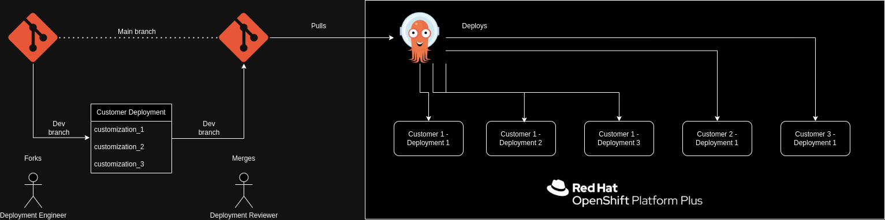

# Scaling Deployments as a Managed Service Provider
This pattern gives an opinionated look at scaling up deployment capabilities using gitops tooling from the perspective of a managed service provider.

## Table of Contents
* [Abstract](#abstract)
* [Problem](#problem)
* [Context](#context)
* [Forces](#forces)
* [Solution](#solution)
* [Resulting Content](#resulting-context)
* [Examples](#examples)
* [Rationale](#rationale)

## Abstract
| Key | Value |
| --- | --- |
| **Platform(s)** | <ul><li>Red Hat Openshift</li></ul> |
| **Scope** | Application deployment |
| **Tooling** | <ul><li>Red Hat OpenShift GitOps</li></ul> |
| **Pre-requisite Blocks** | <ul><li>[Kubernetes Core Concepts](../../blocks/k8s-core-concepts/README.md)</li><li>[Scaling GitOps Deployment](../scaling-gitops-deployment-k8s/README.md)</li><li>[Helm Getting Started](../helm-getting-started/README.md)</li><li>[GitOps Deployments](../gitops-deployment-k8s/README.md)</li><li>[App of Apps](../../blocks/app-of-apps/README.md)</li></ul>
| **Example Application** | Process Control |

## Problem
**Problem Statement:** When acting as a managed service provider, it can often be challenging to install and run many deployments of an application at scale for customers.

## Context
This pattern can be applied where a high number of deployments, usually for external entities such as customers, are being managed from a central location, and deployed to a single target. Current deployment processes are typically manually initiated or completely manual, and deployments have drifted or become inconsistent over time.

In addition, this pattern assumes a platform, such as Red Hat OpenShift, is already deployed and running, and will be used as the target deployment location, as well as where GitOps functionality will live.

## Forces
1. **Scalability:** This pattern allows for easy scalability by adding or removing deployments as needed, up to a nearly limitless number of deployments across customers.
2. **Modularity:** Each deployment can be individually managed or adjusted using the same core  reduces complexity.
3. **Customization:** MSPs can customize the set of applications based on the specific needs of their customers, providing a tailored solution.
4. **Maintenance:** Day 2+ operations are all handled through the same automation path, and can include updates/upgrades, automatic rollbacks, and more.
5. **Resource Efficiency:** Since tooling and technology are responsible for the deployments, time and soft dollar expenses are saved.
6. **Isolation:** This pattern allows for isolation down to the individual deployment level, allowing for proper boundries around customers and deployments, and even multiple deployments within customers.
7. **Flexibility:** MSPs can easily onboard new customers, retire old customers, and contextualize/customize where required through one process.

## Solution
Using modern tooling and processes, the main goals of this pattern are:
1. Increase the number of instances for customers that can be managed
2. Increase the consistency between deployments
3. Allow for customizations between deployments relative to customer requirements
4. Leverage code and code reviews as the "source of truth" for deployments

This pattern leverages two main elements to achieve a solution:
- Using code as the source of truth for deployments
- Using GitOps tooling and practices to manage and enforce deployments

An example implimentation:

Here, a new customer deployment has been identified, added to the code repository, approved for deployment, and is rolled out completely via tooling and automation, and does not require manual intervention.

To achieve this, a few conditions must be met:
- Deployments and their customizations can be captured as code
- A valid code repository exists, with proper controls, to contain deployments
- Proper wiring of tooling to the code repo has been configured

For details on the above, see the prerequisite blocks in the [Abstract](#abstract) setion.

Once the tooling and source of truth are properly configured, all individuals reposonsible for creating, updating, and deleting deployments now adopt the code-focused approach, as opposed to manual processes that are not code driven.

This pattern can scale across multiple types of deployments, such as different applications, different deployment targets, and more, with proper customization.

## Resulting Context
Once deployed, all management of deployments, from initial roll-out to updates to deletion, are completely handled through an automated process that uses code as the source of truth.

Some highlights:
- **Simplified Application Management:** The app-of-apps pattern allows MSPs to manage multiple applications using a single Git repository. This simplifies the management process, as all configuration and deployment information is stored in one central location.
- **Enhanced Collaboration:** GitOps encourages collaboration among teams by providing a centralized repository for managing applications. This helps improve communication, as all team members can easily access and contribute to the repository.
- **Version Control:** Git provides robust version control capabilities, allowing MSPs to track changes made to applications over time. This ensures that they can easily roll back to previous versions if needed, reducing the risk of errors or downtime.
- **Automation:** GitOps promotes the use of automation for application deployment and management. By leveraging tools like GitLab CI/CD or Argo CD, MSPs can automate the deployment process, reducing manual intervention and the risk of human error.
- **Scalability:** The app-of-apps pattern is highly scalable, allowing MSPs to easily add or remove applications as needed. This scalability ensures that MSPs can quickly adapt to changing customer requirements without significant overhead.
- **Consistency:** With the app-of-apps pattern, MSPs can ensure consistency across applications by defining common configurations and deployment processes. This helps maintain a standardized environment, reducing the risk of configuration drift.
- **Security:** GitOps promotes security best practices by enforcing code reviews, access controls, and audit logs. This helps ensure that applications are deployed securely, reducing the risk of security breaches.

## Examples
In all examples, the same overall setup and process is used:

### Adding a New Customer Deployment
When a new deployment is desired, the following process is used:
1. The production code repo is cloned
2. A new branch is created from the production branch
3. The new deployment is added to the new branch
4. A pull request is opened to merge changes to the production branch
5. The request is approved, and the new deployment code is merged
6. RHOCP GitOps syncs the code changes
7. RHCOP evaluates existing deployments against the code repositroy
8. RHOCP creates a new deployment with the specified information

### Updating All Existing Deployment
When deployments need to be modified, such as for updating the application code, the following example process can be used:
1. The production code repo is cloned
2. A new branch is created from the production branch
3. The new application code information is added
4. A pull request is opened to merge changes to the production branch
5. The request is approved, and the new deployment code is merged
6. RHOCP GitOps syncs the code changes
7. RHCOP evaluates existing deployments against the code repository
8. RHOCP begins rolling through deployments, upgrading components as specified

### Deleting a Customer Deployment
If a deployment is no longer needed, such as a customer not renewing, or a deployment no longer being needed, the following example process can be used:
1. The production code repo is cloned
2. A new branch is created from the production branch
3. The deployment definition is deleted from the code base
4. A pull request is opened to merge changes to the production branch
5. The request is approved, and the new deployment code is merged
6. RHOCP GitOps syncs the code changes
7. RHCOP evaluates existing deployments against the code repository
8. RHOCP deletes the deployment that was removed from the code repository

## Rationale
The two main points that set this process above other ways to manage deployments at scale are:
1. Using Code as a Source of Truth
2. Having GitOps Tooling Track Status Automatically

### Using Code as a Source of Truth
While manually deployments are subject to human error, deployments triggered from a code repository are always deployed according to their specification. This brings near-perfect consistency to deployments, even when operating at scale.

In addition, using code as a source of truth allows for easy audit trails, clear definitions of production environments, and can be integrated easily with other systems as needed.

Finally, code repositories almost always allow for peer or team reviews before making impactful changes, and in fact best practices for code maintenance and operations require reviews.

### Having GitOps Tooling Track Status Automatically
An "out of the box" feature of RHOCP GitOps is the ability to automatically track resources that are created as part of a deployed application. For example, if an application contains: two pods, two services, and a route, these will all be tracked as a group under the application deployment.

In the event of drift or deletion, reconsiliation will automatically happen, bringing the application back to the desired, known good state without manual intervention.

These rationales, along with the features and functionality provided by the tooling and processes described here, provide an easily adopted, highly scalable approach to running deployments at scale as a managed service provider.

## Footnotes

### Version
1.0.0

### Authors
- Josh Swanson (jswanson@redhat.com)