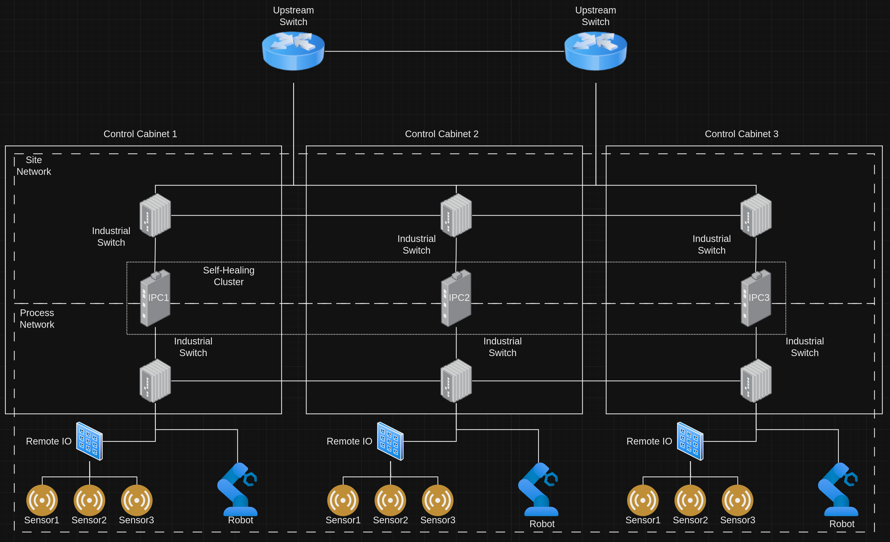

# Creating a Self-Healing DCN Cluster
This pattern gives a technical look at how to create a clsuter across distributed control nodes, where workloads will be automatically recovered in the event of an node failure.

## Table of Contents
* [Abstract](#abstract)
* [Problem](#problem)
* [Context](#context)
* [Forces](#forces)
* [Solution](#solution)
* [Resulting Content](#resulting-context)
* [Examples](#examples)
* [Rationale](#rationale)

## Abstract
| Key | Value |
| --- | --- |
| **Platform(s)** | Red Hat Device Edge |
| **Scope** | Virtualization, Containerization |
| **Tooling** | <ul><li>Red Hat Ansible Automation Platform</li></ul> |
| **Pre-requisite Blocks** | N/A |
| **Pre-requisite Patterns** | <ul><li>[Creating RHDE Images on an ACP](../create-rhde-images-on-acp/README.md)</li>></ul> |
| **Example Application** | N/A |

## Problem
**Problem Statement:** Distributed control nodes are often single points of failure, meaning that in the event of a hardware or network failure, the workloads on the DCN are lost. These workloads should be automatically recovered to another eligible DCN in the event of a failure.

## Context
This pattern can be applied to DCNs for many types of workloads, where multiple DCNs are eligible to run the workloads. These DCNs should be in close "proximity" to one another, as to ease the transition of workload takeover in the event of a failure.

A few key assumptions are made:
- All DCNs that are to be clustered have the appropriate packages installed in the image.
- All DCNs have similiar connectivity.
- All DCNs have similar resources to properly handle workloads.
- Workloads can be relocated and restarted without external factors causing recovery issues.

## Forces
- **Customizability:** The pattern's solution should work for many, if not all, types of workloads that are found on DCNs.
- **Ease of Consumption:** This pattern's solution should allow for easy creation and consumption of the created clusters.
- **Self-contained:** A DCN cluster should be completely self-sufficient, not requiring any external control planes or other functionality outside of the clustered nodes.
- **Low Overhead:** The DCN cluster should work on limited compute, small form-factor devices that are not able to handle full ACP functionality due to resource constraints.

## Solution
The solution for this pattern is to create a self-healing cluster on the desired DCNs, then configure the cluster to monitor workloads, and recover them if a DCN fails, or if network issues occur.

For example, to run software control in a control cabinet, a DCN can be configured with two connections: one to the site network, and one to a process network.

Input data from the sensors is related up to remote IO, communicated over the process network to the IPC, the soft control computes instructions for the drive, then sends those instructions back down the process network.

To make this solution more resiliant, more IPCs could be added, all with the same compute resources and connectivity:

This configuration would allow for faster recovery of lost workloads, such as soft control. However, an additional setup can be taken to round out this solution: adding a self-healing cluster on the IPCs, and having it watch the soft control workload:

With the creation of the self-healing cluster, the DCNs all become eligible to run the soft control workload:

Then, in the event of a failure of a DCN, the soft control workload will automatically be recovered to another DCN:

This behavior is fully configurable: workloads can be recovered but not started, or automatically started, depending on the configuration of the workload. In addition, multiple workloads can be monitored by the cluster, all with independent actions in case of failure.

## Resulting Context
The resulting context is the ability to have workloads automatically recovered by other nodes within the self-healing cluster, providing self-healing and redundancy for the workloads. An outage of a single DCN no longer means long-running downtime for the workloads it was responsible for, instead, the impact is limited, and the hardware can be recovered or replaced independently of normal operations.

This methodology can be extended to multiple workloads on the same set of DCNs, and can be used with different types of workloads, such as virtualized, containerized, bare-metal, or a combination of all three.

In addition, other resources, such as floating IP addresses, can be created and managed by the cluster, allowing for consistent addressing and communications after a failure and recovery.

## Examples
Two key examples will be considered for this pattern: a self-healing cluster within a single control cabinet, and a cluster that spans across three control cabinets.

### Self-Healing Within a Cabinet
A self-healing cluster could be set up on DCNs located within a cabinet, allowing for the functions of those DCNs to move freely between them:

In this example, the failure of a single DCN will not remove the ability for the cabinet to function, and depending on the configuration of the workloads, may automatically recover from a DCN failure.

### Self-Healing Between Cabinets
Self healing clusters can also be stretched between multiple cabinets, potentially allowing for more resiliency to failures at multiple points.

In this example, the networks and self-healing cluster are spanned across multiple cabinets. In the event of a failure of components in cabinet 1, cabinet 2 could take over and continue operations.

Network topologies play a large part in enabling this functionality, however if connectivity can be made redundant, then further resilency is achieved.

## Rationale
The rationale for this pattern is to have self-healing capabilities on small form-factor hardware, allowing for availability of services in the event of hardware failure. It helps prevent a single device from causing long running impacts to availability, without needing large hardware investments. The automatic self-healing can also help lower operational costs and incease availability over time, as much of the recovery actions are performed without intervention.

## Footnotes

### Version
1.0.0

### Authors
- Tim Mirth (tmirth@redhat.com)
- Dave Rapini (drapini@redhat.com)
- Josh Swanson (jswanson@redhat.com)