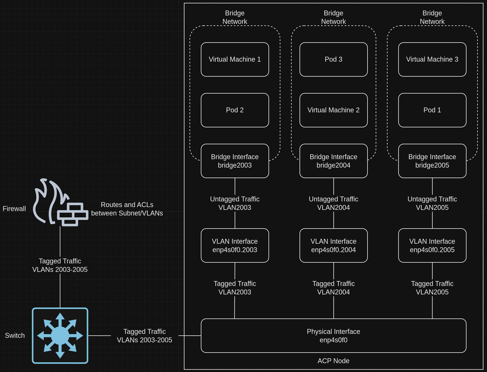
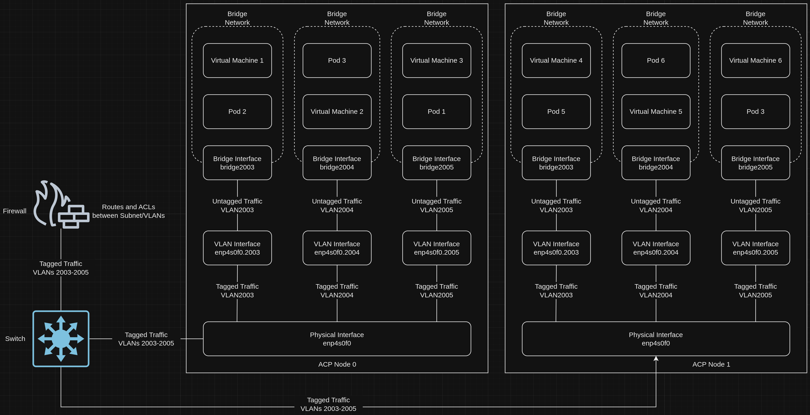
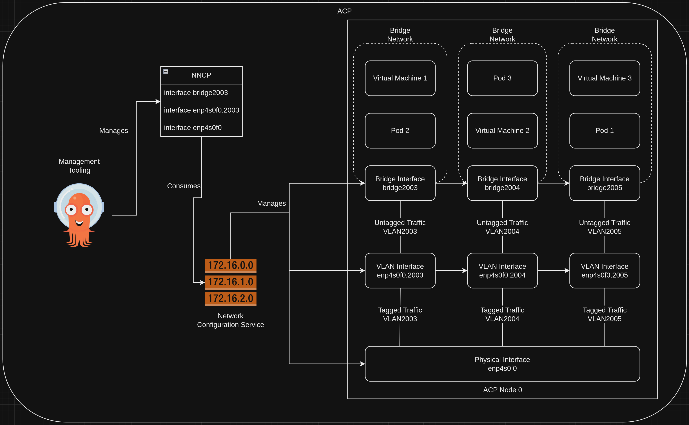
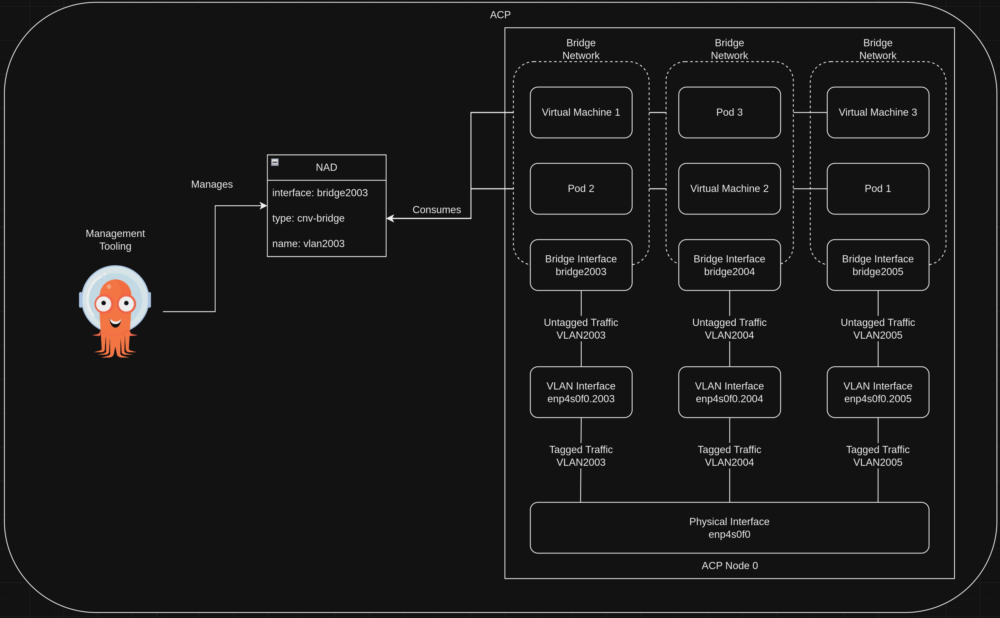
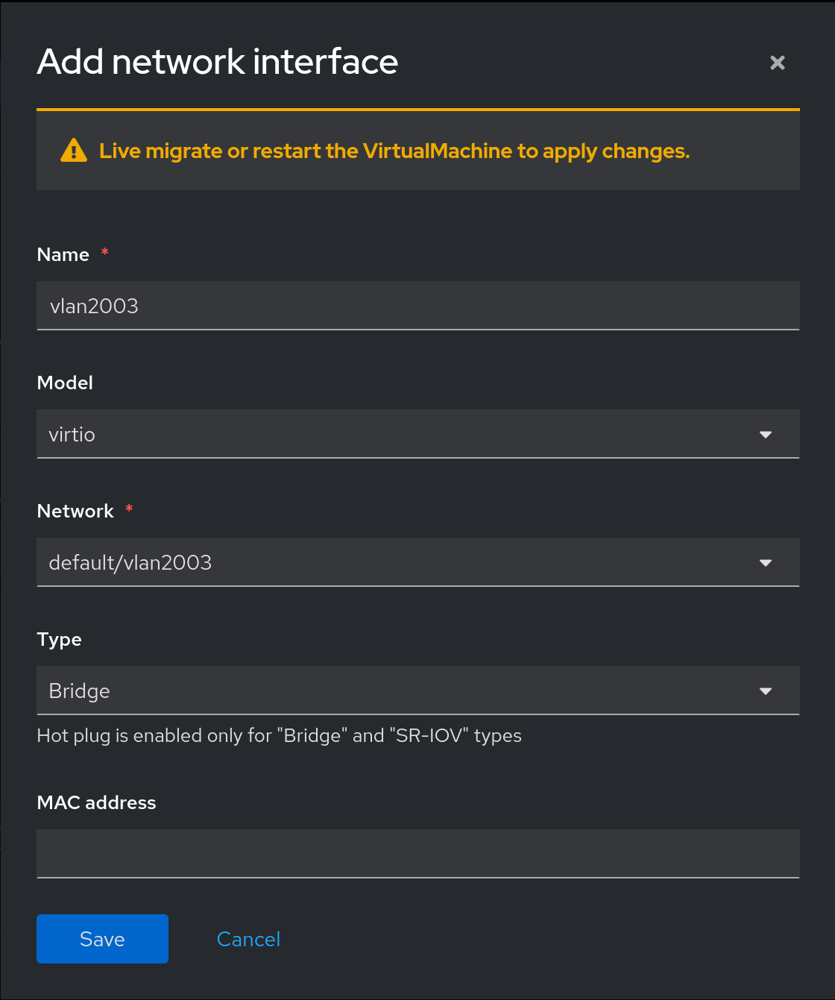
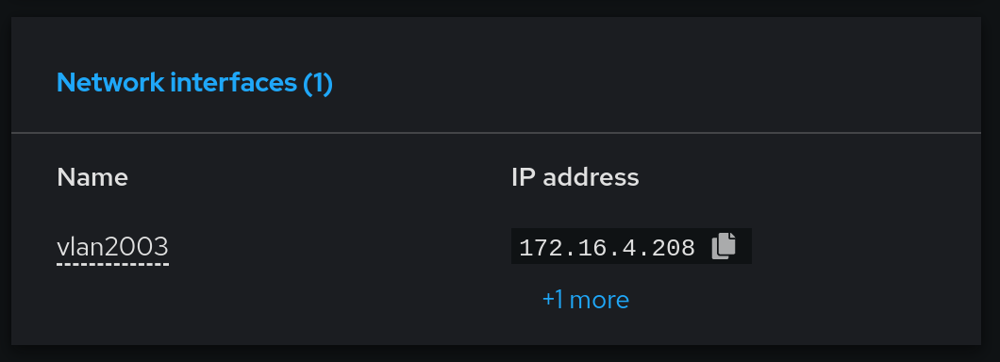

# Bridging Virtual Machines Directly to a Network
This pattern gives a technical look at how virtual machines run on an ACP can be attached directly to a network, using the "traditional" bridged network configuration.

## Table of Contents
* [Abstract](#abstract)
* [Problem](#problem)
* [Context](#context)
* [Forces](#forces)
* [Solution](#solution)
* [Resulting Content](#resulting-context)
* [Examples](#examples)
* [Rationale](#rationale)

## Abstract
| Key | Value |
| --- | --- |
| **Platform(s)** | Red Hat OpenShift |
| **Scope** | Virtualization |
| **Tooling** | <ul><li>Red Hat OpenShift GitOps</li></ul> |
| **Pre-requisite Blocks** | <ul><li>[Example ACP Networking](../../blocks/example-network-config/README.md)</li><li>[ACP Network Configuration](../../blocks/acp-network-configuration/)</li><li>[Creating Bridged Networks on an ACP](../../blocks/acp-bridge-networks/README.md)</li></ul> |
| **Pre-requisite Patterns** | <ul><li>[ACP Standard Architecture](../acp-standardized-architecture-ha/README.md)</li></ul> |
| **Example Application** | N/A |

## Problem
**Problem Statement:** Often, virtual machines and their workloads are deployed across different layer 2 domains, known as VLANs, for various reasons such as security isolation, traffic grouping, and scalability. However, instead of 1:1 mappings of VLANs to physical interfaces, many VLANs are trunked down a single physical link. The platform must be able to understand and host workloads, including virtual machines, and provide the appropriate connectivity to various separated networks via VLANs.

## Context
This pattern can be applied to ACPs where workloads need to communicate on different VLANs which are trunked down over a single (or multiple) physical links to the platform. While many different types of workloads can leverage the same connectivity model, virtual machines will be the focus for the examples below.

A few key assumptions are made:
- The intended context of the platform aligns to the [Standard HA ACP Architecture](../acp-standardized-architecture-ha/README.md)
- Physical connections, such as power and networking, have been made to the target hardware
- The upstream network configuration is completed and verified

## Forces
- **Hardware Consolidation:** This pattern is focused allowing a single platform on a single set of hardware to run many workloads across many different network segments, with a limited number of physical network links.
- **Network-Level Isolation:** This pattern allows workloads to be isolated from others at the network level, creating logical boundries if desired.
- **Broad Hardware Compatibility:** This functionality is provided via the Linux kernel, meaning almost all supported hardware will be able to support this connectivity model, as the "heavy lifting" is done by the kernel's network stack.
-  **Broad Workload Compatibility:** This pattern supports many traditional workloads that expect to be installed on a virtual machine that is "directly connected" to a network, meaning the connection mechanics are transparent to the virtual machine itself.

## Solution
The networking stack of an ACP can be configured to allow for connectivity across VLANs using built-in functionality of the Linux kernel, without needing specialized hardware. Since the responsiblity of adding/removing VLAN tags falls to the networking stack, some CPU cycles are expended to support this functionality.

A combination of linux bridges, which are software-based network switches that exist entirely within the kernel, and VLAN interfaces, which segment traffic and add/subtrack VLAN tags, depending on flow. When used together, VLANs become virtual networks within the networking stack of the platform, and cross-VLAN traffic will exit the platform and be handled by the networking stack.

An example topology, as visualized below, will be used to represent an example ACP being installed.


In the topology diragram, the focus will be placed on the link labeled "Virtual Machines", as that compute mode will be the primary utilization of this additional networking functionality.

The following example subnets/VLANs will be used:
| VLAN | Subnet | Description |
| --- | ---| --- |
| 2000 | 172.16.0.0/24 | Out of band management interfaces of hardware |
| 2001 | 172.16.1.0/24 | Hyperconverged storage network |
| 2002 | 172.16.2.0/23 | Cluster primary network for ingress, load balanced services, and MetalLB pools |
| 2003 | 172.16.4.0/24 | First dedicated network for bridged virtual machines |
| 2004 | 172.16.5.0/24 | Second dedicated network for bridged virtual machines |
| 2005 | 172.16.6.0/24 | Third dedicated network for bridged virtual machines |

The upstream networking devices to which the bare metal systems are connected on the "virtual machines" connection are configured as such:
```
interface Ethernet1/3
  description node0-virtualization
  switchport mode trunk
  switchport trunk allowed vlan 2003-2005

interface Ethernet1/7
  description node1-virtualization
  switchport mode trunk
  switchport trunk allowed vlan 2003-2005

interface Ethernet1/11
  description node2-virtualization
  switchport mode trunk
  switchport trunk allowed vlan 2003-2005
```

These interfaces are configured as VLAN trunks, meaning multiple VLANs can be passed over the interfaces to the connected systems. VLAN filtering is enabled, allowing VLANs 2003-2005.

The upstream firewall will be responsible for routing between subnet/VLANs.

From this configuration, the necessary configuration of the platform can be gathered. The platform must be able to:

1. Be configured to support connectivity on VLANs 2003, 2004, and 2005 on a single physical link
2. Understand incoming tagged traffic and remove the VLAN tag before presenting it to the workload
3. When traffic exits the platform networking stack, the appropriate VLAN tag must be added

The platform should handle these functions seamlessly after initial configuration.

This solution is broken down into four main areas: an explination of the platform networking, example traffic flows, configuration of the ACP's networking, and attaching an example workload (a virtual machine) to consume the new network functionality.

### Section 1 - Explination of Platform Networking
Using a combination of VLAN interfaces and bridge interfaces, the platform can be configured to isolate and tag/untag traffic as it flows between various destinations.


In this example, all ACP nodes have identical network configurations, so the configuration layout is identical:


In this configuration, VLAN interfaces are created using a parent physical interface corresponding to a VLAN tag. In this example, VLAN interfaces are created for VLANs 2003, 2004, and 2005, using the same physical interface of `enp4s0f0`.

Next, Linux bridges are created using the VLAN interfaces as ports. In this example, the bridges are named according to the VLAN interface they're using as a port: `bridge2003`, `bridge2004`, and `bridge2005`, respectively.

Once the bridges are created, workloads can be attached to the bridge networks. These workloads can be virtual machines, pods, and more, however virtual machines will be used for example purposes going forward.

### Section 2 - Example Traffic Flows
The following tables give a high-level overview of how certain flows would be handled by the platfom's networking capabilities in the stated configuration:

#### Virtual Machine 1 to Pod 2
Because virtual machine 1 and pod 2 are both in the same bridge network, the flow is simple:
| Step Number | Source | Destination | Device | Interface | Tagged/Untagged | Notes |
| --- | --- | --- | --- | --- | --- | --- |
| 1. | Virtual Machine 1 | Pod 2 | node0 | `bridge2003` | Untagged | Switched by Linux bridge |

#### Virtual Machine 1 to Virtual Machine 3
Now, because the virtual machines exist in different subnet/VLANs, and the firewall is responsible for routing/ACLs between the network segments, the traffic flow involves more steps, even through the workloads are on the same physical node:
| Step Number | Source | Destination | Device | Interface | Tagged/Untagged | Notes |
| --- | --- | --- | --- | --- | --- | --- |
| 1. | Virtual Machine 1 | Virtual Machine 3 | Virtual Machine 1 | `vmnic1` | Untagged | Exiting VM interface |
| 2. | Virtual Machine 1 | Virtual Machine 3 | node0 | `bridge2003` | Untagged | Exiting bridge network |
| 3. | Virtual Machine 1 | Virtual Machine 3 | node0 | `enp4s0f0.2003` | Untagged | Adding VLAN tag 2003 via VLAN interface |
| 4. | Virtual Machine 1 | Virtual Machine 3 | node0 | `enp4s0f0` | Tagged | Exiting via physical interface |
| 5. | Virtual Machine 1 | Virtual Machine 3 | Switch | `Ethernet 1/3` | Tagged | Arrives at switch |
| 6. | Virtual Machine 1 | Virtual Machine 3 | Firewall | `Uplink 1` | Tagged | Routing and ACLs evaluated/enacted, tag changed from 2003 to 2004 |
| 7. | Virtual Machine 1 | Virtual Machine 3 | Switch | `Ethernet 1/3` | Tagged | Departing switch to ACP node |
| 8. | Virtual Machine 1 | Virtual Machine 3 | node0 | `enp4s0f0` | Tagged | Entering via physical interface |
| 9. | Virtual Machine 1 | Virtual Machine 3 | node0 | `enp4s0f0.2004` | Tagged | Removing VLAN tag 2004 via VLAN interface |
| 10. | Virtual Machine 1 | Virtual Machine 3 | node0 | `bridge2004` | Untagged | Entering bridge network |
| 11. | Virtual Machine 1 | Virtual Machine 3 | Virtual Machine 3 | `vmnic1` | Untagged | Entering VM interface |

#### Virtual Machine 1 to Virtual Machine 4
This flow is simplified because the source and destination exist within the same subnet/VLAN, and thus will be switched instead of routed. The network switch will handle the switching, as the source and destination exist on different ACP nodes:
| Step Number | Source | Destination | Device | Interface | Tagged/Untagged | Notes |
| --- | --- | --- | --- | --- | --- | --- |
| 1. | Virtual Machine 1 | Virtual Machine 4 | Virtual Machine 1 | `vmnic1` | Untagged | Exiting VM interface |
| 2. | Virtual Machine 1 | Virtual Machine 4 | node0 | `bridge2003` | Untagged | Exiting bridge network |
| 3. | Virtual Machine 1 | Virtual Machine 4 | node0 | `enp4s0f0.2003` | Untagged | Adding VLAN tag 2003 via VLAN interface |
| 4. | Virtual Machine 1 | Virtual Machine 4 | node0 | `enp4s0f0` | Tagged | Exiting via physical interface |
| 5. | Virtual Machine 1 | Virtual Machine 4 | Switch | `Ethernet 1/3` | Tagged | Arrives at switch |
| 7. | Virtual Machine 1 | Virtual Machine 4 | Switch | `Ethernet 1/6` | Tagged | Departing switch to ACP node |
| 8. | Virtual Machine 1 | Virtual Machine 4 | node0 | `enp4s0f0` | Tagged | Entering via physical interface |
| 9. | Virtual Machine 1 | Virtual Machine 4 | node0 | `enp4s0f0.2003` | Tagged | Removing VLAN tag 2004 via VLAN interface |
| 10. | Virtual Machine 1 | Virtual Machine 4 | node0 | `bridge2003` | Untagged | Entering bridge network |
| 11. | Virtual Machine 1 | Virtual Machine 4 | Virtual Machine 4 | `vmnic1` | Untagged | Entering VM interface |

#### Virtual Machine 1 to Virtual Machine 6
Finally, similar to the second flow, going between virtual machines on different subnet/VLANs requires traversing the network up to the firewall then returning to a different ACP node:
| Step Number | Source | Destination | Device | Interface | Tagged/Untagged | Notes |
| --- | --- | --- | --- | --- | --- | --- |
| 1. | Virtual Machine 1 | Virtual Machine 6 | Virtual Machine 1 | `vmnic1` | Untagged | Exiting VM interface |
| 2. | Virtual Machine 1 | Virtual Machine 6 | node0 | `bridge2003` | Untagged | Exiting bridge network |
| 3. | Virtual Machine 1 | Virtual Machine 6 | node0 | `enp4s0f0.2003` | Untagged | Adding VLAN tag 2003 via VLAN interface |
| 4. | Virtual Machine 1 | Virtual Machine 6 | node0 | `enp4s0f0` | Tagged | Exiting via physical interface |
| 5. | Virtual Machine 1 | Virtual Machine 6 | Switch | `Ethernet 1/3` | Tagged | Arrives at switch |
| 6. | Virtual Machine 1 | Virtual Machine 6 | Firewall | `Uplink 1` | Tagged | Routing and ACLs evaluated/enacted, tag changed from 2003 to 2005 |
| 7. | Virtual Machine 1 | Virtual Machine 6 | Switch | `Ethernet 1/6` | Tagged | Departing switch to ACP node |
| 8. | Virtual Machine 1 | Virtual Machine 6 | node1 | `enp4s0f0` | Tagged | Entering via physical interface |
| 9. | Virtual Machine 1 | Virtual Machine 6 | node1 | `enp4s0f0.2005` | Tagged | Removing VLAN tag 2004 via VLAN interface |
| 10. | Virtual Machine 1 | Virtual Machine 6 | node1 | `bridge2005` | Untagged | Entering bridge network |
| 11. | Virtual Machine 1 | Virtual Machine 6 | Virtual Machine 6 | `vmnic1` | Untagged | Entering VM interface |

### Section 3 - Configuration of the ACP's Networking
To support this connectivity model, the ACP's network configuration service is leveraged to configure and create the necessary interfaces.

In the same way phyiscal interfaces are configured, a declarative approach is used to create and configure the VLAN and Linux bridges.

For example, on node0, the following [NMstate](https://nmstate.io) definition would be used to create the VLAN interface and bridge associated with connectivity on VLAN2003:
```yaml
  - name: node0-vlan2003
    node: node0
    interfaces:
      # Create the VLAN interface with parent enp4s0f0
      - name: enp4s0f0.2003
        state: up
        type: vlan
        vlan:
          base-iface: enp4s0f0
          id: 2003
      # Create the linux-bridge with vlan interface enp4s0f0.2003 as a port
      - name: bridge2003
        type: linux-bridge
        state: up
        bridge:
          port:
            - name: enp4s0f0.2003
              vlan: {}
          options:
            stp:
              enabled: false
```

Once defined, the management tooling will create the appropriate resources, called a `NodeNetworkConfigurationPolicy`, which the network configuration service will consume.


> Note:
>
> Refer to the [ACP Networking Configuration](https://github.com/RedHatEdge/patterns/tree/main/blocks/acp-network-configuration#part-4---applying-network-configurations) block for a refresher configuring and managing ACP networking.

### Section 4 - Attaching Workloads
The final step in configuring the platform is to create `NetworkAttachmentDefinition`(s), which express the intent to attach workloads to logical or physical networks.

In this example, a `NetworkAttachmentDefinition` is required for attaching workloads to VLAN2003 via `bridge2003`:
```yaml
apiVersion: k8s.cni.cncf.io/v1
kind: NetworkAttachmentDefinition
metadata:
  annotations:
    argocd.argoproj.io/sync-wave: '1'
    k8s.v1.cni.cncf.io/resourceName: bridge.network.kubevirt.io/bridge2003
  name: vlan2003
  namespace: default
  labels:
    app.kubernetes.io/instance: acp-standard-services
spec:
  config: '{
    "cniVersion": "0.3.1",
    "name": "vlan2003",
    "type": "cnv-bridge",
    "bridge": "bridge2003",
    "macspoofchk": true
    }'
```

> Note:
>
> Network attachment definitions created in the `default` namespace are available to all workloads in all namespaces. For more strict control, create them in the same namespace as the workload that requires them.

Workloads, such as virtual machines, can now be "attached" to VLAN2003, allowing for communication on that specific virtual network.


## Resulting Context
The resulting context is the ability to support workloads, such as virtual machines, running in different virtualized network segments, leveraging the same physical interfaces. This allows for alignment to existing network topologies, and if desired, isolation of specific workloads to specific network segments.

## Examples
A common example for this connectivity model is running virtual machines that are spread out across different VLANs on the same platform, without needing physical network connections for each network segment.

Instead of using the `masquerade`/default network configuration for virtual machines, which uses the cluster's internal networking stack, the virtual machines can be bridged directly onto the network, which is the connectivity model more commonly expected for traditional virtualized workloads.

Virtual machines created using the virtualization service of the platform can be modified at creation or after deployment to consume this new connectivity functionality:


Once the interface has been added, if DHCP is available, the virtual machine will recieve a lease. If DHCP is not available, the interface can be configured with a static address.


This address is reachable on the network, using the newly configured network connectivity functionality:
```
ping 172.16.4.208
PING 172.16.4.208 (172.16.4.208) 56(84) bytes of data.
64 bytes from 172.16.4.208: icmp_seq=1 ttl=63 time=4.29 ms
64 bytes from 172.16.4.208: icmp_seq=2 ttl=63 time=3.79 ms
64 bytes from 172.16.4.208: icmp_seq=3 ttl=63 time=3.76 ms
64 bytes from 172.16.4.208: icmp_seq=4 ttl=63 time=3.70 ms
64 bytes from 172.16.4.208: icmp_seq=5 ttl=63 time=3.65 ms
^C
--- 172.16.4.208 ping statistics ---
5 packets transmitted, 5 received, 0% packet loss, time 4008ms
rtt min/avg/max/mdev = 3.645/3.837/4.294/0.233 ms
```

## Rationale
The rationale for this pattern is to support the current predominant connectivity model for virtual machines and their workloads. This pattern also does not require specialized hardware or NICs to enable, since it uses native kernel functionality, making it broadly applicable.

## Footnotes

### Version
1.0.0

### Authors
- Josh Swanson (jswanson@redhat.com)