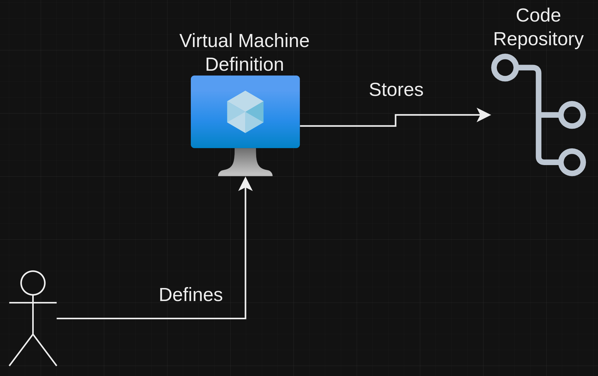
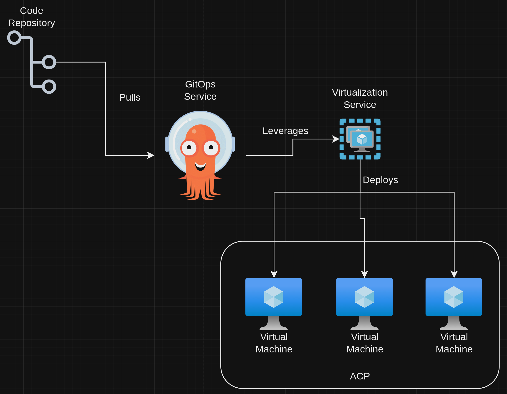
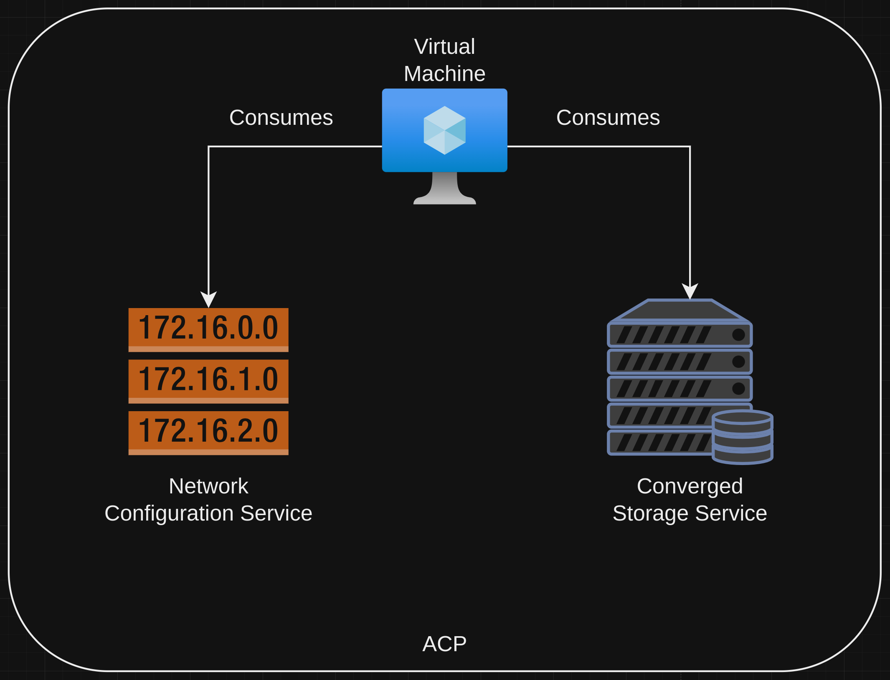
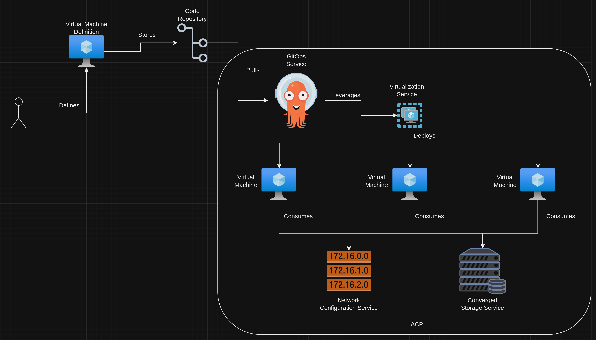
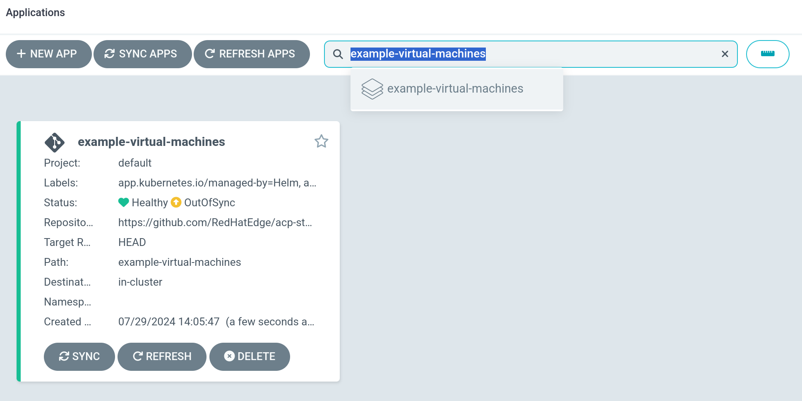
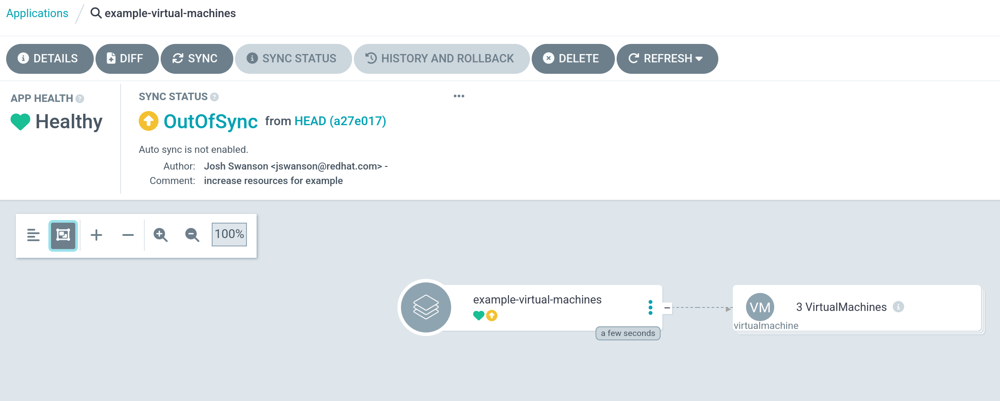
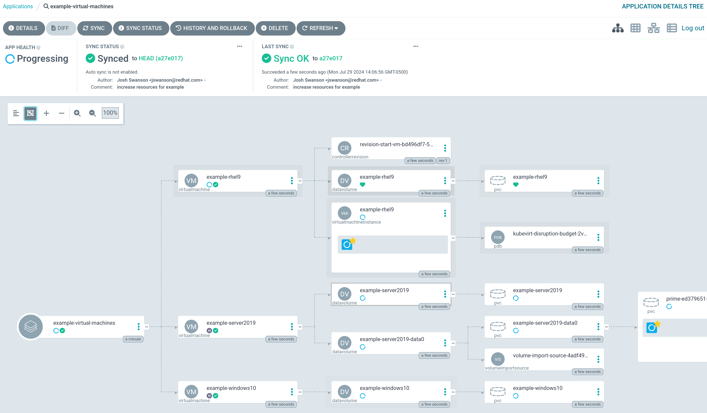
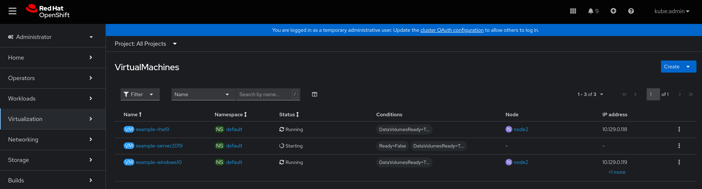
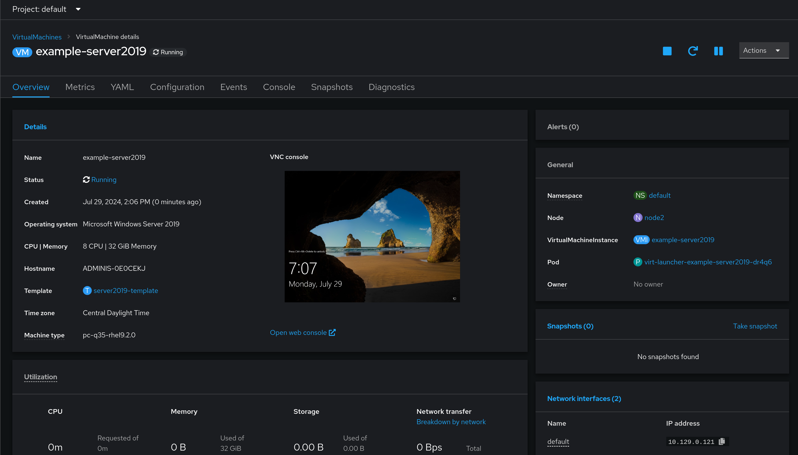

# Virtualization on an ACP
This pattern gives a technical look at how virtual machines are created and managed on an ACP via consumption of the virtualization and gitops services.

## Table of Contents
* [Abstract](#abstract)
* [Problem](#problem)
* [Context](#context)
* [Forces](#forces)
* [Solution](#solution)
* [Resulting Content](#resulting-context)
* [Examples](#examples)
* [Rationale](#rationale)

## Abstract
| Key | Value |
| --- | --- |
| **Platform(s)** | Red Hat OpenShift |
| **Scope** | Virtualization |
| **Tooling** | <ul><li>Red Hat OpenShift GitOps</li></ul> |
| **Pre-requisite Blocks** | <ul><li>[Example ACP Networking](../../blocks/example-network-config/README.md)</li><li>[ACP Network Configuration](../../blocks/acp-network-configuration/)</li><li>[Creating Bridged Networks on an ACP](../../blocks/acp-bridge-networks/README.md)</li><li>[Creating Virtual Machines via Code]()</li></ul> |
| **Pre-requisite Patterns** | <ul><li>[ACP Standard Architecture](../acp-standardized-architecture-ha/README.md)</li><li>[ACP Standard Services](../rh-acp-standard-services/README.md)</li></ul> |
| **Example Application** | N/A |

## Problem
**Problem Statement:** ACPs are designed to handle multiple types of workloads concurrently while maintaining management and operations consistency. Virtual machines, a specific type of workload provided by the virtualization service, should have the same deployment and management flow as other types of workloads, such as containerized workloads. Ideally, virtual machines should also use the same tooling for the initial deployment and management.

## Context
This pattern can be applied to ACPs where virtual machines are required to run workloads, and the ACP has been setup and configured according the the [Standard HA ACP Architecture](../acp-standardized-architecture-ha/README.md). In addition, the standard set of [ACP Services](../rh-acp-standard-services/README.md) have been deployed and are ready to be consumed. GitOps tooling will be used to deploy the virtual machines, and can be used to update/change them over their lifecycle.

A few key assumptions are made:
- The intended context of the platform aligns to the [Standard HA ACP Architecture](../acp-standardized-architecture-ha/README.md)
- The standard set of [ACP Services](../rh-acp-standard-services/README.md) are available for consumption.
- Physical connections, such as power and networking, have been made to the target hardware
- The upstream network configuration is completed and verified

## Forces
- **Management Tooling Consolidation:** This pattern is focused on leveraging common tooling to manage the deployment and lifecycle of virtual machines, identically to how other workloads are deployed and managed on an ACP.
- **Extensibility:** The solution outlined in this pattern focuses on the initial deployment of a virtual machine, along with how to make adjustments during normal operation, however additional hooks/steps can be added with ease.
- **Broad Applicability:** This pattern's solution works for almost all types of virtual machine, regardless of required compute resources, network connections, or operating system.

## Solution
The solution for this pattern involves consuming the virtualization and gitops services to deploy and manage virtual machines. This is accomplished by defining the desired virtual machines and their configurations, then leveraging GitOps tooling to run the deployment, and optionally, make changes over time.

The virtual machine definitions are stored as code, and automatically tracked and deployed by GitOps tooling. This allows for a clear audit trail and ease of management without needing another management tool specifically for virtual machines.

Typically, the virtual machine definitions include information such as requested resources (CPU/memory), desired operating system, and any additional configuration details as needed.



To deploy and manage virtual machines in a declarative method, the gitops service of the platform is leveraged. It reads in the virtual machine definitions, then consumes the virtualization service to instantiate and manage virtual machines.



The virtual machines consume various services from the platform, depending on their configuration. For example, a virtual machine bridged onto the network that leverages converged storage would consume those respective services to operate.



The provided services are scalable, allowing for as many virtual machines as the underlying compute hardware provides, using all the same flow and technologies.



## Resulting Context
The resulting context is the ability to deploy and manage virtual machines at scale on ACPs. These virtual machines can be of multiple operating systems, resource requirements, and more, all contained within a defintion stored as code, and acted on in a declarative fashion. The platform's core services and core functionality ensure the virtual machines are scheduled and running automatically. In addition, the provided services such as converged storage and network configuration allow for persistent storage and advanced connectivity models.

## Examples
The main example flow is creating and deleting virtual machines, leveraging a declarative method of resource management.

### Creating Virtual Machines
Creating virtual machines are handled through the same gitops tooling: the virtual machine desired states are declared, then the tooling creates the virtual machines on the platform.

For example, a sample application consisting of three virtual machines will be created: one RHEL9, one Windows 10, and one Server 2019, each with different configurations.

#### Virtual Machine Definitions

For the RHEL9 virtual machine, 4 cores and 16GB of memory are assigned, with a root password fed in via a values.yaml file. This virtual machine is created by using one of the pre-existing RHEL9 virtual machine templates, which are provided out of the box by the platform's virtualization service.
```yaml
apiVersion: kubevirt.io/v1
kind: VirtualMachine
metadata:
  name: example-rhel9
  namespace: default
  finalizers:
    - kubevirt.io/virtualMachineControllerFinalize
  labels:
    app: example-rhel9
    kubevirt.io/dynamic-credentials-support: 'true'
    vm.kubevirt.io/template: rhel9-server-small
    vm.kubevirt.io/template.namespace: openshift
    vm.kubevirt.io/template.revision: '1'
    vm.kubevirt.io/template.version: v0.27.0
spec:
  dataVolumeTemplates:
    - apiVersion: cdi.kubevirt.io/v1beta1
      kind: DataVolume
      metadata:
        name: example-rhel9
      spec:
        sourceRef:
          kind: DataSource
          name: rhel9
          namespace: openshift-virtualization-os-images
        storage:
          resources:
            requests:
              storage: 30Gi
  running: true
  template:
    metadata:
      annotations:
        vm.kubevirt.io/flavor: small
        vm.kubevirt.io/os: rhel9
        vm.kubevirt.io/workload: server
      creationTimestamp: null
      labels:
        kubevirt.io/domain: example-rhel9
        kubevirt.io/size: small
    spec:
      architecture: amd64
      domain:
        cpu:
          cores: 4 # 4 Cores specified
          sockets: 1
          threads: 1
        devices:
          disks:
            - disk:
                bus: virtio
              name: rootdisk
            - disk: # Used for cloud-init
                bus: virtio
              name: cloudinitdisk
          interfaces:
            - name: default
              masquerade: {}
              model: virtio
          networkInterfaceMultiqueue: true
          rng: {}
        features:
          acpi: {}
          smm:
            enabled: true
        firmware:
          bootloader:
            efi: {}
        machine:
          type: pc-q35-rhel9.2.0
        memory:
          guest: 16Gi # 16GB of memory
        resources: {}
      networks:
        - name: default
          pod: {}
      terminationGracePeriodSeconds: 180
      volumes:
        - dataVolume:
            name: example-rhel9
          name: rootdisk
        - cloudInitNoCloud:
            userData: |-
              #cloud-config
              user: cloud-user
              password: {{ $.Values.rhelRootPassword }} # Templated in
              chpasswd: { expire: False }
          name: cloudinitdisk
```

Next, the Windows 10 virtual machine is created from a user-made template created in the [Creating Windows Templates for ACP Virtualization](../windows-templates-acp-virtualization/README.md) pattern. This instance is created with 4 cores and 8GB of RAM, and also includes an interface bridged directly onto a specific network.
```yaml
apiVersion: kubevirt.io/v1
kind: VirtualMachine
metadata:
  name: example-windows10
  namespace: default
  finalizers:
    - kubevirt.io/virtualMachineControllerFinalize
  labels:
    app: example-windows10
    vm.kubevirt.io/template: windows10-template
    vm.kubevirt.io/template.namespace: openshift
    vm.kubevirt.io/template.revision: '1'
    vm.kubevirt.io/template.version: v0.26.0
spec:
  dataVolumeTemplates:
    - apiVersion: cdi.kubevirt.io/v1beta1
      kind: DataVolume
      metadata:
        name: example-windows10
      spec:
        sourceRef:
          kind: DataSource
          name: windows10
          namespace: openshift-virtualization-os-images
        storage:
          resources:
            requests:
              storage: 50Gi
  running: true
  template:
    metadata:
      annotations:
        vm.kubevirt.io/flavor: medium
        vm.kubevirt.io/os: windows10
        vm.kubevirt.io/workload: desktop
      labels:
        kubevirt.io/domain: example-windows10
        kubevirt.io/size: medium
    spec:
      architecture: amd64
      domain:
        cpu:
          cores: 4
          sockets: 1
          threads: 1
        devices:
          disks:
            - disk:
                bus: sata
              name: rootdisk
          inputs:
            - bus: usb
              name: tablet
              type: tablet
          interfaces:
            - name: default
              masquerade: {}
              model: e1000e
              ports:
                - name: rdp
                  port: 3389
                  protocol: TCP
            - bridge: {}
              model: virtio
              name: vlan2003
          logSerialConsole: false
        features:
          acpi: {}
          hyperv:
            spinlocks:
              spinlocks: 8191
        machine:
          type: pc-q35-rhel9.2.0
        memory:
          guest: 8Gi
      networks:
        - name: default
          pod: {}
        - multus:
            networkName: default/vlan2003
          name: vlan2003
      terminationGracePeriodSeconds: 3600
      volumes:
        - dataVolume:
            name: example-windows10
          name: rootdisk
```

Finally, the Server 2019 virtual machine is also created from a user-defined template, however it also has an additional data disk attached for extra storage, along with a bridged network interface. This additional disk consumes storage from the converged storage service.
```yaml
apiVersion: kubevirt.io/v1
kind: VirtualMachine
metadata:
  name: example-server2019
  namespace: default
  finalizers:
    - kubevirt.io/virtualMachineControllerFinalize
  labels:
    app: example-server2019
    vm.kubevirt.io/template: server2019-template
    vm.kubevirt.io/template.namespace: openshift
    vm.kubevirt.io/template.revision: '1'
    vm.kubevirt.io/template.version: v0.26.0
spec:
  dataVolumeTemplates:
    - apiVersion: cdi.kubevirt.io/v1beta1
      kind: DataVolume
      metadata:
        creationTimestamp: null
        name: example-server2019
      spec:
        sourceRef:
          kind: DataSource
          name: server2019
          namespace: openshift-virtualization-os-images
        storage:
          resources:
            requests:
              storage: 50Gi
    - metadata:
        name: example-server2019-data0
      spec:
        preallocation: false
        source:
          blank: {}
        storage:
          resources:
            requests:
              storage: 120Gi
          storageClassName: ocs-storagecluster-ceph-rbd-virtualization
  running: true
  template:
    metadata:
      annotations:
        vm.kubevirt.io/flavor: medium
        vm.kubevirt.io/os: server2019
        vm.kubevirt.io/workload: server
      labels:
        kubevirt.io/domain: example-server2019
        kubevirt.io/size: medium
    spec:
      architecture: amd64
      domain:
        cpu:
          cores: 8
          sockets: 1
          threads: 1
        devices:
          disks:
            - disk:
                bus: sata
              name: rootdisk
            - disk:
                bus: virtio
              name: data0
          inputs:
            - bus: usb
              name: tablet
              type: tablet
          interfaces:
            - name: default
              masquerade: {}
              model: e1000e
              ports:
                - name: rdp
                  port: 3389
                  protocol: TCP
            - bridge: {}
              model: virtio
              name: vlan2003
        machine:
          type: pc-q35-rhel9.2.0
        memory:
          guest: 32Gi
      networks:
        - name: default
          pod: {}
        - multus:
            networkName: default/vlan2003
          name: vlan2003
      terminationGracePeriodSeconds: 3600
      volumes:
        - dataVolume:
            name: example-server2019
          name: rootdisk
        - dataVolume:
            name: example-server2019-data0
          name: data0
```

#### Application with Virtual Machines
These definitions are loaded into a code repository, and an application is created which instructs the gitops tooling to deploy and manage them on the target platform.

```yaml
---
apiVersion: argoproj.io/v1alpha1
kind: Application
metadata:
  name: example-virtual-machines
  namespace: openshift-gitops
  labels:
    application: example-virtual-machines
spec:
  destination:
    name: ""
    server: https://kubernetes.default.svc
  project: default
  source:
    repoURL: https://github.com/RedHatEdge/acp-standard-services.git
    targetRevision: HEAD
    path: example-virtual-machines
    helm:
      values: |
{{- toYaml .Values | nindent 8 }} # Feed in values.yaml, if any
```

#### Deploying the Application
After the application is created in the gitops tooling, the application can be synced, and the virtual machines will be created.

The application in the list of applications in the gitops tooling web interface:


The application details before sync:


The application sync started:


The virtual machines bring created on the platform:


Details on the Server 2019 virtual machine after creation:


## Rationale
The rationale for this pattern is to have an easily managed way to consume the virtualization service provided by an ACP. The goal is to treat virtual machines the same as any other workload on the platform, where the management is driven by code and tooling, and heavily automated. Ideally, this pattern becomes the foundation for any deployed virtual machines on the platform.

## Footnotes

### Version
1.0.0

### Authors
- Josh Swanson (jswanson@redhat.com)