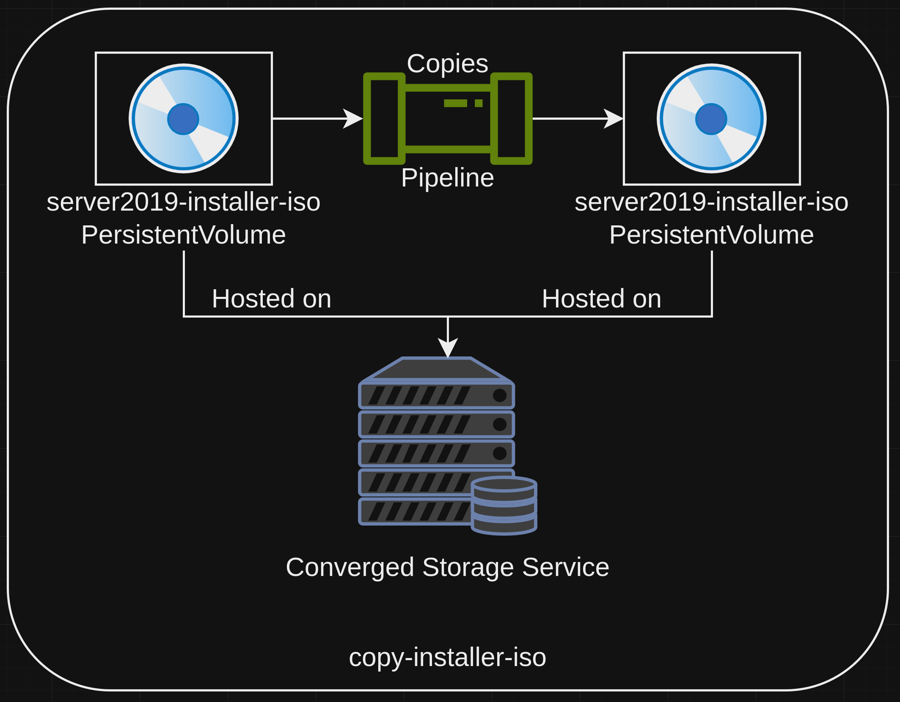

# Creating Windows Virtual Machine Templates for Virtualization on an ACP
This pattern gives a technical look at how to create virtual machine templates of windows images, specifically Windows 10 and Server 2019, for use with the virtualization service of an ACP.

## Table of Contents
* [Abstract](#abstract)
* [Problem](#problem)
* [Context](#context)
* [Forces](#forces)
* [Solution](#solution)
* [Resulting Content](#resulting-context)
* [Examples](#examples)
* [Rationale](#rationale)

## Abstract
| Key | Value |
| --- | --- |
| **Platform(s)** | Red Hat OpenShift |
| **Scope** | Virtualization |
| **Tooling** | <ul><li>Red Hat OpenShift GitOps</li></ul> |
| **Pre-requisite Blocks** | <ul><li>[Example ACP Networking](../../blocks/example-network-config/README.md)</li><li>[ACP Network Configuration](../../blocks/acp-network-configuration/)</li><li>[Creating Bridged Networks on an ACP](../../blocks/acp-bridge-networks/README.md)</li><li>[Creating Virtual Machines via Code]()</li></ul> |
| **Pre-requisite Patterns** | <ul><li>[ACP Standard Architecture](../acp-standardized-architecture-ha/README.md)</li><li>[ACP Standard Services](../rh-acp-standard-services/README.md)</li></ul> |
| **Example Application** | N/A |

## Problem
**Problem Statement:** The virtualization service of an ACP provides a base set of virtual machine templates that can be immediately deployed from for a set of virtual machines, however these do not include templates for Windows operating systems. These must be created by a user (or automation) before virtual machines can be deployed in an automated fashion, in bulk, from a known good template source.

## Context
This pattern can be applied to ACPs where Windows virtual machines are required to run certain applications on the platform. It is targeted at creating these templates via a base set of functionality provided by the platform, with a few additions. This functionality can be called on-demand or through automation, allowing for updating and modification of the templates as requirements change.

A few key assumptions are made:
- The intended context of the platform aligns to the [Standard HA ACP Architecture](../acp-standardized-architecture-ha/README.md)
- The standard set of [ACP Services](../rh-acp-standard-services/README.md) are available for consumption.
- Physical connections, such as power and networking, have been made to the target hardware
- The upstream network configuration is completed and verified
- The virtualization service has been installed is ready to be leveraged

## Forces
- **Self-Contained:** This pattern consumes functionality provided by the platform, allowing for the process to run "locally", meaning additional compute is not required.
- **Versioning:** The pattern's process should allow for templates to be created with versioning, as to denote when new versions have been created, and allow for rollback if needed.
- **Ease of Consumption:** This pattern's solution should be easily leveraged when new templates are required, and can be triggred using the web interface or via other processes, such as GitOps.
- **Repeatable:** This pattern's solution should be re-usable whenever needed, and should be portable to newer versions of operating systems as they're released.

## Solution
The solution for this pattern is to create and consume a pipeline hosted on the platform that creates virtual machine templates. The pipeline should consume resources already available on the platform, such as converged storage and virtualization, to build the templates, and the created artifacts are versioned and ready for immediate consumption.

As this pipeline is the cornerstone of the solution of this pattern, it will be walked through in detail below.

### Pipeline Overview

At a high level, the pipeline should clone the installation media for the desired operating system, create a location the template OS can be installed to, run the installation, apply post-installation customizations to the operating system, shut down the operating system while calling for OS-level sanitization, then update templates to point to the new location where the operating system was just installed to.

After completing these steps, cleanup of the temporary resources should occur, leaving only the new template source as the output.

### copy-installer-iso and create-install-destination
These two steps, which happen simultaneously at the beginning of the pipeline run, set up some initial resources that are used by later steps in the pipeline.

First, the `copy-installer-iso` task creates a copy of the [uploaded installer ISOs](../link-to-block) that will later be attached to the temporary virtual machine. This functionality is provided by the converged storage service of the platform.

The `create-install-destination` step requests a block of storage from the converged storage service that will be used as the boot/installation disk for the temporary virtual machine's operating system to be installed to. After the installation and post-install tasks have been completed, this storage will be snapshotted and used as the source for the virtual machine template.

### create-template-virtual-machine
The next step creates a virtual machine by consuming the virtualization service of the platform, attaching the previously created resouces, and also further configures additional resources to be presented to the virtual machine, in this case, automated setup resources. To fully automate the setup and post-installation of a Windows system, an `autounttend.xml` file and a PowerShell script called `post-install.ps1` are mounted into the virtual machines on a virtualized CD image.

At install time, Windows automatically looks for an `autounattend` file, and if one is found, attempts to read in the desired configuration and setup, and run the installation and post-configuration automatically. Once the installation and post-installation tasks have been completed, the virtual machine is instructed to generalize itself and shut down.

### wait-for-virtual-machine-install
This step simply monitors the state of the virtual machine, waiting until the state is "Stopped", meaning the operating system shut down. This happens at the end of the `post-install.ps1` script mounted to the virtual machine in a previous step, and denotes the end of the installation and post-installation configuration steps. The virtual machine must reach this state to safely proceed onward in creating the template.

### WIP BELOW ###

Required blocks:
- Importing installer ISOs
- Autounattend for Windows
- Attaching autounattend files to Windows virtual machines
- OpenShift Pipelines
- Creating Windows Template Prep pipelines

## Resulting Context

## Examples

## Rationale

## Footnotes

### Version
1.0.0

### Authors
- Josh Swanson (jswanson@redhat.com)