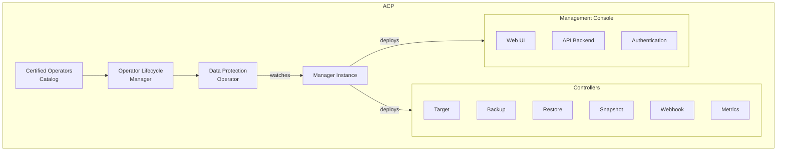
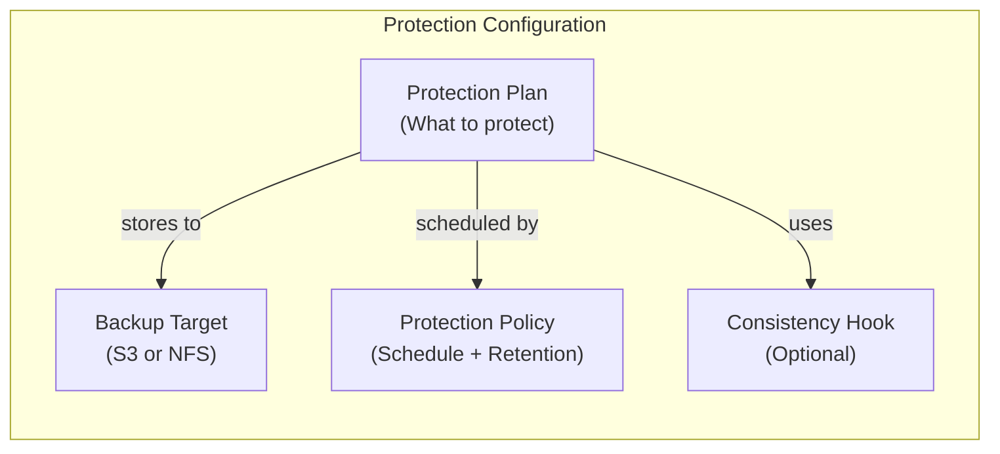
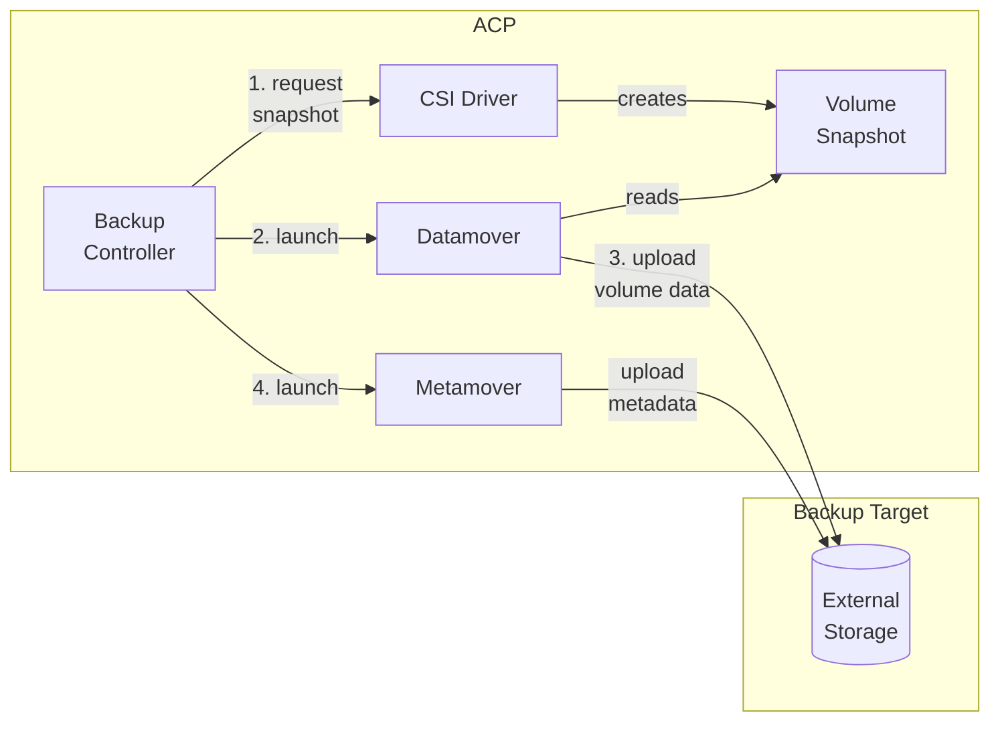
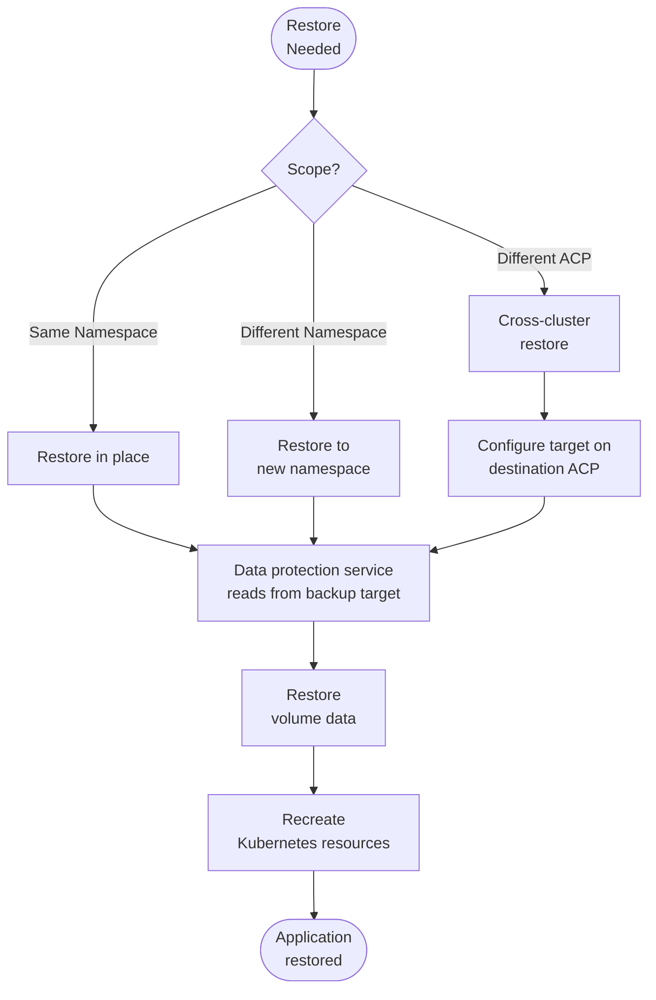
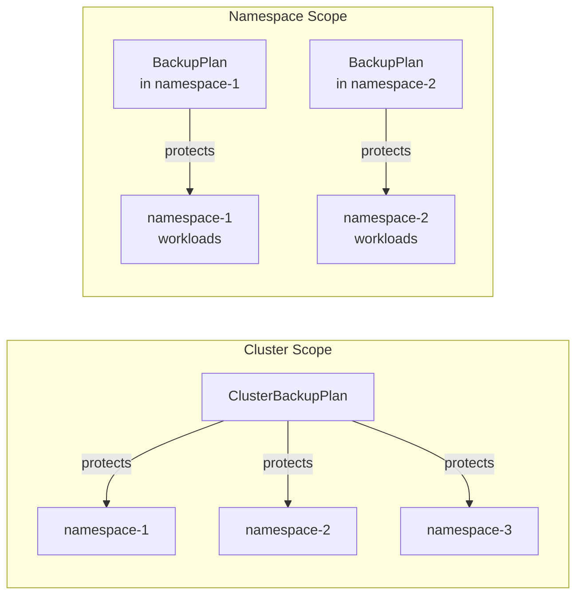
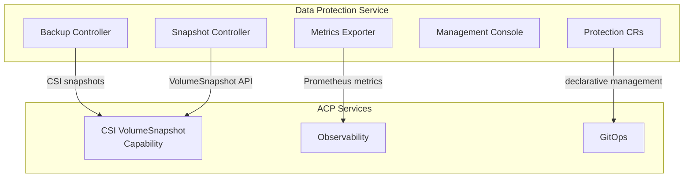
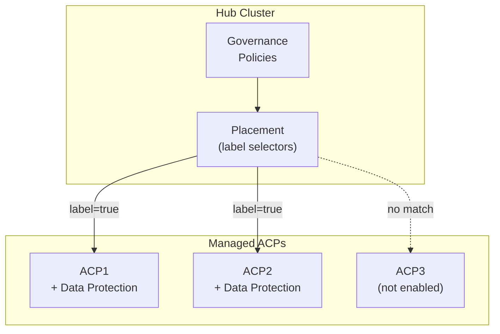
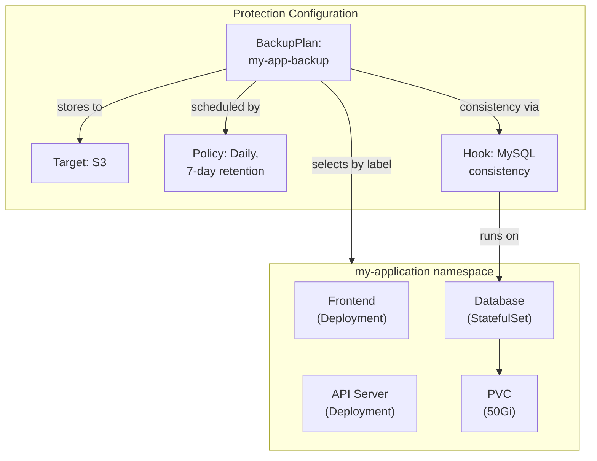
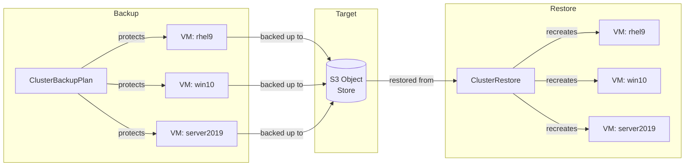

# Workload Data Protection on an ACP
This pattern gives a technical look at how workloads on an ACP are protected through application-aware backup, restore, and disaster recovery, using the data protection and gitops services.

## Table of Contents
* [Abstract](#abstract)
* [Problem](#problem)
* [Context](#context)
* [Forces](#forces)
* [Solution](#solution)
* [Resulting Content](#resulting-context)
* [Examples](#examples)
* [Rationale](#rationale)

## Abstract
| Key | Value |
| --- | --- |
| **Platform(s)** | Advanced Compute Platform |
| **Scope** | Data Protection |
| **Tooling** | <ul><li>(Option 1) Trilio for Kubernetes (T4K)</li></ul> |
| **Pre-requisite Blocks** | <ul><li>[Workload Data Protection on an ACP](../../blocks/workload-data-protection-acp/README.md)</li></ul> |
| **Pre-requisite Patterns** | <ul><li>[ACP Standardized Architecture - Highly Available](../acp-standardized-architecture-ha/README.md)</li><li>[ACP Standard Services](../rh-acp-standard-services/README.md)</li></ul> |
| **Example Application** | N/A |

## Problem
**Problem Statement:** ACPs are designed to host many different workload types concurrently — containerized applications, virtual machines, Helm-managed releases, and operator-managed services. These workloads rely on the platform's core services for storage, networking, and management, but the platform does not provide a built-in mechanism for application-aware backup and recovery. Volume-level snapshots alone are insufficient because they do not capture the full application state: the Kubernetes resources, configurations, secrets, and custom resources that define how a workload runs. Without a data protection service, recovery from accidental deletion, corruption, or a disaster scenario requires manual reconstruction of application state, which is error-prone and time-consuming.

## Context
This pattern is best applied when workloads running on an ACP need to be protected against data loss, accidental deletion, or disaster scenarios. The ACP should be set up and configured according to the [Standard HA ACP Architecture](../acp-standardized-architecture-ha/README.md), and the standard set of [ACP Services](../rh-acp-standard-services/README.md) should be deployed and available for consumption.

The data protection service relies on the CSI VolumeSnapshot capability for capturing point-in-time copies of persistent data. This capability is provided by any CSI-compliant storage driver that supports the VolumeSnapshot API — the specific storage service used on the platform does not matter, as long as VolumeSnapshot, VolumeSnapshotContent, and VolumeSnapshotClass CRDs are registered on the ACP.

Backup data is stored externally to the ACP on S3-compatible object stores or NFS shares. These targets are assumed to be available and reachable from the ACP.

A few key assumptions are made:
- The intended context of the platform aligns to the [Standard HA ACP Architecture](../acp-standardized-architecture-ha/README.md)
- The standard set of [ACP Services](../rh-acp-standard-services/README.md) are available for consumption
- A CSI driver with VolumeSnapshot support is available on the ACP
- An external backup target (S3-compatible object store or NFS share) is available and reachable from the platform
- Physical connections, such as power and networking, have been made to the target hardware

## Forces
- **Application Awareness:** Backups must capture the full application state — not just persistent volumes, but also Kubernetes resources, configurations, secrets, and custom resources. This ensures that a restore produces a fully functional application, not just a set of disconnected data volumes.
- **Operational Consistency:** Protection plans are defined as Kubernetes custom resources, stored as code, and managed through the same gitops tooling used for all other workloads on the platform. This keeps data protection operations consistent with how everything else is managed on the ACP.
- **Flexibility:** The solution supports multiple methods for selecting what to protect, and protection can be scoped to a single namespace or span the entire ACP. Backup targets can be S3-compatible object stores or NFS shares.
- **Resilience:** Backup data is stored externally to the ACP, ensuring recoverability even in a total ACP loss scenario. Immutable backups via object locking provide protection against ransomware or accidental deletion of backup data.

## Solution
The solution leverages a data protection service to provide application-aware backup, restore, and disaster recovery for workloads running on the platform. This service is deployed as an operator through the platform's operator lifecycle tooling, and once running, is configured and managed entirely through custom resources.

### Service Deployment
The data protection service is installed from the certified operators catalog. Once the operator is deployed, a manager instance is created that deploys the full set of controllers responsible for backup orchestration, restore, snapshot management, target validation, and metrics. This can be driven stand-alone on an ACP, through the declarative state management service, or through enforcement via a hub.

### Protection Configuration Model
To start protecting workloads, three pieces of configuration are needed, all defined as custom resources:

| Configuration | Purpose |
| --- | --- |
| Backup Target | Defines where backup data is stored — an S3-compatible object store or NFS share, with credentials and capacity thresholds |
| Protection Policy | Defines the schedule (cron-based) and retention rules for backups — how often to run, and how long to keep completed backups |
| Consistency Hook | Runs commands inside application containers before and after a backup to ensure a consistent snapshot — useful for databases and stateful workloads |
| Protection Plan | Ties everything together — selects which workloads to protect (by label, Helm release, or operator), and references the target, policy, and hooks |

### Backup Flow
When a backup is triggered — either by the schedule defined in the policy, or manually — the data protection service orchestrates a multi-step process that captures both the persistent data and the Kubernetes resources that define the workload.

1. The backup controller requests CSI VolumeSnapshots for each persistent volume attached to the protected workloads.
2. A datamover component reads the snapshot data and transfers it to the configured backup target, stored in QCOW2 format.
3. A metamover component collects all Kubernetes resource definitions — Deployments, Services, ConfigMaps, Secrets, custom resources — and uploads them alongside the volume data.
4. The backup is recorded and tracked as a custom resource, with status visible through the standard Kubernetes API.

The datamover and metamover components are created as ephemeral pods for each operation and destroyed after completion. This means the data protection service only consumes significant resources during active backup or restore operations.

### Restore Flow
Restores work in the opposite direction. The data protection service reads the backup data from the target, recreates the Kubernetes resources, and restores the persistent volume data. Restores can target the original namespace, a different namespace on the same cluster, or a different cluster entirely — as long as the backup target is accessible.

### Protection Scopes
The data protection service supports two scopes, controlled by the manager instance configuration:

- **Cluster scope** uses `ClusterBackupPlan` and `ClusterBackup` resources that can discover and protect workloads across all namespaces. This is suited for centralized management.
- **Namespace scope** uses `BackupPlan` and `Backup` resources scoped to a single namespace. This is suited for teams managing their own protection independently.

Both scopes can be used on the same platform. Cluster scope is recommended for ACP deployments where a platform team manages data protection centrally.

### Integration with Platform Services
The data protection service integrates with several standard ACP services:

| ACP Service | Integration |
| --- | --- |
| CSI VolumeSnapshot | The data protection service uses the platform's CSI driver and VolumeSnapshot API to capture point-in-time copies of persistent volumes during backups |
| Observability | Metrics about backup status, duration, success/failure rates, and storage consumption are exposed and can be scraped by the platform's monitoring stack |
| GitOps | All protection configuration — targets, policies, hooks, and plans — are custom resources that can be stored as code and managed through the gitops service |

### Disconnected and Fleet Deployments
The data protection operator is available through the certified operators catalog, which can be mirrored for disconnected environments using standard oc-mirror tooling.

For fleet deployments managed through a hub cluster, the data protection service can be deployed at scale using governance policies. Cluster labels control which managed ACPs receive the service, and per-ACP configuration (such as backup target endpoints and credentials) can be templated through hub-level configuration.

## Resulting Context
The resulting context is the ability to protect workloads running on an ACP with application-aware backup and restore. Protection plans are defined as code, managed through the same gitops tooling as all other workloads, and executed automatically on schedule. Backup data is stored externally, ensuring recoverability even in total ACP loss scenarios. The full application state is captured — Kubernetes resources, configurations, secrets, persistent data, and optionally container images — so restores produce fully functional applications without manual reconstruction. The service integrates with the platform's existing observability capabilities for monitoring, and can be deployed at scale across a fleet of managed ACPs.

## Examples
The [Workload Data Protection block](../../blocks/workload-data-protection-acp/README.md) provides detailed, step-by-step examples with full resource definitions for each component. This section provides a high-level view of two common scenarios.

### Protecting a Containerized Application
A three-tier application consisting of a frontend, API server, and database runs in a single namespace. A protection plan selects the application by label, references an S3 backup target and daily schedule policy, and attaches a database consistency hook.

The backup runs daily at 2:00 AM, captures the full application state including the database volume, and stores it on the S3 target. Backups older than 7 days are automatically cleaned up by the retention service.

If the application needs to be restored, a restore resource is created that references a specific backup. The data protection service restores the persistent volume data, recreates all Kubernetes resources, and the application comes back up in its pre-failure state.

### Protecting Virtual Machines at Scale
Virtual machines running through the platform's virtualization service are protected using the same model. A cluster-scoped protection plan selects all production virtual machines by label, across all namespaces.

The backup captures the `VirtualMachine` resource definitions, data volumes, and all associated configurations. The restore recreates the virtual machines with their data volumes, and the virtualization service automatically starts them.

## Rationale
The rationale for this pattern is to address the need for application-aware data protection on ACPs. Volume-level snapshots alone are not sufficient for protecting complex, multi-component workloads — the full application state needs to be captured and made recoverable. By leveraging a data protection service that understands Kubernetes-native constructs, protection plans can be defined declaratively and managed through the same tooling used for all other workloads on the platform. The CSI VolumeSnapshot dependency is intentionally generic — any compliant CSI driver works, keeping the solution flexible across different storage configurations.

## Footnotes

### Version
1.0.0

### Authors
- Josh Swanson (jswanson@redhat.com)
